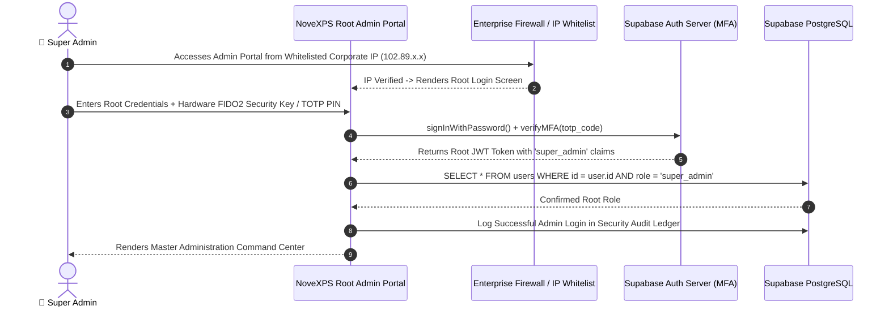

# 🔐 Admin Workflow 01: Super Admin Authentication & Master Security Governance

This document outlines the authentication protocol, hardware multi-factor authentication (MFA), IP whitelisting, session lifetime governance, and emergency break-glass procedures for the Overall / Super Administrator of NovaExpress.

---

## 🎯 Overview & Objectives

* **Primary Goal**: Ensure impenetrable root-level security for the NoveXPS platform while providing the Super Administrator with uninterrupted, audited, and sovereign control over all system parameters.
* **Primary Actors**: Super Administrator, Enterprise Security Engine, Supabase Auth Service, PostgreSQL RLS Engine.
* **Database Tables**: `users`, `companies`, `order_activities`.

---

## 📊 Detailed Workflow Diagram

---

## 📑 Step-by-Step Execution Sequence

### Step 1: Network Perimeter & IP Verification
1. Access to the Root Admin Portal (`/admin-root`) is restricted at the Web Application Firewall (WAF) level to whitelisted static corporate IP addresses and encrypted VPN tunnels.
2. Unlisted IP attempts trigger automated blocking and alert notification to the Chief Information Security Officer (CISO).

### Step 2: Multi-Factor Root Authentication
1. Super Admin inputs primary corporate credentials.
2. System prompts for mandatory second-factor authentication:
   * **Primary MFA**: Hardware FIDO2 / WebAuthn Security Key (YubiKey).
   * **Secondary MFA**: Time-Based One-Time Password (TOTP) from Google Authenticator.
3. Upon validation, Supabase Auth issues a short-lived administrative JWT access token (15-minute expiration with secure automatic rolling refresh).

### Step 3: Master Command Center Hydration
1. The portal hydrates the **Master System Command Center**:
   * **Active Platform Database Connections**: Monitored via PgBouncer / Supavisor connection pools.
   * **Edge Function Health**: Uptime telemetry across all 6 microservices.
   * **Payment Gateway Status**: Monnify API latency and webhook queue backlog.
   * **Live National Telemetry**: Real-time order volume, cash in transit, and active fleet counts.

---

## 🛑 Emergency Break-Glass Protocol

| Scenario | Break-Glass Procedure |
|---|---|
| **Catastrophic Admin Lockout** | System features a Dual-Key Disaster Recovery mechanism requiring two offline PGP-encrypted private key shards held by the CEO and Lead Systems Architect to regenerate root administrative credentials. |
| **Active Malicious Compromise** | Super Admin triggers **System Lockdown Mode**, immediately terminating all active user sessions across all devices, revoking API tokens, and locking cash payout channels. |
