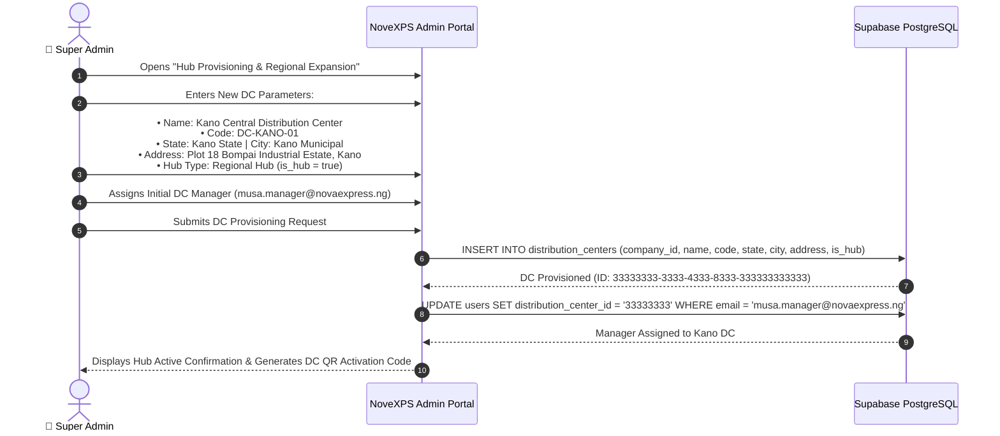

# 🏢 Admin Workflow 02: Multi-Company Tenancy, Organization & Hub Provisioning

This document outlines the workflow for creating tenant organizations, provisioning new regional Distribution Centers (DCs), configuring operational zones, and establishing corporate parameters.

---

## 🎯 Overview & Objectives

* **Primary Goal**: Manage multi-company tenancy structures, provision new regional distribution hubs as the logistics network expands (e.g. launching a new DC in Kano, Port Harcourt, or Ibadan), and configure regional operating parameters.
* **Primary Actors**: Super Administrator, Head of Expansion, Supabase Database.
* **Database Tables**: `companies`, `distribution_centers`, `users`.

---

## 📊 Detailed Workflow Diagram



---

## 📑 Step-by-Step Execution Sequence

### Step 1: Company / Tenant Management
1. Super Admin manages corporate tenant entities in the `companies` table:
   * **Company Name**: `NovaExpress Logistics Limited`
   * **Company Code**: `NOVEXPS`
   * **Base Currency**: `NGN` (Nigerian Naira)
   * **Tax Identification Number (TIN)**: Corporate tax compliance code.
   * **Headquarters Address**: `Plot 102 Central Business District, Abuja, Nigeria`

### Step 2: Regional Distribution Center Provisioning
1. When opening a new regional hub, Super Admin clicks **[ + Provision New Distribution Center ]**.
2. Fills in operational attributes:
   * **Hub Name**: `Kano Central Distribution Center`
   * **Hub Code**: `DC-KANO-01` (Unique uppercase alphanumeric code)
   * **Operating State**: `Kano State`
   * **Operating City**: `Kano Municipal`
   * **Facility Address**: `Plot 18 Bompai Industrial Estate, Kano`
   * **Contact Phone**: `+2348061112233`
   * **Contact Email**: `kano.dc@novaexpress.ng`
   * **Is Regional Hub**: `true`

### Step 3: Database Insertion & Geographic Scope
1. System executes SQL insertion:
   ```sql
   INSERT INTO distribution_centers (
       id,
       company_id,
       name,
       code,
       state,
       city,
       address,
       contact_phone,
       contact_email,
       is_hub,
       is_active,
       created_at,
       updated_at
   ) VALUES (
       gen_random_uuid(),
       '11111111-1111-4111-8111-111111111111',
       'Kano Central Distribution Center',
       'DC-KANO-01',
       'Kano State',
       'Kano Municipal',
       'Plot 18 Bompai Industrial Estate, Kano',
       '+2348061112233',
       'kano.dc@novaexpress.ng',
       true,
       true,
       NOW(),
       NOW()
   );
   ```

### Step 4: Manager Appointment & Operational Launch
1. Super Admin assigns the appointed DC Manager to the new hub.
2. The Kano DC becomes immediately selectable in:
   * **HQ Inter-DC Transfer Manifests**: Available to receive bulk freight from Lagos.
   * **Rider PDA Onboarding**: Available for riders registering in Kano State.
   * **Client Delivery Routing**: Orders with delivery addresses in Kano route automatically to `DC-KANO-01`.

---

## 🛑 Tenancy & Hub Decommissioning Constraints

| Condition | System Enforcement |
|---|---|
| **Active Stock Block** | A Distribution Center cannot be deactivated or deleted if active warehouse stock or un-remitted rider cash exists in `product_batches` or `delivery_agents`. |
| **Unique Hub Code** | Hub codes must be unique system-wide (`code UNIQUE NOT NULL`). |
