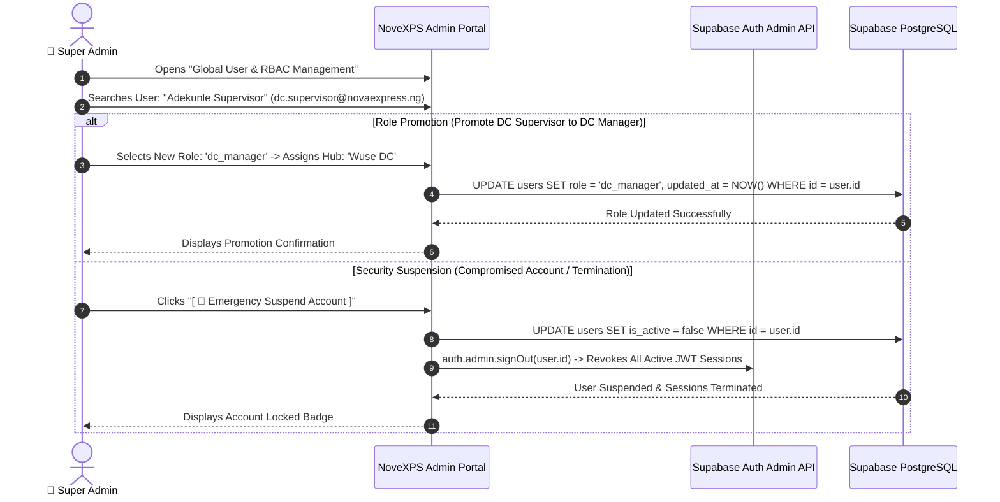

# 👥 Admin Workflow 03: Global Role-Based Access Control (RBAC) & User Lifecycle Governance

This document details the system-wide Role-Based Access Control (RBAC) matrix, administrative permission hierarchies, user lifecycle management (provisioning, promotion, suspension, offboarding), and cryptographic token revocation.

---

## 🎯 Overview & Objectives

* **Primary Goal**: Govern user access privileges across all 8 operational roles, maintain strict separation of duties, provision new personnel, and execute instant security revocations when accounts are compromised or offboarded.
* **Primary Actors**: Super Administrator, Head of Human Resources, Enterprise Identity Provider.
* **Database Tables**: `users`, `delivery_agents`, `distribution_centers`, `companies`.

---

## 📊 Detailed Workflow Diagram

---

## 📑 Step-by-Step Execution Sequence

### Step 1: Enterprise Role Taxonomy
1. Super Admin manages the 8 core operational roles in NoveXPS:

| Role Identifier | Description & Operational Scope | Interface Access |
|---|---|---|
| **`super_admin`** | Root platform controller; global system configuration, infrastructure, rate governance. | Root Admin Command Center |
| **`hq_manager`** | National logistics director; inter-DC freight, merchant catalog, national inventory. | Enterprise Management Portal |
| **`hq_finance`** | Central treasury officer; Monnify settlements, batch payouts, client billing. | Central Treasury Portal |
| **`dc_manager`** | Regional DC director; local hub oversight, fleet onboarding, audit approvals. | Regional DC Portal |
| **`dc_supervisor`** | Warehouse floor supervisor; stock request review, batch picking, handover PIN. | DC Floor Terminal |
| **`dc_finance`** | Local DC cashier/accountant; teller verification, physical cash custody receipt. | DC Finance Desk |
| **`delivery_agent`** | Field last-mile delivery rider; vehicle stock custody, COD, POD signature. | NoveXPS Mobile PDA App |
| **`client_admin`** | Corporate merchant client logistics officer (*Novacare*, *PharmaPlus*). | Merchant Client Portal |

### Step 2: User Account Provisioning
1. Super Admin navigates to **User Management Page** $\rightarrow$ Clicks **[ + Create User ]**.
2. Inputs user identity:
   * **Full Name**: `Adekunle Supervisor`
   * **Corporate Email**: `dc.supervisor@novaexpress.ng`
   * **Phone Number**: `08091112233`
   * **Role**: `dc_manager`
   * **Assigned Hub**: `Wuse Distribution Center`
3. Generates a secure temporary password and sends an invitation link with mandatory password reset on first login.

### Step 3: Emergency Suspension & Session Revocation
1. If a staff member is terminated or an account shows signs of credential compromise:
   * Super Admin clicks **[ 🚫 Emergency Suspend Account ]**.
   * System sets `users.is_active = false`.
   * System invokes `supabaseClient.auth.admin.signOut(user_id)` to invalidate all active JWT tokens instantly across all mobile devices, web browsers, and DC terminals.
   * Any subsequent API requests with old tokens are rejected with `403 Forbidden`.

---

## 🛑 Separation of Duties Constraints

| Security Rule | Enforcement Mechanism |
|---|---|
| **Treasury vs Rate Setting Separation** | `hq_finance` users cannot alter compensation tier rates (only `super_admin` can publish rates). |
| **Rider Financial Immutability (BR-015)** | `delivery_agent` roles have zero write permissions on `rider_transactions`, `orders.agent_entitlement`, or compensation rates. |
