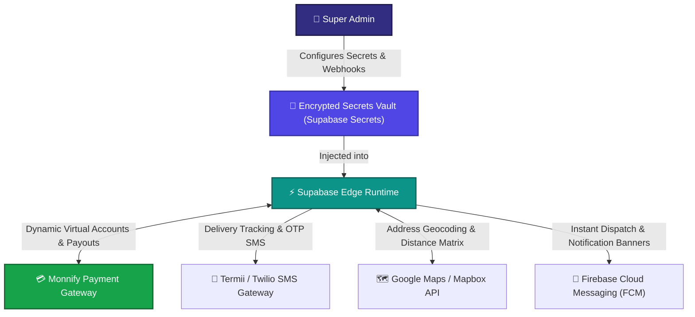

# 🔌 Admin Workflow 04: System Integrations & External Gateway Configuration

This document details the configuration, credential management, cryptographic webhook signature verification, and key rotation for Monnify Payment Gateway, Termii SMS/WhatsApp, Google Maps Geocoding, and Firebase Cloud Messaging (FCM).

---

## 🎯 Overview & Objectives

* **Primary Goal**: Manage enterprise-grade external service integrations, configure secure API keys and webhook signing secrets, monitor gateway uptime and latency, and execute key rotations without service downtime.
* **Primary Actors**: Super Administrator, Principal Integration Engineer, External API Providers.
* **Integrations**: Monnify (Fintech), Termii/Twilio (SMS/WhatsApp), Google Maps/Mapbox (GIS), Firebase FCM (Push Notifications).

---

## 📊 Integration Architecture Diagram

---

## 📑 Step-by-Step Execution Sequence

### Step 1: Monnify Payment Gateway Configuration (BR-021, BR-022)
1. Super Admin navigates to **Integrations $\rightarrow$ Payment Gateways $\rightarrow$ Monnify**.
2. Configures secure parameters:
   * **API Key**: `MK_PROD_xxxxxxxxxxxxxxxx`
   * **Secret Key**: `SK_PROD_xxxxxxxxxxxxxxxx` (Encrypted at rest)
   * **Contract Code**: `7890892401`
   * **Base URL**: `https://api.monnify.com`
   * **Webhook URL**: `https://oygtaeriljuelhshfvkv.supabase.co/functions/v1/monnify-webhook`
   * **Webhook Secret**: Cryptographic SHA-512 signing secret used to verify incoming transaction hashes.

### Step 2: SMS & Customer Messaging Gateway (Termii)
1. Super Admin navigates to **Integrations $\rightarrow$ Messaging $\rightarrow$ Termii**.
2. Configures messaging triggers:
   * **Sender ID**: `NOVEXPS`
   * **API Key**: Encrypted token for transactional SMS.
   * **Automated Triggers**:
     - *Order Dispatched*: "Your NovaExpress order TRK-8924 is in transit with Rider Emeka."
     - *Delivery Completed*: "Thank you! Your order TRK-8924 was delivered successfully."
     - *Monnify Transfer Prompt*: "Pay ₦35,000 for order TRK-8925 to Wema Bank / 7890892501."

### Step 3: Mapping & Route Optimization (Google Maps / Mapbox)
1. Super Admin navigates to **Integrations $\rightarrow$ GIS & Geocoding**.
2. Configures API keys with restricted HTTP referrers:
   * **Geocoding API**: Translates raw Nigerian addresses (e.g. *Plot 402 Aminu Kano Crescent, Wuse 2*) into exact latitude/longitude coordinates.
   * **Distance Matrix API**: Computes optimal multi-drop delivery route sequences for PDA riders.

### Step 4: Push Notifications (Firebase FCM)
1. Super Admin uploads the **Firebase Service Account JSON (`google-services.json` / `firebase-admin.json`)**.
2. Configures real-time push notification payloads sent to rider PDAs upon:
   * New Order Assignments (`status = 'accepted'`).
   * Stock Pickup Approvals (`status = 'approved'`, Code: `HND-9921`).
   * Remittance Approvals (`status = 'verified'`).

---

## 🛑 Security & Webhook Validation Protocol

| Gateway | Security Validation Requirement |
|---|---|
| **Monnify Webhook** | Edge Function computes `SHA-512(monnifySecretKey + payloadJSON)` and matches incoming `monnify-signature` header before processing payments. |
| **Zero-Downtime Secret Rotation** | System supports dual-secret overlapping during API key rotations so in-flight requests are not dropped. |
