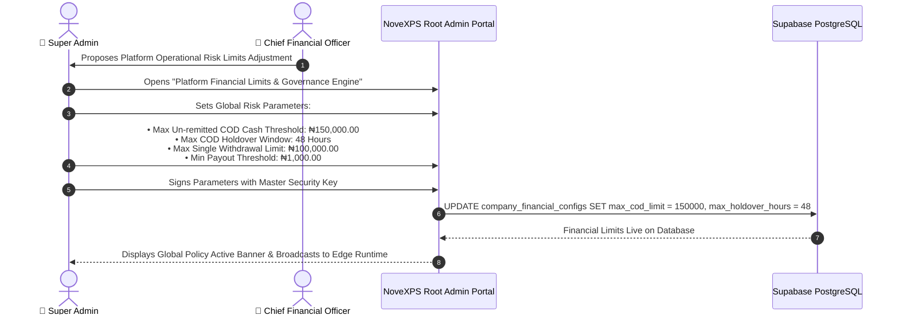

# 💵 Admin Workflow 05: Financial Core, Platform Limits & Rate Publishing Governance

This document details the configuration of platform financial limits, sovereign compensation rate publishing (BR-010 to BR-015), maximum COD cash holdover thresholds, and revenue share splits.

---

## 🎯 Overview & Objectives

* **Primary Goal**: Govern platform-wide financial rules, enforce strict physical cash custody limits to eliminate holdover risk, publish immutable compensation rate models, and preserve historical accounting integrity (BR-014).
* **Primary Actors**: Super Administrator, Chief Financial Officer (CFO), Supabase Database.
* **Database Tables**: `delivery_agents`, `rider_transactions`, `orders`, `companies`.

---

## 📊 Detailed Workflow Diagram

---

## 📑 Step-by-Step Execution Sequence

### Step 1: Global Cash Custody Risk Limits
1. The Super Admin configures automated circuit-breakers to prevent rider cash leakage:
   * **Max COD Cash Limit (`₦150,000.00`)**: If a rider’s `delivery_agents.current_cod_balance` reaches ₦150,000, the system automatically pauses new order assignments until a remittance is submitted and verified.
   * **Max Cash Holdover Window (`48 Hours`)**: If un-remitted physical cash remains in rider custody $> 48$ hours, the rider’s profile is temporarily locked.
   * **Max Single Payout Limit (`₦100,000.00`)**: Payout requests exceeding ₦100,000 require dual approval from Treasury and CFO.
   * **Min Withdrawal Threshold (`₦1,000.00`)**: Prevents micro-transaction fee drain on corporate bank accounts.

### Step 2: Compensation Model Publishing (BR-010 to BR-015)
1. Super Admin is the **sole sovereign role** with authority to publish compensation updates (BR-015).
2. Sets the baseline operational payout rates:
   * **Base Delivery Commission**: `₦1,000.00` per delivered order.
   * **Transport Allowance**: `₦1,500.00` per delivered order.
   * **Upsell Commission**: `10%` of additional upsell item value.
3. System applies **BR-014 (Historical Rate Locking)**:
   * When an order is completed, the system calculates and snapshots the exact rate into `orders.agent_entitlement` and `rider_transactions.amount`.
   * Future rate updates never mutate previously settled historical transactions.

---

## 🛑 Financial Governance Matrix

| Parameter | Default Setting | Enforcement Mechanism |
|---|:---:|---|
| **Max COD Balance** | ₦150,000.00 | Edge Function `confirm-delivery-pod` blocks new order intake if threshold exceeded. |
| **Max Holdover Window** | 48 Hours | Automated cron script checks `cash_remittances.created_at`. |
| **Agent Rate Alteration** | Strictly Prohibited | PostgreSQL RLS denies UPDATE on `agent_entitlement` for all non-super-admin users (BR-015). |
