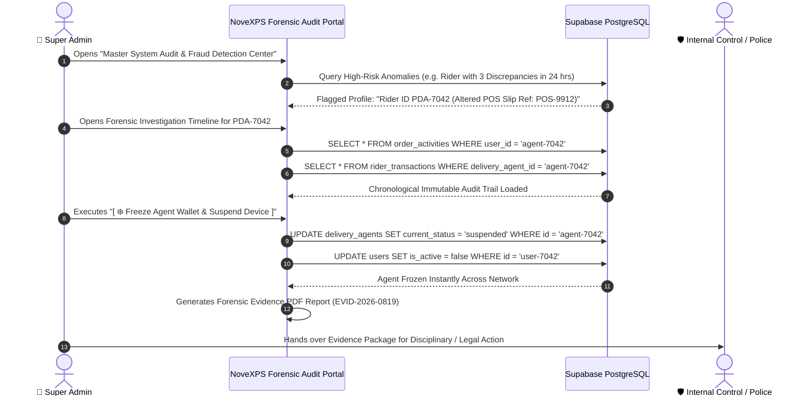

# 🔍 Admin Workflow 07: Enterprise Audit Trails, Security Telemetry & Fraud Forensics

This document details master append-only audit trail inspection, fraud forensic investigation procedures, suspicious activity anomaly detection, account freezing, and regulatory compliance reporting.

---

## 🎯 Overview & Objectives

* **Primary Goal**: Maintain complete, tamper-evident audit trails for every physical and financial action in the system (BR-020), detect fraud or inventory leakage in real-time, and execute rapid forensic investigations.
* **Primary Actors**: Super Administrator, Head of Internal Control, Forensic Auditor, Supabase Database.
* **Database Tables**: `order_activities`, `inventory_audits`, `rider_transactions`, `cash_remittances`, `payout_requests`.

---

## 📊 Detailed Workflow Diagram

---

## 📑 Step-by-Step Execution Sequence

### Step 1: Immutable Audit Trail Architecture (BR-020)
1. Every critical operational and financial event generates an append-only row in `order_activities`:
   * **Order Assigned**: `activity_type = 'assigned'`
   * **Status Changed**: `activity_type = 'status_changed'`
   * **POD Captured**: `activity_type = 'delivery_completed'`, including GPS coordinates and photo URL.
   * **Failure Logged**: `activity_type = 'delivery_failed'`, including failure category and notes.
   * **Monnify Paid**: `activity_type = 'monnify_paid'`, including Monnify session ID and webhook payload hash.

### Step 2: Automated Fraud Detection Heuristics
1. The forensic engine continuously scans for red-flag patterns:
   * **Heuristic A (Rapid POD Submissions)**: Multiple orders marked delivered within seconds (indicates fake/ghost PODs).
   * **Heuristic B (Altered Deposit Tellers)**: Duplicate bank reference numbers submitted across multiple remittance tickets.
   * **Heuristic C (Off-Route GPS Anomalies)**: Deliveries completed $> 10\text{ km}$ away from customer delivery address.

### Step 3: Forensic Account Freeze & Asset Lock
1. When fraud is detected, Super Admin clicks **[ ❄️ Freeze Agent Wallet & Suspend Device ]**.
2. System executes atomic security lock:
   * Sets `delivery_agents.current_status = 'suspended'`.
   * Sets `users.is_active = false`.
   * Freezes all pending withdrawal payouts in `payout_requests`.
   * Revokes mobile JWT tokens to lock out the device immediately.

### Step 4: Forensic Report Export
1. System compiles a certified, timestamped PDF Evidence Package containing:
   * Device IMEI, IP address, and GPS trail.
   * Uploaded deposit slip images and Monnify transaction logs.
   * Chronological order activity timeline.

---

## 🛑 Audit Data Retention Policies

| Data Category | Retention Period | Storage Standard |
|---|:---:|---|
| **Order Activity Logs (`order_activities`)** | 7 Years | Append-only PostgreSQL Partition |
| **Financial Ledger (`rider_transactions`)** | 10 Years | Cryptographically signed, immutable |
| **POD & Remittance Photo Proofs** | 3 Years | Supabase Encrypted Storage S3 Buckets |
