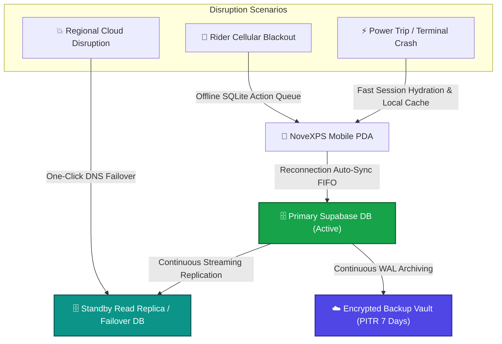

# 🛡️ Admin Workflow 08: Disaster Recovery, Backup Retention & Business Continuity

This document details automated database snapshot backups, Point-in-Time Recovery (PITR), power outage and crash recovery procedures, offline transaction replay, and high-availability business continuity.

---

## 🎯 Overview & Objectives

* **Primary Goal**: Guarantee 99.99% system availability, zero data loss (RPO = 0), rapid recovery time (RTO $< 15\text{ mins}$) in the event of hardware failure, power trip, or cloud infrastructure disruption, and ensure seamless offline mobile queue synchronization.
* **Primary Actors**: Super Administrator, DevOps Lead, Supabase Cloud Infrastructure.
* **Infrastructure**: Automated Continuous WAL Archiving, PostgreSQL PITR, Encrypted Cloud Backups.

---

## 📊 Disaster Recovery Architecture Diagram

---

## 📑 Step-by-Step Execution Sequence

### Step 1: Automated Continuous Backup Policies
1. **Point-in-Time Recovery (PITR)**: System continuously archives Write-Ahead Logs (WAL), enabling restoration to any precise second within the past 7 days.
2. **Daily Logical Backups**: Automated `pg_dump` snapshots generated every night at 01:00 UTC, encrypted via AES-256 and replicated across multi-region cloud storage.

### Step 2: Power Trip & Unexpected Crash Recovery
1. When power trips occur at local workstations, warehouses, or developer consoles:
   * Supabase PostgreSQL maintains full ACID compliance via write-ahead logging; uncommitted transactions roll back safely with zero table corruption.
   * Mobile PDA apps persist in-flight draft state in encrypted local SQLite/Hive storage, restoring full user state upon restart.

### Step 3: Offline Mobile Sync Queue Replay (FIFO)
1. If field riders experience cellular dropouts during deliveries:
   * POD signatures, photos, and failure logs are buffered in `offline_action_queue`.
   * When cellular connectivity is restored, the `connectivity_plus` background sync listener dequeues payloads in strict First-In, First-Out (FIFO) chronological order.
   * Conflict resolution: Server timestamps take precedence for financial ledgers; client captured signatures and photos are merged idempotently.

### Step 4: Emergency Failover Protocol
1. In the event of primary datacenter disruption:
   * Super Admin promotes the **Standby Read Replica** to primary.
   * DNS routing is updated via Cloudflare / API Gateway within 60 seconds.
   * All mobile apps and DC portals seamlessly reconnect to the active endpoint.

---

## 🛑 Disaster Recovery Metrics (SLA)

| Metric | Target SLA | Implementation |
|---|:---:|---|
| **Recovery Point Objective (RPO)** | **0 Seconds** | Continuous synchronous WAL replication |
| **Recovery Time Objective (RTO)** | **$< 15\text{ Minutes}$** | Automated database snapshot & DNS failover |
| **Data Retention Compliance** | **7 Years** | Encrypted multi-region cold storage archives |
