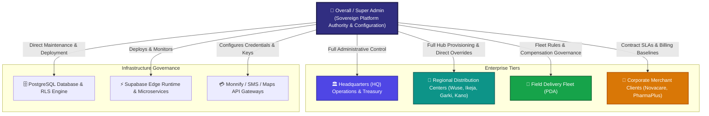

# 👑 NoveXPS Overall Administration (Super Admin) Master Operational Workflow Guide & Sitemap

Welcome to the **NovaExpress Logistics Management System (NoveXPS) Overall Administration (Super Admin) Operational Workflow Guide**. This master document details platform-wide governance, multi-company tenancy, system integrations, database and Edge Function maintenance, cryptographic security, global rate governance, and disaster recovery.

---

## 🏛️ The Overall Admin Hierarchy & Sovereign Authority

The **Overall / Super Administrator** holds supreme governance authority across the entire NoveXPS enterprise ecosystem:

---

## 📑 Master Admin Workflow Index

| # | Workflow Module | Description | Primary Actors | Documentation Link |
|:---:|---|---|---|---|
| **01** | **Super Admin Auth & Master Security Governance** | Root credentials, TOTP Hardware MFA, IP whitelisting, session timeouts, and break-glass protocols. | Super Admin, Security Architect | [01_SUPER_ADMIN_AUTH_AND_SECURITY_GOVERNANCE_WORKFLOW.md](file:///c:/PROJECT/NoveXPS/DOCUMENTATION/ADMIN/WORKFLOW/01_SUPER_ADMIN_AUTH_AND_SECURITY_GOVERNANCE_WORKFLOW.md) |
| **02** | **Tenancy, Organization & Hub Provisioning** | Creating companies (`companies`), provisioning new DC hubs (`distribution_centers`), zone polygon mapping, and tax configs. | Super Admin, Head of Expansion | [02_TENANCY_ORGANIZATION_AND_HUB_PROVISIONING_WORKFLOW.md](file:///c:/PROJECT/NoveXPS/DOCUMENTATION/ADMIN/WORKFLOW/02_TENANCY_ORGANIZATION_AND_HUB_PROVISIONING_WORKFLOW.md) |
| **03** | **Global RBAC & User Lifecycle Management** | System-wide user role provisioning, permissions matrix, promoting/suspending accounts, and API service keys. | Super Admin, HR Director | [03_GLOBAL_RBAC_AND_USER_LIFECYCLE_WORKFLOW.md](file:///c:/PROJECT/NoveXPS/DOCUMENTATION/ADMIN/WORKFLOW/03_GLOBAL_RBAC_AND_USER_LIFECYCLE_WORKFLOW.md) |
| **04** | **System Integrations & Gateway Config** | Monnify Payment Gateway, Termii SMS/WhatsApp, Google Maps Geocoding, and FCM Push Notification credentials. | Super Admin, Lead Systems Architect | [04_SYSTEM_INTEGRATIONS_AND_GATEWAY_CONFIG_WORKFLOW.md](file:///c:/PROJECT/NoveXPS/DOCUMENTATION/ADMIN/WORKFLOW/04_SYSTEM_INTEGRATIONS_AND_GATEWAY_CONFIG_WORKFLOW.md) |
| **05** | **Financial Core & Rate Publishing Governance** | Publishing immutable compensation rate structures (BR-010 to BR-015), COD retention limits, and revenue splits. | Super Admin, Chief Financial Officer | [05_FINANCIAL_CORE_AND_COMPENSATION_PUBLISHING_WORKFLOW.md](file:///c:/PROJECT/NoveXPS/DOCUMENTATION/ADMIN/WORKFLOW/05_FINANCIAL_CORE_AND_COMPENSATION_PUBLISHING_WORKFLOW.md) |
| **06** | **Database Migrations & System Maintenance** | Pushing DDL migrations, PostgREST schema cache reloads, Edge Function deployments, and indexing optimization. | Super Admin, Principal Database Engineer | [06_DATABASE_SCHEMA_MIGRATIONS_AND_SYSTEM_MAINTENANCE_WORKFLOW.md](file:///c:/PROJECT/NoveXPS/DOCUMENTATION/ADMIN/WORKFLOW/06_DATABASE_SCHEMA_MIGRATIONS_AND_SYSTEM_MAINTENANCE_WORKFLOW.md) |
| **07** | **Enterprise Audit Trail & Fraud Forensics** | Master append-only log inspection, fraud forensics, anomaly investigation, asset freeze, and compliance reports. | Super Admin, Head of Internal Control | [07_ENTERPRISE_AUDIT_LOGS_AND_FRAUD_FORENSICS_WORKFLOW.md](file:///c:/PROJECT/NoveXPS/DOCUMENTATION/ADMIN/WORKFLOW/07_ENTERPRISE_AUDIT_LOGS_AND_FRAUD_FORENSICS_WORKFLOW.md) |
| **08** | **Disaster Recovery & Business Continuity** | PITR database backups, power failure transaction recovery, offline queue sync recovery, and failover management. | Super Admin, DevOps Lead | [08_DISASTER_RECOVERY_AND_BUSINESS_CONTINUITY_WORKFLOW.md](file:///c:/PROJECT/NoveXPS/DOCUMENTATION/ADMIN/WORKFLOW/08_DISASTER_RECOVERY_AND_BUSINESS_CONTINUITY_WORKFLOW.md) |

---

## 🛡️ Sovereign Super Admin Privileges

The Super Admin possesses exclusive capabilities that no other role can execute:
1. **Rate Governance Authority**: Sole role authorized to update global compensation parameters (BR-015).
2. **Infrastructure Direct Access**: Full authority to push PostgreSQL schema migrations and deploy Edge Functions.
3. **Cross-Entity Impersonation**: Ability to operate as any HQ manager, DC supervisor, or client admin for troubleshooting and operational intervention.
4. **Emergency Kill-Switch**: Ability to pause external gateway webhooks or freeze suspicious agent payouts instantly.
