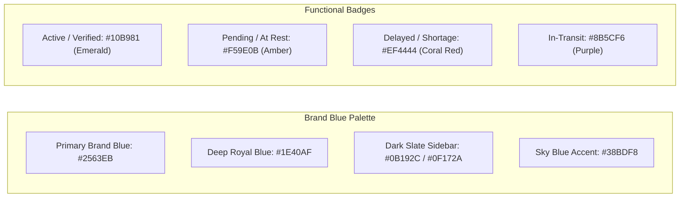
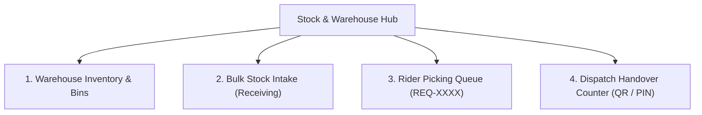
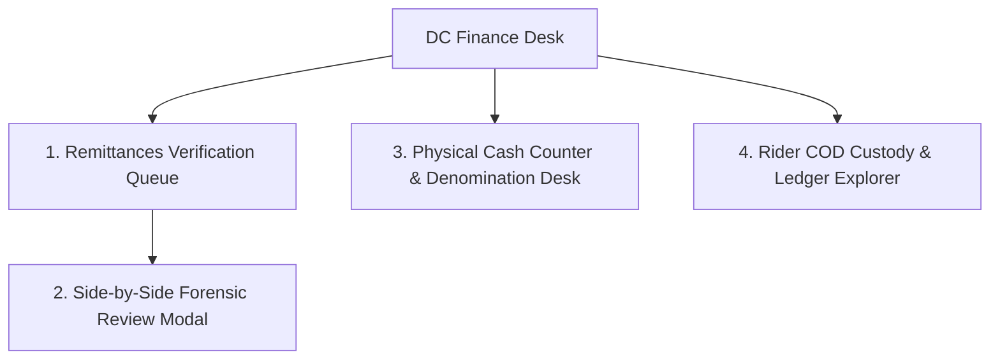
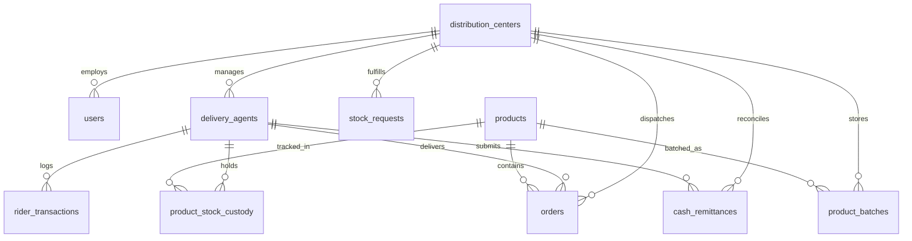

# 🏢 NoveXPS Distribution Center (DC) Admin Console — Master Screens Specification & Blueprint Guide

Welcome to the **NoveXPS Distribution Center (DC) Operations & Administration Console Specification Guide**. This document is the definitive master reference for all screens, navigation tabs, layouts, interactive workflows, data schemas, responsive design rules, and UI/UX design tokens for the DC Admin Console.

---

## 🧭 Executive Architecture & Layout Blueprint

The DC Console is a modern enterprise web and tablet dashboard designed for **DC Operations Managers**, **Warehouse Supervisors**, **Dispatch Coordinators**, and **DC Finance Cashiers**.

### 🖥️ Desktop & Tablet Layout Structure (Based on Brand Blueprint)

```
┌──────────────────────────────────────────────────────────────────────────────────────────────────────────────────┐
│  SIDEBAR (Collapsible 255px / 76px)  │  TOP APP BAR (Global Search, Hub Switcher, Theme, Notifications, Avatar)  │
├──────────────────────────────────────┼───────────────────────────────────────────────────────────────────────────┤
│  🏢 NovaExpress DC                   │  🔍 Search orders, waybills, packages, or riders...                       │
│  Hub Operations Console              │  [ 🏢 Wuse Distribution Center (DC-WUSE-01) ▼ ]  [ ☀️/🌙 ]  [ 🔔(3) ]    │
│                                      ├───────────────────────────────────────────────────────────────────────────┤
│  📊 Dashboard (Active)               │  MAIN CONTENT AREA (Operational Business Tabs & Controls)                 │
│  🚚 Deliveries & Orders              │  ┌─────────────────────────────────┬─────────────────┬──────────────────┐  │
│  📦 Inventory & Stock                │  │ 🗺️ LIVE CITY ROUTE MAP          │ 📦 RESTOCK QUEUE│ 💵 FLEET CASH    │  │
│  💵 Cash & Remittances               │  │ (Active GPS Pins & Zones)       │ 2 Requests      │ ₦953,000.00      │  │
│  🔄 Returns & QC Desk                │  │ [ 4 Active Riders • 12 Routes ] │ [ 30 units ]    │ [ Unverified ]   │  │
│  💳 Rider Payouts                    │  └─────────────────────────────────┴─────────────────┴──────────────────┘  │
│  👥 Riders & Fleet                   │  ┌───────────────────────────────────────────────────────────────────────┐  │
│                                      │  │ 📋 FLEET DRIVER MANIFEST TABLE                                        │  │
│  ─────────────────────────────────── │  │ [#PDA-7000] Emeka Rider    • Bajaj Boxer• [ACTIVE] • [██████ 96%] 99%│  │
│  👤 Adekunle Supervisor              │  │ [#DRV-8901] Jameson Miller • Volvo FH16 • [ACTIVE] • [████░░ 72%] 98%│  │
│     Wuse DC Manager                  │  │ [#DRV-7723] Leila Vance    • Isuzu NPR  • [AT REST]• [██████ Done] 94%│  │
│     [ ⎋ Log Out ]                    │  └───────────────────────────────────────────────────────────────────────┘  │
└──────────────────────────────────────────────────────────────────────────────────────────────────────────────────┘
```

---

## 📱 Responsive & Adaptive Breakpoint Specifications

| Form Factor | Screen Width | Sidebar Behavior | Content Layout | Optimal Use Case |
|---|---|---|---|---|
| **Desktop (Large / Ultra-Wide)** | $\ge 1280\text{px}$ | Expanded (260px width) with text labels & badge counts | 3 to 4-column cards, full data tables with sticky headers | Dispatch control rooms, DC Office workstations |
| **Desktop (Standard / Laptop)** | $1024\text{px} - 1279\text{px}$ | Collapsible (76px icon rail or toggleable 240px drawer) | 2 to 3-column cards, scrollable tables with fixed columns | Supervisor laptop, DC Manager desk |
| **Tablet (Landscape & Portrait)** | $768\text{px} - 1023\text{px}$ | Slim Icon Rail (72px) or Swipeable Drawer | 2-column cards, touch-optimized rows with swipe actions | Rugged warehouse floor tablets, dispatch counter iPads |
| **Mobile (Handheld Devices)** | $< 768\text{px}$ | Hidden Drawer (triggered via AppBar hamburger menu) | Single stacked column, bottom sheets for forms and modals | Quick on-the-go supervisor checks, gate security |

---

## 🎨 Theme Tokens & Design System

The DC Console strictly conforms to NoveXPS design tokens with dual Light & Dark mode support:



| Token / Element | Light Mode Value | Dark Mode Value | Usage |
|---|---|---|---|
| **Sidebar Background** | `#0B192C` (Deep Navy) | `#0B132B` / `#0F172A` (Obsidian Navy) | Persistent navigation sidebar |
| **Sidebar Active Item** | `#2563EB` (Primary Blue) | `#2563EB` with glow (`0 4px 12px rgba(37,99,235,0.3)`) | Selected tab indicator |
| **Page Background** | `#F8FAFC` (Cool Off-White) | `#0B1120` (Dark Space Blue) | Main screen canvas |
| **Card Background** | `#FFFFFF` (Pure White) | `#1E293B` (Slate Card Surface) | Content cards & metric tiles |
| **Card Border** | `#E2E8F0` (Slate-200) | `#334155` (Slate-700) | 1px clean crisp borders |
| **Primary Text** | `#0F172A` (Slate-900) | `#F8FAFC` (Slate-50) | Main titles & table contents |
| **Secondary Text** | `#64748B` (Slate-500) | `#94A3B8` (Slate-400) | Subtitles, labels, metadata |
| **Status Pill (Active)** | Bg: `#ECFDF5`, Text: `#059669` | Bg: `rgba(16,185,129,0.15)`, Text: `#34D399` | Online riders, verified remittances |
| **Status Pill (Delayed)** | Bg: `#FEF2F2`, Text: `#DC2626` | Bg: `rgba(239,68,68,0.15)`, Text: `#F87171` | Delayed routes, inventory shortages |
| **Status Pill (At Rest)** | Bg: `#FFFBEB`, Text: `#D97706` | Bg: `rgba(245,158,11,0.15)`, Text: `#FBBF24` | Break time, pending DC intake |

---

## 📑 Master Navigation Tabs & Screen-by-Screen Specifications

---

### Tab 1: 📊 Dashboard (Operations Command Center)
* **Route**: `/dc/dashboard`
* **Target Users**: DC Operations Manager, Floor Supervisors.
* **Goal**: Real-time operational bird’s-eye view of all hub activities, active fleet health, route progress, urgent queues, and key performance indicators.

#### 1. Top Hub Header & Global Controls
* **Hub Selector**: Dropdown selector displaying active hub: `Wuse Distribution Center (DC-WUSE-01)` with toggle for regional managers to switch hubs (*Garki DC*, *Ikeja DC*).
* **Global Search**: Typeahead search indexing active orders (`TRK-XXXX`), rider names (`Emeka Rider`), product batches (`BATCH-XXXX`), and remittance references (`REM-XXXX`).
* **Live System Status**: Pulsing green dot with `LIVE: 142 Active Units / 53 Hub Orders`.
* **Utility Actions**: Theme toggle (☀️ / 🌙), Real-time Notification Bell with unread counter badge, Settings modal, DC Supervisor avatar profile.

#### 2. Key Metrics & Telemetry Grid
* **Live Interactive Route & Zone Map Card**:
  * Visual GPS map rendering Abuja metropolis (Wuse, Maitama, Garki, Utako, Asokoro).
  * Color-coded pins for active riders:
    - 🟢 Active / Delivering (`#10B981`)
    - 🟡 At Rest / Standby (`#F59E0B`)
    - 🔴 Delayed / Route Alert (`#EF4444`)
  * **Floating "Network Pulse" Widget**:
    - `On Schedule: 88%` (Emerald progress bar)
    - `Idle Capacity: 12%` (Amber progress bar)
* **Average Delivery Time Tile**:
  * Prominent value: `24.5 min` with micro-bar comparison against DC daily target (25.0 min).
* **Fuel & Dispatch Efficiency Tile**:
  * Prominent value: `9.2 km/l` with trend indicator (`🌿 +4.2% from last week`) and sparkline curve.
* **Actionable Queue Tiles**:
  * **Pending Stock Requests**: `5 Requests` (Orange badge) $\rightarrow$ Clicking routes directly to Picking Queue.
  * **Unverified Remittances**: `₦953,000.00 (6 Pending)` (Emerald/Amber badge) $\rightarrow$ Clicking routes directly to Finance Verification Queue.

#### 3. Fleet Driver Manifest Table
* **Header Actions**: Search filter, `[ + Add Driver ]` button, `[ Export CSV ]` button.
* **Table Columns**:
  1. **Driver ID**: Monospace badge (e.g. `#DRV-8901`, `PDA-7000`).
  2. **Operator Name**: Avatar image + Full name + assigned zone (e.g. *Jameson Miller • Wuse II*).
  3. **Vehicle**: Vehicle model & plate (e.g. *Volvo FH16 • 44-BB-92*, *Bajaj Boxer • ABJ-204-XY*).
  4. **Status Pill**: `ACTIVE` (Green), `AT REST` (Amber), `DELAYED` (Red).
  5. **Route Progress**: Linear progress bar with percentage (`72%`, `Done`, `34%`).
  6. **Efficiency**: Numerical rating badge (`98.4%`, `94.1%`, `82.0%`).
  7. **Quick Action**: `[ View Route ]`, `[ Call Rider ]`, `[ Dispatch Order ]`.

---

### Tab 2: 🚚 Fleet & Riders Management
* **Route**: `/dc/fleet`
* **Target Users**: DC Fleet Manager, Dispatch Supervisors.
* **Goal**: Manage all registered delivery agents, vehicles, shifts, real-time GPS locations, daily route manifests, and driver performance.

#### Screen Features & Components
1. **Fleet Status Filter Bar**: Quick filter chips: `All Drivers (24)`, `Active on Route (18)`, `Standby / At Rest (4)`, `Delayed / Issues (2)`.
2. **Interactive Driver Detail Drawer**:
   * Tapping any driver opens a slide-over panel displaying:
     * Contact Info: Phone (`08012345678`), Emergency contact, Agent Code (`PDA-7000`).
     * Current Custody Inventory: Breakdown of products currently in the rider’s vehicle top-box.
     * Cash in Transit: Total unremitted cash balance held by rider.
     * Active Manifest: Ordered list of deliveries (`TRK-8924`, `TRK-8925`) with addresses and customer phone numbers.
     * Action Buttons: `[ Reassign Orders ]`, `[ Force Remittance Lock ]`, `[ Send In-App Field Alert ]`.
3. **Add / Edit Driver Modal**:
   * Full Name, Email, Phone number, NIN / Driver’s License upload.
   * Vehicle Selection: Motorcycle, Tricycle, Light Van, Heavy Truck.
   * Assigned Hub & Primary Delivery Zone (e.g. *Wuse I & II, Maitama*).
   * Commission & Allowance Plan selector.

---

### Tab 3: 📦 Stock & Warehouse Management
* **Route**: `/dc/stock`
* **Target Users**: DC Warehouse Supervisor, Inventory Control Officers.
* **Goal**: Manage end-to-end warehouse product batches, bulk stock intake from merchants, rider restock picking queue, and counter stock handover validation.

#### Sub-Views & Tabs


#### 1. Warehouse Inventory & Bin Locations
* **Live Product Cards**: Displaying total stock, units allocated, available buffer stock, reorder threshold, and shelf bin tags (e.g. `BIN-A1-04`).
* **Batch Lot Explorer**: Displays batch code (`BATCH-RSP-2026`), manufacture date, expiry countdown (e.g. `Expires in 420 days`), and batch health indicator (🟢 Good, 🟡 Expiring within 90d, 🔴 Expired).

#### 2. Bulk Stock Intake (Receiving Loading Dock)
* **Intake Form**:
  * Merchant / Client Selector (*Novacare*, *PharmaPlus*).
  * Inbound Waybill Reference (`WAY-2026-0819`).
  * Product SKU Selector with dynamic search.
  * Batch Lot Number & Expiry Date pickers.
  * Received Quantity with quick increment buttons (`+100`, `+500`, `+1,000`).
  * Assigned Storage Bin Tagging (`BIN-A1-04`).
* **Action**: `[ Save & Generate Warehouse Bin Barcode Label ]`.

#### 3. Rider Picking Queue
* **Split Queue Interface**:
  * Left Panel: List of incoming rider stock requests (e.g. `REQ-00482` — Emeka Rider, 20x Respira, 10x Grazer).
  * Right Panel: Itemized review table showing requested quantity vs available warehouse bin stock, editable approved quantity, and picking instructions.
* **Actions**:
  * `[ Approve & Generate Handover PIN (HND-XXXX) ]` (Triggers SMS / push notification to rider).
  * `[ Print Warehouse Picking Sheet ]`.
  * `[ Reject Request with Reason ]`.

#### 4. Dispatch Counter Handover Desk (Optimized for Touch Tablets)
* **High-Speed Counter Interface**:
  * **Mode A (Camera QR Scanner)**: Viewfinder to scan rider’s PDA handover QR code.
  * **Mode B (Large Keypad PIN)**: 6-digit numeric keypad for entering rider’s `HND-9921` code.
* **Verification Confirmation Modal**:
  * Shows Rider Photo, Name, and Itemized Box Breakdown.
  * Dual-Signature Canvas (DC Staff signature + Rider signature).
  * Large Action Button: `[ ✅ Confirm Physical Handover & Transfer Custody ]`.
  * Atomically updates Postgres DB, decrements warehouse bin count, increments rider vehicle custody, and emits instant audio confirmation beep.

---

### Tab 4: 📋 Deliveries & Dispatch Management
* **Route**: `/dc/dispatch`
* **Target Users**: Dispatch Coordinators, Route Leads.
* **Goal**: Organize, batch, and assign delivery orders to field agents; track route progress; and manage escalations.

#### Screen Features & Components
1. **Unassigned Orders Pool**:
   * Filter by Delivery Zone, Priority, SLA deadline.
   * Multi-select checkboxes for batch allocation.
2. **Smart Route Dispatcher**:
   * Drag-and-drop order cards directly onto active rider cards to create optimized route manifests.
   * Auto-Dispatch button: AI / heuristic route clustering that automatically assigns orders by GPS proximity.
3. **Live In-Transit Delivery Monitor**:
   * List of all orders currently on the road.
   * Status indicators: `In-Transit`, `Out for Delivery`, `Failed Attempt`, `Call-Back Rescheduled`.
   * SLA countdown timers with yellow/red warning alerts for orders approaching deadline.

---

### Tab 5: 🔄 Returns & QC Grading Desk
* **Route**: `/dc/returns`
* **Target Users**: Quality Control Officers, DC Warehouse Staff.
* **Goal**: Receive returned customer items from field riders, perform quality control grading, restock viable inventory, and log damaged write-offs.

#### Screen Features & Components
1. **Return Ticket Ingestion**:
   * Search return ticket `RET-00109` or scan returned package barcode.
   * Displays original order details (`TRK-8920` — Mrs. Folake Adebayo), reason for return (*Customer refused delivery / Wrong item*), and original rider name.
2. **QC Grading Selector Cards**:
   * **Grade A (Restockable / Resellable)**:
     - Outer box intact, security seal unbroken.
     - Action: Select destination warehouse shelf bin (`BIN-A1-04`) $\rightarrow$ Increments warehouse inventory.
   * **Grade B (Damaged / Opened / Written-off)**:
     - Broken seal, damaged packaging, expired.
     - Action: Select damage reason $\rightarrow$ Moves item to scrap/defect ledger.
3. **Custody Settlement Action**:
   * `[ Complete QC & Clear Rider Return Custody ]`: Immediately settles the return ticket and clears return liability from the rider's PDA profile.

---

### Tab 6: 💵 Finance & Cash Remittances Desk
* **Route**: `/dc/finance`
* **Target Users**: DC Cashier, Finance Desk Supervisor (`role = 'dc_finance'`).
* **Goal**: Reconcile physical cash and digital remittances collected by delivery agents, match bank transaction statements, approve deposits, and resolve discrepancies.

#### Sub-Views & Core Modals


#### 1. Remittances Verification Queue
* **Top Metric Ribbon**:
  * `Unverified Remittances`: `6 Pending (₦953,000.00)`
  * `Counter Cash Reconciled Today`: `₦380,000.00`
  * `Fleet Cash in Custody`: `₦1,240,000.00`
  * `High Risk Alerts`: `2 Riders > ₦100k for > 24h`
* **Remittance Stream Table**:
  * Reference number, Rider name, Payment method (Bank Transfer, POS, Cash to DC), Claimed Amount, Submission Date, Action button `[ Review & Reconcile ]`.

#### 2. Side-by-Side Forensic Review Modal (Core Financial Screen)
* **Left 50% Panel (Image Forensic Viewer)**:
  * High-resolution pan-and-zoom viewer for uploaded bank teller / POS receipt slip.
  * Controls: Zoom In (`+`), Zoom Out (`-`), Rotate (`90°`), Fullscreen, Download.
  * Extracted Bank Session ID / Reference: `NIP-GTB-892102`.
* **Right 50% Panel (Audit Calculation & Order Breakdown)**:
  * Rider Information: Emeka Rider (`PDA-7000`), Wuse DC.
  * Financial Calculation Formula:
    - Gross Customer Collections: `₦130,000.00`
    - Less Commission Deductions (2 deliveries): `-₦2,000.00`
    - Less Transport Allowance Deductions (2 orders): `-₦3,000.00`
    - Less Previous Verified Remittances: `-₦379,500.00`
    - **Net Expected Remittance**: `₦953,000.00`
    - **Claimed Deposit Amount**: `₦953,000.00` (Variance: `₦0.00` 🟢)
  * Linked Delivered Orders Accordion: Lists each order included in this remittance batch with individual cash amounts.
* **Actions**:
  * `[ ✅ Approve & Reconcile Remittance ]`: Credits corporate ledger, marks remittance `verified`, clears rider's COD liability, and emits push notification to rider.
  * `[ ⚠️ Approve Partial Deposit with Shortage ]`: Logs approved portion and leaves unpaid balance in rider custody.
  * `[ ❌ Reject Remittance with Reason ]`: Rejects claim with feedback to rider.

#### 3. Physical Cash Counter & Denomination Calculator
* **Denomination Stepper Table**:
  - `₦1,000 notes` $\times$ count = Subtotal
  - `₦500 notes` $\times$ count = Subtotal
  - `₦200 notes` $\times$ count = Subtotal
  - `₦100 notes` $\times$ count = Subtotal
  - **Auto-Calculated Total Cash Received**.
* **Instant Thermal Counter Deposit Receipt**:
  - Generates printable thermal receipt (`REM-CASH-XXXX`) with DC stamp and cashier signature.

#### 4. Rider COD Custody & Ledger Explorer
* Searchable directory of all riders with live outstanding COD balances, last remittance date, and downloadable PDF/CSV financial statements.

---

### Tab 7: 📈 Analytics, SLA & Reports
* **Route**: `/dc/analytics`
* **Target Users**: DC Operations Manager, Regional Executives.
* **Goal**: Analyze hub throughput, delivery turnaround time trends, fleet productivity, and export official daily audit logs.

#### Screen Features & Components
1. **Turnaround Time & SLA Analytics**:
   * Average pickup-to-delivery time breakdown by zone (Wuse: 21 min, Maitama: 24 min, Garki: 28 min).
   * First-attempt delivery success rate (Target: 90%, Actual: 94.2%).
2. **Financial Reconciliation Reports**:
   * Daily cash collected vs verified remittances vs pending shortages.
   * Rider earnings & payout summaries.
3. **Warehouse Stock Turnover & Shrinkage Report**:
   * Inventory movement velocity (Fast-moving: Grazer Herbal Tea, Respira Tea).
   * Damaged goods shrinkage rate (< 0.5%).
4. **Export Engine**:
   * Quick export buttons: `[ Export Daily Operations PDF ]`, `[ Export Finance Ledger CSV ]`, `[ Export Inventory Manifest XLSX ]`.

---

## 🗄️ Database Entity & Relational Integration Map

The DC Console seamlessly connects to the Supabase PostgreSQL database tables:



---

## 🚀 Implementation Roadmap for DC Console

1. **Step 1 — Navigation Shell & Layout Framework**:
   - Build responsive `DCConsoleLayout` with collapsible Brand Blue sidebar (`#0B192C`), Top AppBar with Hub Switcher and Global Search, and Theme Switcher.
2. **Step 2 — Operations Command Dashboard (`/dc/dashboard`)**:
   - Implement live city map with GPS pins, Network Pulse widget, KPI tiles, and Fleet Driver Manifest Table.
3. **Step 3 — Stock & Warehouse Hub (`/dc/stock`)**:
   - Implement Bins & Batches overview, Bulk Intake form, Rider Picking Queue (`REQ-XXXX`), and Touchscreen Handover Desk (QR/PIN).
4. **Step 4 — Fleet & Rider Management (`/dc/fleet`)**:
   - Implement Driver Manifest table, status filters (`ACTIVE`, `AT REST`, `DELAYED`), and Driver Profile drawer.
5. **Step 5 — Deliveries & Dispatch Hub (`/dc/dispatch`)**:
   - Implement unassigned leads pool, zone clustering, and live in-transit monitoring.
6. **Step 6 — Returns & QC Grading Desk (`/dc/returns`)**:
   - Implement return ticket scanner, Grade A restock vs Grade B scrap grading selector, and custody adjustment.
7. **Step 7 — Finance & Cash Remittances Desk (`/dc/finance`)**:
   - Implement Remittance Queue, 50/50 Side-by-Side Forensic Receipt Review Modal, Denomination Counter, and Rider COD explorer.
8. **Step 8 — Analytics & Reports (`/dc/analytics`)**:
   - Implement SLA trend charts, Daily Reconciliation PDF/CSV exports, and audit logs.
