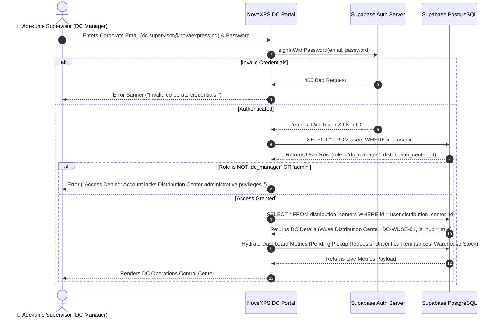

# 🔐 DC Workflow 01: Staff Authentication, Role Access Control & Hub Context Setup

This document details staff authentication, role access control verification, multi-DC hub selection, and dashboard metrics hydration for Distribution Center (DC) Managers, Warehouse Supervisors, and Finance Personnel.

---

## 🎯 Overview & Objectives

* **Primary Goal**: Securely authenticate Distribution Center personnel, verify administrative roles (`dc_manager`, `admin`), load hub operational scope (*Wuse DC*, *Ikeja DC*), and hydrate real-time warehouse control dashboards.
* **Primary Actors**: DC Supervisor (*Adekunle Supervisor*), NoveXPS Management Portal / DC Tablet App, Supabase Auth Service, Supabase Database.
* **Database Tables**: `users`, `distribution_centers`, `companies`.

---

## 📊 Detailed Workflow Diagram



---

## 📑 Step-by-Step Execution Sequence

### Step 1: Credentials Entry & Hub Scope Resolution
1. The DC Supervisor opens the NoveXPS Management Web Portal or DC Terminal App.
2. Inputs corporate credentials (`dc.supervisor@novaexpress.ng` + Password).
3. System authenticates via Supabase Auth.

### Step 2: Role & Permission Validation
1. PostgREST queries user metadata:
   ```sql
   SELECT id, email, first_name, last_name, role, company_id, distribution_center_id
   FROM users
   WHERE id = auth.uid();
   ```
2. The application verifies that `role IN ('dc_manager', 'admin')`. If a field delivery agent attempts to log in, access is denied.

### Step 3: Distribution Center Hub Hydration
1. The application resolves the supervisor’s primary warehouse hub:
   ```sql
   SELECT id, name, code, state, city, address, contact_phone, is_hub
   FROM distribution_centers
   WHERE id = user.distribution_center_id;
   ```
2. Sets global operational context to **Wuse Distribution Center (`DC-WUSE-01`)**.

### Step 4: Real-Time Dashboard Metrics Hydration
1. The portal issues parallel PostgREST queries to populate the DC Control Center:
   * **Pending Stock Requests**:
     ```sql
     SELECT COUNT(*) FROM stock_requests WHERE distribution_center_id = 'dc-wuse-uuid' AND status = 'pending';
     ```
   * **Pending Cash Remittances**:
     ```sql
     SELECT COUNT(*) FROM cash_remittances WHERE status = 'pending';
     ```
   * **Active Rider Fleet Status**:
     ```sql
     SELECT current_status, COUNT(*) FROM delivery_agents WHERE distribution_center_id = 'dc-wuse-uuid' GROUP BY current_status;
     ```
   * **Warehouse Stock Health**: Sum of `product_batches.current_quantity` grouped by `product_id`.

---

## 🛑 Security & Multi-Hub Access Control

| Scenario | System Enforcement |
|---|---|
| **Multi-Hub Manager Access** | Regional Operations Directors (`role = 'admin'`) have a Hub Switcher dropdown allowing seamless switching between *Wuse DC*, *Garki DC*, and *Ikeja DC*. |
| **Session Inactivity Timeout** | Sessions automatically lock after 30 minutes of inactivity to prevent unauthorized access at warehouse terminals. |
