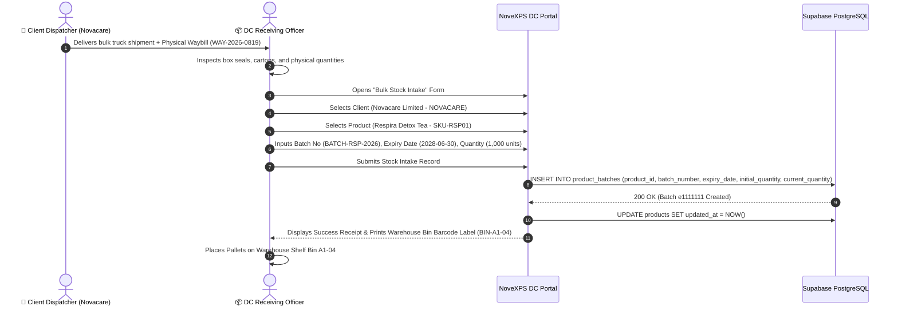

# 📦 DC Workflow 02: Bulk Stock Intake & Warehouse Batch Receiving

This document outlines the operational process for receiving bulk inventory shipments from corporate clients (e.g. *Novacare Limited*, *PharmaPlus*), waybill verification, batch creation, expiry date tracking, and warehouse bin storage.

---

## 🎯 Overview & Objectives

* **Primary Goal**: Accurately intake incoming bulk inventory pallets into Distribution Center warehouses, record manufacturer batch lot numbers and expiry dates, and increment warehouse stock balances.
* **Primary Actors**: DC Receiving Officer, Corporate Client Dispatcher (*Novacare Representative*), NoveXPS DC Portal, Supabase Database.
* **Database Tables**: `products`, `product_batches`, `clients`, `distribution_centers`.

---

## 📊 Detailed Workflow Diagram



---

## 📑 Step-by-Step Execution Sequence

### Step 1: Shipment Arrival & Physical Inspection
1. The Client Delivery Truck arrives at the Distribution Center loading dock.
2. The DC Receiving Officer receives the physical Waybill / Manifest (`WAY-2026-0819`).
3. Verifies container seals, carton damage, and package count against the waybill:
   * **Item 1**: 1,000 packs of *Respira Detox Tea* (Batch: `BATCH-RSP-2026`)
   * **Item 2**: 800 packs of *Grazer Herbal Tea* (Batch: `BATCH-GRZ-2026`)

### Step 2: Intake Form Entry on DC Portal
1. Receiving Officer opens **Bulk Stock Intake Page** on DC Portal.
2. Selects Client Account: `Novacare Limited` (`c1111111-1111-4111-8111-111111111111`).
3. Fills in product batch metadata:
   * **Product**: *Respira Detox Tea* (`SKU-RSP01`)
   * **Batch Number**: `BATCH-RSP-2026`
   * **Manufacture Date**: `2026-06-01`
   * **Expiry Date**: `2028-06-30`
   * **Quantity Received**: `1,000` units
   * **Warehouse Bin**: `BIN-A1-04`

### Step 3: Database Batch Creation
1. The portal executes an SQL INSERT:
   ```sql
   INSERT INTO product_batches (
       id,
       product_id,
       batch_number,
       manufacture_date,
       expiry_date,
       initial_quantity,
       current_quantity,
       created_at
   ) VALUES (
       gen_random_uuid(),
       'd1111111-1111-4111-8111-111111111111',
       'BATCH-RSP-2026',
       '2026-06-01',
       '2028-06-30',
       1000,
       1000,
       NOW()
   );
   ```
2. Product master record in `products` is updated.

### Step 4: Pallet Staging & Barcode Tagging
1. Portal generates a warehouse location barcode label (`BIN-A1-04`).
2. Receiving Officer prints and attaches barcode label to pallet stack.
3. Pallet is moved via forklift to Storage Rack Shelf `A1-04`.

---

## 🛑 Discrepancy Protocol

| Discrepancy | Handling Procedure |
|---|---|
| **Damaged Cartons on Arrival** | Receiving Officer logs damaged quantity (e.g. 15 damaged units). Initial batch quantity is set to 985 units, and a Damage Claim Form is generated for the client. |
| **Short Expiry Date (< 6 months)** | System triggers warning if `expiry_date` is less than 180 days. Requires special approval from Quality Control Director before intake. |
