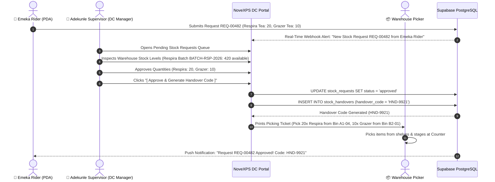

# 📋 DC Workflow 03: Rider Stock Request Review, Picking & Allocation

This document outlines the workflow for DC Supervisors reviewing incoming rider restock requests, warehouse batch lot selection, item picking, allocation approval, and Handover Code (`HND-9921`) generation.

---

## 🎯 Overview & Objectives

* **Primary Goal**: Rapidly process and fulfill rider inventory restock requests while maintaining FIFO (First-In, First-Out) batch lot picking and security handover verification.
* **Primary Actors**: DC Supervisor (*Adekunle Supervisor*), Warehouse Picker, Edge Function (`request-stock-transfer`), Supabase Database.
* **Database Tables**: `stock_requests`, `stock_request_items`, `product_batches`, `stock_handovers`.

---

## 📊 Detailed Workflow Diagram



---

## 📑 Step-by-Step Execution Sequence

### Step 1: Request Alert & Queue Inspection
1. When a rider submits a restock request, a real-time notification pops up on the DC Portal:
   * **Request ID**: `REQ-00482`
   * **Rider**: Emeka Rider (`PDA-7000`)
   * **Requested Items**: 20x *Respira Detox Tea*, 10x *Grazer Herbal Tea*.
2. The DC Supervisor clicks on the notification to open the **Request Detail Modal**.

### Step 2: Batch Inventory Verification & Allocation
1. The portal displays current warehouse stock for each requested SKU:
   * *Respira Detox Tea*: 420 units available (Batch: `BATCH-RSP-2026`, Exp: `2028-06-30`).
   * *Grazer Herbal Tea*: 310 units available (Batch: `BATCH-GRZ-2026`, Exp: `2028-08-31`).
2. System enforces **FIFO (First Expiry, First Out)** by pre-selecting the oldest unexpired batch lot.

### Step 3: Approval & Handover Code Generation
1. Supervisor confirms approved quantities (`approved_quantity = 20` and `10`).
2. Clicks **[ Approve & Generate Handover Code ]**.
3. Portal executes database updates:
   ```sql
   UPDATE stock_requests 
   SET status = 'approved', updated_at = NOW() 
   WHERE id = 'req-uuid-00482';

   INSERT INTO stock_handovers (
       id,
       stock_request_id,
       delivery_agent_id,
       dc_supervisor_id,
       handover_code,
       created_at
   ) VALUES (
       gen_random_uuid(),
       'req-uuid-00482',
       'agent-uuid-7000',
       auth.uid(),
       'HND-9921',
       NOW()
   );
   ```

### Step 4: Pick List Generation & Staging
1. System prints a Picking Ticket to the warehouse thermal printer:
   ```
   ========================================
   NOVEXPS DC PICK TICKET — REQ-00482
   Rider: Emeka Rider (PDA-7000)
   Handover Code: HND-9921
   ----------------------------------------
   [ ] 20x Respira Tea  --> BIN A1-04 (BATCH-RSP-2026)
   [ ] 10x Grazer Tea   --> BIN B2-01 (BATCH-GRZ-2026)
   ----------------------------------------
   Stage Location: Counter #2
   ========================================
   ```
2. Warehouse Picker retrieves physical stock boxes from bins and places them at **Dispatch Counter #2**.

---

## 🛑 Exception Handling

| Scenario | Resolution Procedure |
|---|---|
| **Partial Warehouse Stock** | If warehouse has only 12 units of *Respira Tea*, supervisor approves `approved_quantity = 12`. Rider PDA updates to `partially_approved`. |
| **Rider Cancellation** | If rider cancels request before pickup, supervisor taps **[ Cancel Request ]**, releasing reserved pick allocations. |
