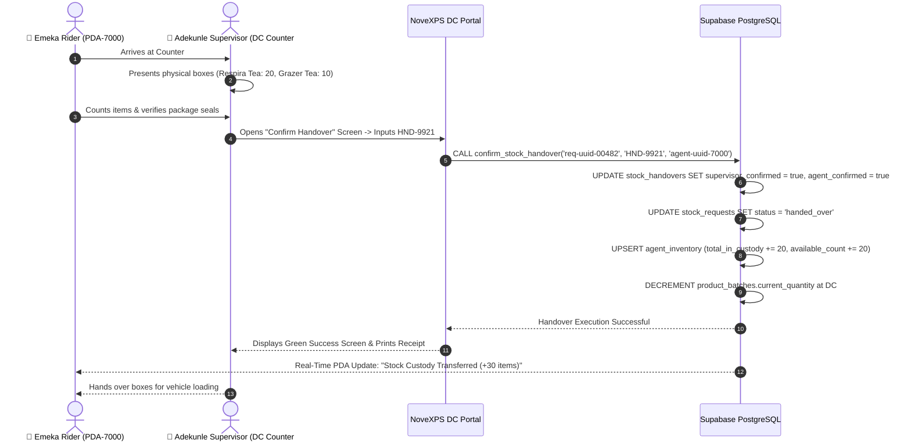

# 🤝 DC Workflow 04: Physical Stock Handover & Verification

This document details the dual-verification physical stock handover procedure at DC dispatch counters, QR/PIN validation, atomic custody transfer, and inventory database updates.

---

## 🎯 Overview & Objectives

* **Primary Goal**: Execute physical handover of picked inventory from DC warehouse custody to field delivery agent custody, ensuring 100% agreement on item counts and zero unrecorded inventory movement.
* **Primary Actors**: DC Supervisor (*Adekunle Supervisor*), Delivery Agent (*Emeka Rider*), NoveXPS DC Portal, PostgreSQL Stored Procedure (`confirm_stock_handover`).
* **Database Tables**: `agent_inventory`, `stock_handovers`, `stock_requests`, `product_batches`.

---

## 📊 Detailed Workflow Diagram



---

## 📑 Step-by-Step Execution Sequence

### Step 1: Counter Verification & Item Inspection
1. Rider presents Handover Security Code `HND-9921` on PDA screen at **Dispatch Counter #2**.
2. Supervisor locates staged boxes:
   * **Box 1**: 20 units of *Respira Detox Tea* (Batch `BATCH-RSP-2026`).
   * **Box 2**: 10 units of *Grazer Herbal Tea* (Batch `BATCH-GRZ-2026`).
3. Rider and Supervisor perform a joint physical count and inspect box tamper seals.

### Step 2: Handover Confirmation Input
1. Supervisor enters `HND-9921` into the **Handover Verification Screen** on the DC Portal (or scans rider’s PDA screen QR code).
2. Taps **[ Confirm Physical Handover ]**.

### Step 3: Atomic Stored Procedure Execution
1. System executes stored procedure `confirm_stock_handover`:
   ```sql
   SELECT confirm_stock_handover(
       p_request_id := 'req-uuid-00482',
       p_handover_code := 'HND-9921',
       p_agent_id := 'agent-uuid-7000'
   );
   ```
2. Database atomic changes:
   * `stock_handovers`: `supervisor_confirmed = true`, `agent_confirmed = true`, `confirmed_at = NOW()`.
   * `stock_requests.status` updated to `'handed_over'`.
   * `agent_inventory`: `total_in_custody` and `available_count` incremented for rider.
   * `product_batches.current_quantity`: decremented at DC warehouse.

### Step 4: Loading & Dispatch
1. Portal displays green checkmark confirmation.
2. Rider’s PDA vehicle stock grazer updates immediately via WebSocket CDC.
3. Rider loads boxes into motorcycle cargo box and departs for delivery route.

---

## 🛑 Discrepancy Protocol

| Scenario | Action Required |
|---|---|
| **Damaged Pack Found at Counter** | Supervisor removes damaged pack, edits handover quantity on portal from 20 to 19 before code validation. Database updates custody for 19 units. |
| **Code Mismatch / Invalid PIN** | Portal displays red error banner. Supervisor re-checks active request queue to ensure correct code entry. |
