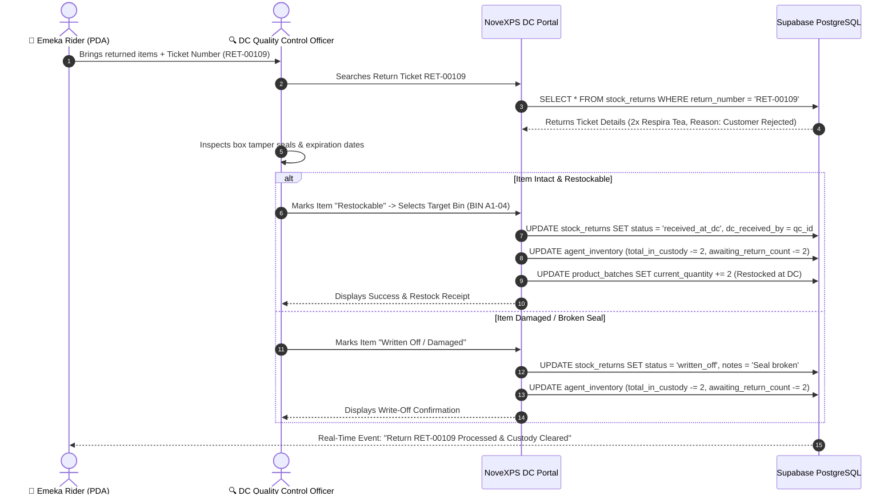

# 🔄 DC Workflow 05: Customer Returns & Damaged Goods Processing

This document outlines the workflow for receiving returned items from delivery riders, quality control inspection, restockable vs damaged classification, rider custody clearance, and warehouse inventory adjustment.

---

## 🎯 Overview & Objectives

* **Primary Goal**: Process returned customer items efficiently, inspect package seals for quality assurance, restock sound inventory back into DC warehouse bins, and write off damaged goods while clearing rider return custody balances.
* **Primary Actors**: DC Quality Control Officer, Delivery Agent (*Emeka Rider*), NoveXPS DC Portal, Supabase PostgreSQL Database.
* **Database Tables**: `stock_returns`, `agent_inventory`, `product_batches`, `inventory_audits`.

---

## 📊 Detailed Workflow Diagram



---

## 📑 Step-by-Step Execution Sequence

### Step 1: Return Ticket Reception
1. Rider arrives at DC Quality Control Counter at end of shift/route.
2. Presents returned items and Return Ticket `RET-00109` (generated on PDA when delivery failed).
3. QC Officer searches ticket number `RET-00109` on the DC Portal.

### Step 2: Quality Inspection & Grading
1. QC Officer examines returned product packages:
   * **Visual Check**: Outer box condition, tamper-evident seals.
   * **Expiration Check**: Expiry date vs current date.
2. Grades the item:
   * **Grade A (Restockable)**: Seal unbroken, box clean $\rightarrow$ Target: DC Storage Bin `A1-04`.
   * **Grade B (Damaged / Written-Off)**: Seal broken, crushed box $\rightarrow$ Target: Quarantine Scrap Bin.

### Step 3: Database Execution & Rider Custody Clearance
1. QC Officer submits inspection results on portal.
2. Portal executes database updates:
   ```sql
   UPDATE stock_returns
   SET status = 'received_at_dc',
       dc_received_by = auth.uid(),
       received_at = NOW()
   WHERE return_number = 'RET-00109';

   -- Clear Rider Custody
   UPDATE agent_inventory
   SET total_in_custody = total_in_custody - 2,
       awaiting_return_count = awaiting_return_count - 2,
       updated_at = NOW()
   WHERE delivery_agent_id = 'agent-uuid-7000'
     AND product_id = 'product-uuid-respira';

   -- Increment DC Warehouse Batch (If Restockable)
   UPDATE product_batches
   SET current_quantity = current_quantity + 2
   WHERE id = 'batch-uuid-rsp';
   ```

### Step 4: Restocking & Notification
1. Restockable items are returned to Shelf Bin `A1-04`.
2. Rider receives push notification: *"Return RET-00109 verified. Awaiting Return custody cleared."*

---

## 🛑 Return Classification Matrix

| Inspection Result | System Action | Inventory Impact |
|---|---|---|
| **Intact / Unopened** | Mark `status = 'received_at_dc'` | Restocked to `product_batches.current_quantity` at DC. Rider `awaiting_return_count` cleared. |
| **Damaged by Transport** | Mark `status = 'written_off'` | Logged to Damage Expense Ledger. Rider `awaiting_return_count` cleared. |
| **Missing Item (Discrepancy)** | Mark `status = 'discrepancy_flagged'` | Rider flagged for inventory audit investigation. |
