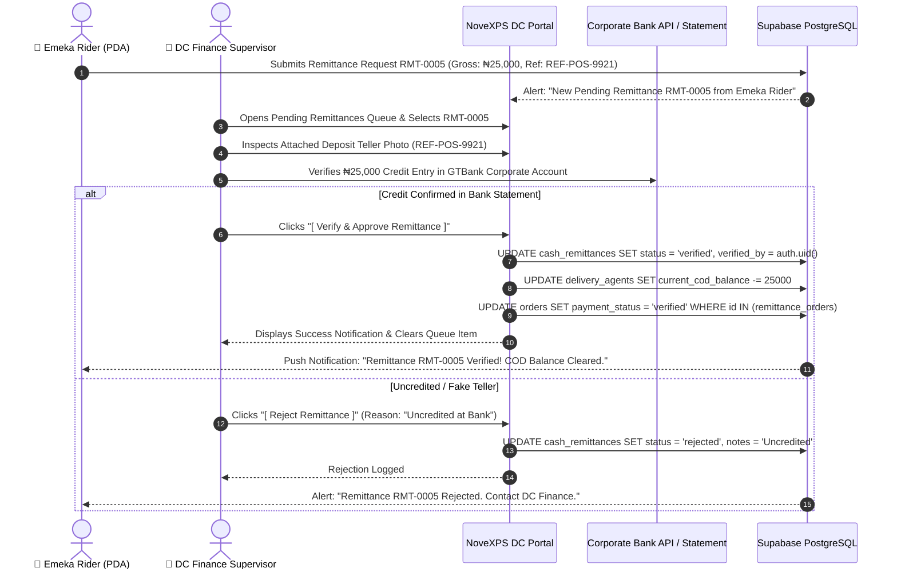

# 💵 DC Workflow 06: Cash & Remittance Reconciliation

This document outlines the workflow for DC Finance Supervisors reviewing rider remittance tickets (`cash_remittances`), verifying bank deposit tellers / POS receipts against corporate bank statements, approving deposits, and clearing rider COD custody balances.

---

## 🎯 Overview & Objectives

* **Primary Goal**: Ensure strict financial auditing and rapid reconciliation of physical COD cash collections, matching bank deposits to corporate statements, and clearing rider physical cash custody balances.
* **Primary Actors**: DC Finance Supervisor, Delivery Agent (*Emeka Rider*), Treasury Officer, Supabase PostgreSQL Database.
* **Database Tables**: `cash_remittances`, `remittance_orders`, `delivery_agents`, `orders`.

---

## 📊 Detailed Workflow Diagram



---

## 📑 Step-by-Step Execution Sequence

### Step 1: Remittance Queue Inspection
1. The DC Finance Supervisor logs into the DC Portal and opens **Pending Remittances Queue**.
2. Selects remittance ticket `RMT-0005`:
   * **Rider**: Emeka Rider (`PDA-7000`)
   * **Gross Cash Collections**: `₦25,000.00`
   * **Payment Channel**: `bank_transfer`
   * **Transaction Reference**: `REF-POS-9921`
   * **Linked Orders**: `TRK-8924` (₦15,000), `TRK-8925` (₦10,000).

### Step 2: Bank Statement Matching & Image Inspection
1. Finance Supervisor opens the high-resolution deposit receipt photo uploaded by the rider.
2. Cross-checks reference `REF-POS-9921` and deposit timestamp against the **GTBank / Monnify Corporate Bank Statement Feed**.
3. Confirms that `₦25,000.00` has landed in the corporate bank account.

### Step 3: Approval Execution & Database Updates
1. Supervisor clicks **[ Verify & Approve Remittance ]**.
2. Database executes atomic updates:
   ```sql
   UPDATE cash_remittances
   SET status = 'verified',
       verified_by = auth.uid(),
       verified_at = NOW()
   WHERE remittance_number = 'RMT-0005';

   -- Clear Rider COD Cash Custody Balance
   UPDATE delivery_agents
   SET current_cod_balance = current_cod_balance - 25000.00,
       last_sync_at = NOW()
   WHERE id = 'agent-uuid-7000';

   -- Update Order Payment Status
   UPDATE orders
   SET payment_status = 'verified',
       updated_at = NOW()
   WHERE id IN (
       SELECT order_id 
       FROM remittance_orders 
       WHERE cash_remittance_id = 'rem-uuid-0005'
   );
   ```

### Step 4: Notification & Balance Hydration
1. Real-time WebSocket event notifies Rider PDA.
2. Rider’s **COD Balance Hero Card** decrements by `₦25,000.00`, turning status badge green.

---

## 🛑 Reconciliation Exception Handling

| Discrepancy | Operational & System Resolution |
|---|---|
| **Shortfall in Deposit** | If bank received ₦24,000 instead of ₦25,000, supervisor approves partial remittance of ₦24,000. Remaining ₦1,000 stays in rider `current_cod_balance`. |
| **Uncredited POS Transaction** | Status set to `rejected` with note *"POS transaction pending bank settlement"*. Ticket re-reviewed after 24 hours. |
