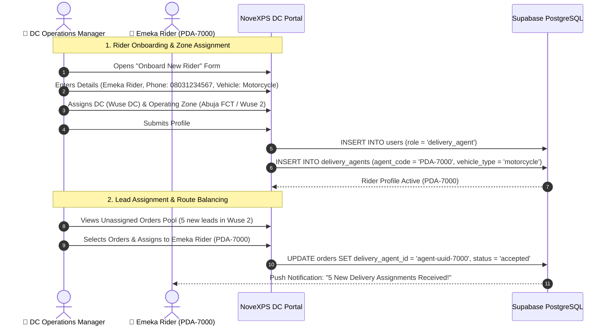

# 🛵 DC Workflow 07: Rider Fleet Management, Zone & Order Assignments

This document outlines the workflow for onboarding delivery riders, vehicle registration, operating zone configuration, live fleet monitoring, and order lead assignment/reassignment.

---

## 🎯 Overview & Objectives

* **Primary Goal**: Manage field delivery agents efficiently, configure operating state/city zones, monitor real-time rider status (`available`, `on_delivery`, `offline`), and optimize order lead distribution.
* **Primary Actors**: DC Operations Manager (*Adekunle Supervisor*), Field Delivery Agent (*Emeka Rider*), NoveXPS DC Portal, Supabase Database.
* **Database Tables**: `delivery_agents`, `users`, `orders`, `distribution_centers`.

---

## 📊 Detailed Workflow Diagram

---

## 📑 Step-by-Step Execution Sequence

### Step 1: Delivery Agent Onboarding & Profile Registration
1. The DC Operations Manager opens **Rider Fleet Management Page** on the DC Portal.
2. Clicks **[ + Onboard New Delivery Agent ]**.
3. Inputs rider credentials and vehicle parameters:
   * **Name**: Emeka Rider
   * **Phone**: `08031234567`
   * **Email**: `emeka.rider@novaexpress.ng`
   * **Assigned DC**: `Wuse Distribution Center`
   * **Operating State**: `Abuja (FCT)`
   * **Operating City / Zone**: `Wuse 2`
   * **Vehicle Type**: `motorcycle` (Options: `motorcycle`, `van`, `bicycle`)
   * **Vehicle Plate Number**: `ABC-123-XY`
   * **Bank Account Details**: Zenith Bank • `0123456789`
4. Portal inserts rows into `users` and `delivery_agents`, generating unique agent code `PDA-7000`.

### Step 2: Live Fleet Status Monitoring
1. DC Control Center displays a live map and status board of all assigned riders:
   * 🟢 **Available** (8 Riders): Ready at DC for stock pickup or dispatch.
   * 🟡 **On Delivery** (12 Riders): Currently executing field delivery routes.
   * 🟠 **Break** (2 Riders): On lunch/maintenance break.
   * 🔴 **Offline** (3 Riders): Off shift.

### Step 3: Lead Allocation & Order Reassignment
1. When new client delivery orders arrive, the DC Portal suggests optimal rider assignment based on operating zone (`delivery_city = 'Wuse 2'`).
2. Operations Manager selects orders `TRK-8924`, `TRK-8925` and assigns them to `Emeka Rider (PDA-7000)`.
3. Database updates `orders.delivery_agent_id` and sets `status = 'accepted'`.
4. Rider receives instant push notification on PDA.

---

## 🛑 Fleet Reassignment & Overflow Rules

| Scenario | Resolution Protocol |
|---|---|
| **Rider Vehicle Breakdown** | Manager opens rider’s active orders, selects **[ Mass Reassign ]**, and transfers orders + vehicle stock custody to a backup rider in the same zone. |
| **Zone Overflow (> 50 Orders)** | Manager temporarily expands operating city boundary or routes excess orders to adjacent DC hub (*Garki DC*). |
