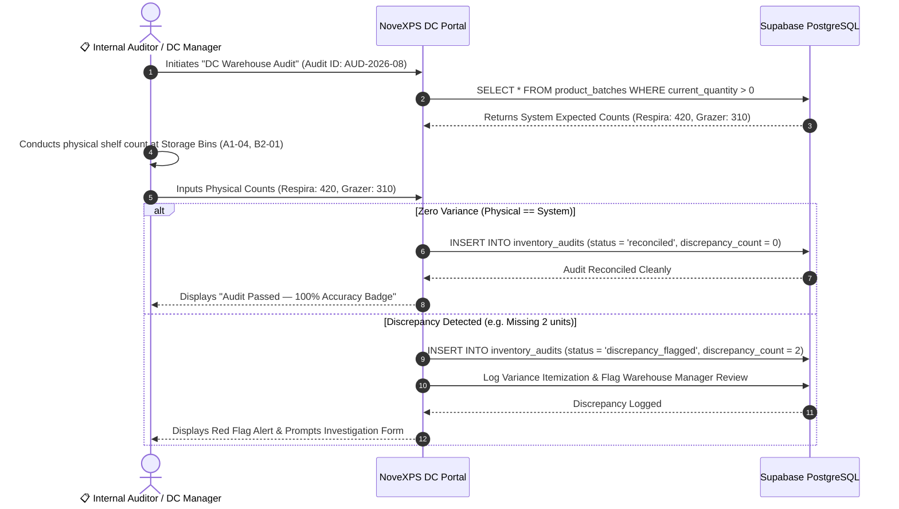

# 📋 DC Workflow 08: Warehouse Inventory Audit & Stock Reconciliation

This document details the operational workflow for conducting periodic physical warehouse inventory audits, batch expiry monitoring, variance calculation, discrepancy reporting, and stock adjustment ledger logging.

---

## 🎯 Overview & Objectives

* **Primary Goal**: Maintain 100% data integrity between physical warehouse stock and system database records, detect stock shrinkage or damage early, and enforce strict warehouse inventory auditing.
* **Primary Actors**: DC Warehouse Manager (*Adekunle Supervisor*), Internal Audit Team, NoveXPS DC Portal, Supabase Database.
* **Database Tables**: `inventory_audits`, `product_batches`, `products`, `agent_inventory`.

---

## 📊 Detailed Workflow Diagram



---

## 📑 Step-by-Step Execution Sequence

### Step 1: Audit Initiation & Freeze Notice
1. The DC Warehouse Manager initiates a scheduled or surprise physical audit on the DC Portal (**Audit ID: AUD-2026-08**).
2. During the active audit window, stock intakes and outward handovers for the selected bins are temporarily locked.

### Step 2: Physical Shelf Counting
1. Audit Team moves shelf-by-shelf through the warehouse:
   * **Bin A1-04**: *Respira Detox Tea* (Batch `BATCH-RSP-2026`) $\rightarrow$ System Expected: `420` units.
   * **Bin B2-01**: *Grazer Herbal Tea* (Batch `BATCH-GRZ-2026`) $\rightarrow$ System Expected: `310` units.
2. Auditors enter actual physical counted quantities into the tablet audit interface.

### Step 3: Variance Calculation & Submission
1. System calculates variance for each SKU:
   $$\text{Variance} = \text{Physical Count} - \text{System Expected Count}$$
2. If Variance $= 0$, audit status is set to `'reconciled'`.
3. If Variance $\neq 0$, audit status is set to `'discrepancy_flagged'`.
4. Submission logs record in `inventory_audits`:
   ```sql
   INSERT INTO inventory_audits (
       id,
       audit_number,
       distribution_center_id,
       audited_by,
       status,
       total_physical_counted,
       total_system_expected,
       discrepancy_count,
       discrepancy_notes,
       created_at
   ) VALUES (
       gen_random_uuid(),
       'AUD-2026-08',
       'dc-wuse-uuid',
       auth.uid(),
       'reconciled',
       730,
       730,
       0,
       'End-of-month physical warehouse count completed with 100% accuracy.',
       NOW()
   );
   ```

---

## 🛑 Discrepancy Investigation Protocol

| Discrepancy Range | Action Protocol |
|---|---|
| **Minor Variance ($\le 3$ units)** | Investigated by DC Warehouse Supervisor. If unrecovered after 48h, written off as warehouse handling loss. |
| **Major Variance ($> 3$ units)** | Escalated immediately to Operations Director & Internal Audit. Triggers security camera review at picking counters. |
