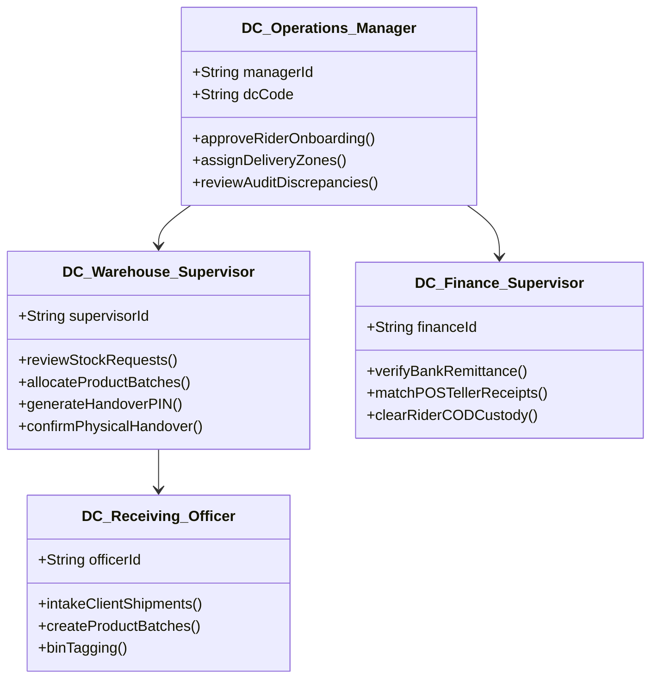

# 🏭 NoveXPS Distribution Center (DC) Complete Operational Workflow Guide & Sitemap

Welcome to the **NovaExpress Logistics Management System (NoveXPS) Distribution Center (DC) Operational Workflow Guide**. This document details all warehouse management, bulk receiving, rider inventory allocation, cash/remittance audit, customer return processing, and fleet management activities taking place at Distribution Centers.

---

## 🗺️ Master DC Workflow Architecture Overview

```mermaid
graph TD
    A[1. DC Staff Auth & Access Control] --> B[2. Bulk Stock Intake & Warehouse Receiving]
    B --> C[3. Stock Request Review, Picking & Allocation]
    C --> D[4. Physical Stock Handover to Rider]
    D --> E[5. Field Operations Execution (PDA)]
    E -->|Returned Goods| F[6. Customer Returns & Damaged Goods Processing]
    E -->|Cash/POS Deposit| G[7. Cash & Remittance Reconciliation]
    F -->|Restocked Bins| B
    G -->|Cleared Custody| H[8. Rider Fleet & Zone Assignments]
    subgraph Warehouse Governance
        I[9. DC Warehouse Stock Audit & Reconciliation]
    end
    B -. Audit .-> I
    C -. Audit .-> I
    F -. Audit .-> I
```

---

## 📑 Workflow Guide Index

| # | Workflow Module | Description | Primary Actors | Documentation Link |
|:---:|---|---|---|---|
| **01** | **DC Staff Auth & Access Control** | Staff login, role verification (`dc_manager`), hub selection (*Wuse DC*, *Ikeja DC*), and dashboard hydration. | DC Manager, DC Supervisor, Supabase Auth | [01_DC_AUTH_AND_ROLE_ACCESS_WORKFLOW.md](file:///c:/PROJECT/NoveXPS/DOCUMENTATION/DC/WORKFLOW/01_DC_AUTH_AND_ROLE_ACCESS_WORKFLOW.md) |
| **02** | **Bulk Stock Intake & Warehouse Receiving** | Receiving bulk shipments/pallets from clients (*Novacare*, *PharmaPlus*), waybill verification, batch creation, and bin tagging. | DC Receiving Officer, Client Dispatcher, PostgreSQL DB | [02_BULK_STOCK_INTAKE_AND_WAREHOUSE_RECEIVING_WORKFLOW.md](file:///c:/PROJECT/NoveXPS/DOCUMENTATION/DC/WORKFLOW/02_BULK_STOCK_INTAKE_AND_WAREHOUSE_RECEIVING_WORKFLOW.md) |
| **03** | **Stock Request Review, Picking & Allocation** | Reviewing rider restock requests (`stock_requests`), warehouse batch picking, quantity approval, and Handover Code (`HND-9921`) generation. | DC Supervisor, Edge Function (`request-stock-transfer`) | [03_STOCK_REQUEST_REVIEW_AND_PICKING_WORKFLOW.md](file:///c:/PROJECT/NoveXPS/DOCUMENTATION/DC/WORKFLOW/03_STOCK_REQUEST_REVIEW_AND_PICKING_WORKFLOW.md) |
| **04** | **Physical Stock Handover & Verification** | Counter QR scan / Handover PIN entry (`confirm_stock_handover`), physical box counting, and atomic inventory custody transfer. | DC Supervisor, Delivery Agent (Rider) | [04_PHYSICAL_STOCK_HANDOVER_AND_VERIFICATION_WORKFLOW.md](file:///c:/PROJECT/NoveXPS/DOCUMENTATION/DC/WORKFLOW/04_PHYSICAL_STOCK_HANDOVER_AND_VERIFICATION_WORKFLOW.md) |
| **05** | **Customer Returns & Damaged Goods Processing** | Receiving rider return tickets (`stock_returns`), physical seal inspection, restockable classification vs write-offs. | DC Quality Control, Rider | [05_CUSTOMER_RETURNS_AND_DAMAGED_GOODS_WORKFLOW.md](file:///c:/PROJECT/NoveXPS/DOCUMENTATION/DC/WORKFLOW/05_CUSTOMER_RETURNS_AND_DAMAGED_GOODS_WORKFLOW.md) |
| **06** | **Cash & Remittance Reconciliation** | Bank teller/POS receipt verification (`REF-POS-9921`), corporate account credit matching, clearing rider COD custody balances. | DC Finance Supervisor, Treasury | [06_CASH_AND_REMITTANCE_RECONCILIATION_WORKFLOW.md](file:///c:/PROJECT/NoveXPS/DOCUMENTATION/DC/WORKFLOW/06_CASH_AND_REMITTANCE_RECONCILIATION_WORKFLOW.md) |
| **07** | **Rider Fleet & Zone Assignments** | Rider onboarding, vehicle type registration, route/zone lead assignment, and active status tracking. | DC Operations Manager, Field Riders | [07_RIDER_FLEET_MANAGEMENT_AND_ASSIGNMENTS_WORKFLOW.md](file:///c:/PROJECT/NoveXPS/DOCUMENTATION/DC/WORKFLOW/07_RIDER_FLEET_MANAGEMENT_AND_ASSIGNMENTS_WORKFLOW.md) |
| **08** | **DC Warehouse Stock Audit & Reconciliation** | Physical warehouse count vs system expected count, batch expiration monitoring, variance logging, and audit reports. | DC Warehouse Manager, Internal Audit | [08_DC_WAREHOUSE_STOCK_AUDIT_WORKFLOW.md](file:///c:/PROJECT/NoveXPS/DOCUMENTATION/DC/WORKFLOW/08_DC_WAREHOUSE_STOCK_AUDIT_WORKFLOW.md) |
| **09** | **DC Admin Console Screen Specification Guide** | Complete UI/UX, responsive breakpoint rules, brand palette tokens, tab-by-tab deep-dive, and database entity integration map. | All DC Personas, UI/UX Engineers | [DC_CONSOLE_SCREENS_SPECIFICATION_GUIDE.md](file:///c:/PROJECT/NoveXPS/DOCUMENTATION/DC/DC_CONSOLE_SCREENS_SPECIFICATION_GUIDE.md) |

---

## 🏛️ DC Operational Hierarchy & Role Responsibilities


