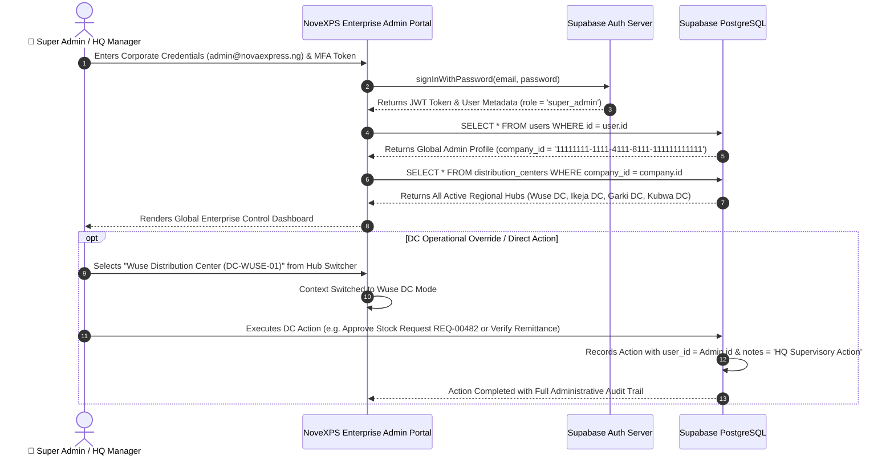

# 🔐 HQ Workflow 01: Headquarters Authentication, Cascading Access Control & DC Hub Switcher

This document details the authentication and authorization mechanism for Super Administrators and Headquarters (HQ) Personnel, the cascading administrative hierarchy, supervisory override capabilities, and the Multi-DC Hub Switcher.

---

## 🎯 Overview & Objectives

* **Primary Goal**: Provide secure enterprise-level access for executive leadership, national operations managers, and treasury officers, enabling global oversight while granting full supervisory authority to perform or override any regional Distribution Center (DC) operation.
* **Primary Actors**: Super Administrator, HQ Operations Director, Supabase Auth Service, PostgreSQL RLS Engine.
* **Database Tables**: `users`, `distribution_centers`, `companies`, `order_activities`.

---

## 📊 Detailed Workflow Diagram



---

## 📑 Step-by-Step Execution Sequence

### Step 1: Corporate MFA Authentication
1. The Super Admin or HQ Manager accesses the **NoveXPS Enterprise Admin Portal**.
2. Enters corporate credentials (`admin@novaexpress.ng` + Password) and 6-digit Time-Based One-Time Password (TOTP MFA).
3. Supabase Auth validates credentials and generates an access token with global administrative claims.

### Step 2: Global Authority Scope Hydration
1. Portal queries corporate tenant scope:
   ```sql
   SELECT u.id, u.email, u.first_name, u.last_name, u.role, c.id AS company_id, c.name AS company_name
   FROM users u
   JOIN companies c ON u.company_id = c.id
   WHERE u.id = auth.uid() 
     AND u.role IN ('super_admin', 'admin', 'hq_manager', 'hq_finance');
   ```
2. Portal hydrates national enterprise metrics across all regional hubs.

### Step 3: Multi-DC Hub Switcher (DC Action Execution)
1. Super Admin and HQ staff have access to the **Hub Switcher Dropdown** in the top navigation bar.
2. When an HQ officer needs to step in and perform an operational task at a specific regional DC:
   * Selects **Wuse Distribution Center (`DC-WUSE-01`)**.
   * The portal interface instantly transforms into the **Wuse DC Control View**.
   * The HQ officer can perform **any DC activity directly**, including:
     - Reviewing and approving rider restock requests (`stock_requests`).
     - Conducting bulk warehouse stock intake (`product_batches`).
     - Verifying and approving cash remittances (`cash_remittances`).
     - Reassigning unassigned or callback order leads to riders.
     - Conducting or signing off on warehouse stock audits (`inventory_audits`).

### Step 4: Immutable Supervisory Audit Logging
1. Whenever a Super Admin or HQ user performs an action in a DC hub context, the system writes an audit event:
   ```sql
   INSERT INTO order_activities (
       id,
       order_id,
       user_id,
       activity_type,
       notes,
       created_at
   ) VALUES (
       gen_random_uuid(),
       'order-uuid-8924',
       auth.uid(),
       'hq_supervisory_override',
       'Order reassigned by HQ Operations Director via DC Hub Switcher.',
       NOW()
   );
   ```

---

## 🛑 Authority & Permission Matrix

| Role | Scope | DC Operations Access | Financial Rate Governance | Payout Disbursement Approval |
|---|---|:---:|:---:|:---:|
| **`super_admin`** | Global Platform | **Full Authority** (All DCs) | **Full Authority** | **Full Authority** |
| **`hq_manager`** | Enterprise Operations | **Full Authority** (All DCs) | Read-Only | Read-Only |
| **`hq_finance`** | Central Treasury | **Full Financial** (All DCs) | Propose Updates | **Full Authority** |
| **`dc_manager`** | Assigned Regional DC | Assigned DC Only | None (Read-Only) | DC Review Only |
| **`delivery_agent`** | Field PDA Vehicle | None | None | Request Withdrawal |
