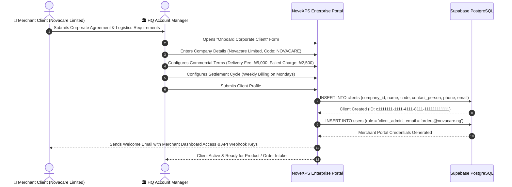

# 🤝 HQ Workflow 02: Merchant Client Onboarding, Service Contracts & Billing SLA Management

This document details the operational workflow for onboarding corporate merchant clients (e.g. *Novacare Limited*, *PharmaPlus*), configuring delivery fee SLAs, defining failed delivery charge policies, and establishing automated billing schedules.

---

## 🎯 Overview & Objectives

* **Primary Goal**: Seamlessly onboard corporate merchant clients, establish contractual fulfillment agreements (BR-001, BR-006, BR-007), configure client delivery fees and failed attempt charges, and provide merchant portal visibility.
* **Primary Actors**: HQ Account Executive, Corporate Merchant Representative, HQ Billing Officer, Supabase Database.
* **Database Tables**: `clients`, `companies`, `orders`, `client_packages`, `products`.

---

## 📊 Detailed Workflow Diagram



---

## 📑 Step-by-Step Execution Sequence

### Step 1: Merchant Account Creation
1. HQ Account Manager opens **Corporate Clients Management Page** on the Enterprise Portal.
2. Clicks **[ + Onboard New Client ]**.
3. Inputs client commercial parameters:
   * **Company Name**: `Novacare Limited`
   * **Client Code**: `NOVACARE` (Unique identifier for tracking numbers e.g. `PKG-NOV-XXXX`)
   * **Contact Person**: `Dr. Kalu Okonkwo`
   * **Official Phone**: `+2348039998877`
   * **Official Email**: `orders@novacare.ng`
   * **Billing Address**: `Plot 44 Victoria Island, Lagos / Wuse 2, Abuja`

### Step 2: Commercial Terms & SLA Rule Configuration
1. System sets delivery compensation and charge rules in adherence to **BR-001, BR-006, and BR-007**:
   * **Successful Delivery Fee (BR-006)**: `₦5,000.00` per completed order.
   * **Failed Delivery Attempt Fee (BR-007)**: `₦2,500.00` (50% charge to cover rider transport allowance and DC handling if customer rejected order).
   * **Billing Cycle**: `Weekly` (Every Monday automated statement generation).
   * **Fulfillment Capabilities**: `distributed_inventory` (Bulk storage in DCs) & `client_package` (Pre-packaged parcel dispatch).

### Step 3: Database Registration
1. System executes SQL insertion:
   ```sql
   INSERT INTO clients (
       id,
       company_id,
       name,
       code,
       contact_person,
       phone,
       email,
       created_at
   ) VALUES (
       'c1111111-1111-4111-8111-111111111111',
       '11111111-1111-4111-8111-111111111111',
       'Novacare Limited',
       'NOVACARE',
       'Dr. Kalu Okonkwo',
       '+2348039998877',
       'orders@novacare.ng',
       NOW()
   );
   ```

### Step 4: Merchant Portal Provisioning
1. System provisions a client dashboard user account with `role = 'client_admin'`.
2. Merchant gains access to the **NovaExpress Merchant Portal** allowing them to:
   * Upload order manifests via CSV/Excel or REST API webhook.
   * Track real-time delivery status of orders (`In Transit`, `Delivered`, `Failed`).
   * View live distributed stock balances across all regional DCs (*Wuse DC*, *Ikeja DC*).
   * Download weekly billing invoices and COD remittance settlement statements.

---

## 🛑 Client Governance & SLA Rules

| Rule / Condition | System Enforcement |
|---|---|
| **Client Ownership (BR-001)** | Every order and product SKU in the database MUST link to a valid `client_id`. |
| **Failed Delivery Charge (BR-007)** | When an order transitions to `failed`, the billing engine automatically generates a client ledger charge according to the client's contractual agreement. |
| **Credit Limit Suspension** | If an invoicing client has overdue unpaid delivery fees exceeding ₦500,000, new order intakes are temporarily paused until billing settlement. |
