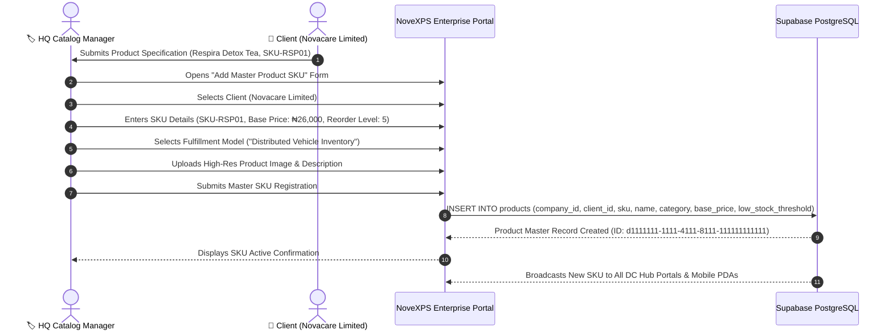

# 🏷️ HQ Workflow 03: Enterprise Master Product Catalog & SKU Management

This document details the configuration of master product SKUs, client catalog associations, pricing governance, inventory classification (distributed inventory vs pre-packaged), and automated threshold triggers.

---

## 🎯 Overview & Objectives

* **Primary Goal**: Maintain an enterprise-grade master catalog of all physical products distributed across the NovaExpress network, linking each SKU to its merchant owner (BR-001), configuring pricing, and defining vehicle distribution rules.
* **Primary Actors**: HQ Product Catalog Manager, Merchant Account Representative, Supabase Database.
* **Database Tables**: `products`, `clients`, `companies`, `product_batches`, `agent_inventory`.

---

## 📊 Detailed Workflow Diagram



---

## 📑 Step-by-Step Execution Sequence

### Step 1: SKU Definition & Commercial Parameters
1. The HQ Product Catalog Manager opens the **Master Product Catalog** on the Enterprise Portal.
2. Clicks **[ + Register Master SKU ]**.
3. Enters product master parameters:
   * **Merchant Client**: `Novacare Limited` (`c1111111-1111-4111-8111-111111111111`)
   * **SKU Code**: `SKU-RSP01`
   * **Product Name**: `Respira Detox Tea`
   * **Category**: `Herbal Detox` (Options: `Herbal Detox`, `Digestive Care`, `Mens Wellness`, `Immunity & Wellness`)
   * **Base Selling Price**: `₦26,000.00`
   * **Standard Delivery Fee**: `₦5,000.00`
   * **Low Stock Warning Threshold**: `5 units` (Triggers PDA & DC warnings when local stock drops below this count)
   * **DC Reorder Level**: `5 units`

### Step 2: Fulfillment Model Selection
1. The Catalog Manager defines how this product is handled across the network:
   * **Option A — Distributed Inventory (Default)**: Stored in bulk at DCs, allocated into rider vehicles, and fulfilled instantly from vehicle cargo upon order assignment.
   * **Option B — Client Pre-Package**: Pre-packaged by merchant; picked and delivered on a per-tracking-number basis.

### Step 3: Database Insertion & Sync
1. The portal executes an SQL INSERT:
   ```sql
   INSERT INTO products (
       id,
       company_id,
       client_id,
       sku,
       name,
       category,
       description,
       base_price,
       reorder_level,
       low_stock_threshold,
       is_active,
       created_at,
       updated_at
   ) VALUES (
       'd1111111-1111-4111-8111-111111111111',
       '11111111-1111-4111-8111-111111111111',
       'c1111111-1111-4111-8111-111111111111',
       'SKU-RSP01',
       'Respira Detox Tea',
       'Herbal Detox',
       'Organic herbal detox blend formulated for respiratory purification and digestive health.',
       26000.00,
       5,
       5,
       true,
       NOW(),
       NOW()
   );
   ```

### Step 4: Real-time Propagation to DCs & PDAs
1. The new SKU is immediately visible in:
   * **DC Receiving Screens**: Available for bulk intake batch creation.
   * **PDA Order & Upsell Screens**: Available for riders to add on-site upsells.
   * **Merchant Portal**: Visible to Novacare for order dispatch creation.

---

## 🛑 Master Catalog Governance Rules

| Rule | System Constraint |
|---|---|
| **Unique SKU Enforcement** | SKU codes must be unique across the tenant company (`sku UNIQUE NOT NULL`). |
| **Active Batch Dependency** | An active product SKU cannot be deleted if active batches or vehicle stock exist in `product_batches` or `agent_inventory`. |
