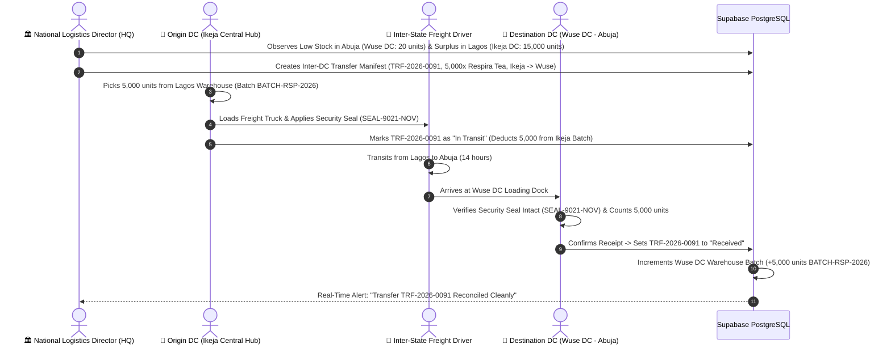

# 🚚 HQ Workflow 04: National Inventory Balancing & Inter-DC Bulk Freight Transfers

This document details the operational workflow for national inventory monitoring, regional stock replenishment planning, creating inter-DC freight transfer manifests, transit seal tracking, and destination DC receiving confirmation.

---

## 🎯 Overview & Objectives

* **Primary Goal**: Maintain balanced inventory levels across all regional distribution centers, prevent regional stockouts by transferring bulk inventory between DC hubs (e.g. from Central Lagos Hub to Abuja DCs), and enforce chain-of-custody security with tamper-evident freight seals.
* **Primary Actors**: National Logistics Director (HQ), Origin DC Supervisor (*Ikeja DC*), Freight Truck Driver, Destination DC Supervisor (*Wuse DC*), Supabase Database.
* **Database Tables**: `distribution_centers`, `product_batches`, `products`, `inventory_audits`.

---

## 📊 Detailed Workflow Diagram



---

## 📑 Step-by-Step Execution Sequence

### Step 1: Regional Demand Analytics & Transfer Creation
1. National Logistics Director views the **National Stock Heatmap** on the Enterprise Portal.
2. Identifies a stock deficit in Abuja (Wuse DC available stock $\le 50$ units) and surplus in Lagos Central Hub (15,000 units).
3. Initiates **Inter-DC Transfer Request**:
   * **Transfer Manifest**: `TRF-2026-0091`
   * **Origin DC**: `Ikeja Central Distribution Center` (`22222222-2222-4222-8222-333333333333`)
   * **Destination DC**: `Wuse Distribution Center` (`22222222-2222-4222-8222-222222222222`)
   * **Product SKU**: `Respira Detox Tea` (`SKU-RSP01`)
   * **Quantity**: `5,000 units`
   * **Batch Lot**: `BATCH-RSP-2026`

### Step 2: Picking, Loading & Seal Application at Origin DC
1. Origin DC Supervisor receives transfer pick order.
2. Forklift operators stage 5,000 units at loading dock.
3. Items loaded into Freight Truck (`ABC-992-XY`).
4. Supervisor applies a heavy-duty tamper-evident security seal: `SEAL-9021-NOV`.
5. Origin DC marks transfer status as `'in_transit'` on portal.
6. Database decrements `product_batches.current_quantity` at Ikeja DC by `5,000` units.

### Step 3: Transit Telemetry Tracking
1. HQ tracks freight vehicle GPS coordinates and estimated time of arrival (ETA: 14 hours).
2. Status remains locked as `in_transit`.

### Step 4: Seal Verification & Receiving at Destination DC
1. Freight Truck arrives at Wuse DC loading dock in Abuja.
2. Wuse DC Receiving Officer inspects physical seal:
   * Verifies seal number matches manifest (`SEAL-9021-NOV`).
   * Confirms seal is unbroken and uncompromised.
3. Unloads pallets, performs carton count, and confirms receiving on portal.
4. Database atomically creates or increments the batch allocation at Wuse DC:
   ```sql
   INSERT INTO product_batches (
       id,
       product_id,
       batch_number,
       expiry_date,
       initial_quantity,
       current_quantity,
       created_at
   ) VALUES (
       gen_random_uuid(),
       'd1111111-1111-4111-8111-111111111111',
       'BATCH-RSP-2026',
       '2028-06-30',
       5000,
       5000,
       NOW()
   );
   ```

---

## 🛑 Security & Discrepancy Protocol

| Discrepancy / Event | Handling Protocol |
|---|---|
| **Broken Seal on Arrival** | Destination DC must NOT unload. An immediate joint inspection with the freight driver and insurance surveyor is triggered; incident logged as `freight_security_breach`. |
| **Shortage in Transit** | If 4,980 units arrive instead of 5,000, Destination DC receives 4,980 units and logs a 20-unit transit loss claim against the haulage contractor. |
