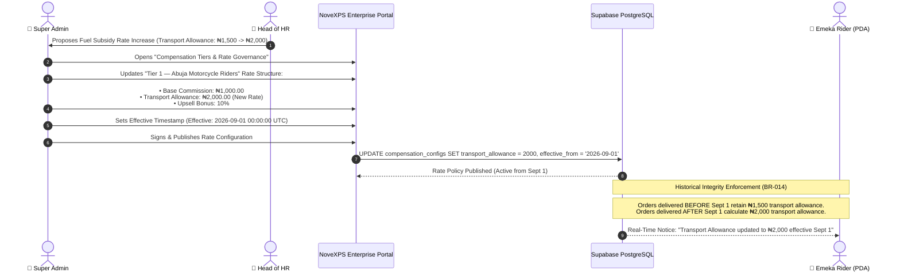

# 💵 HQ Workflow 05: Compensation Tiers, Rate Governance & Historical Rate Locking

This document details the configuration of delivery agent compensation structures, salary vs commission tiers, transport allowances, rate change governance, and immutable historical rate locking (BR-010 to BR-015).

---

## 🎯 Overview & Objectives

* **Primary Goal**: Establish centralized, configuration-driven compensation management for delivery personnel across all operational regions, enforce role differentiation (salary vs commission), and protect financial integrity through immutable historical rate retention.
* **Primary Actors**: Super Administrator, Head of Human Resources / Operations, Supabase Database.
* **Database Tables**: `delivery_agents`, `rider_transactions`, `orders`.

---

## 📊 Detailed Workflow Diagram



---

## 📑 Step-by-Step Execution Sequence

### Step 1: Compensation Tier Modeling (BR-010, BR-011, BR-012)
1. The Super Admin accesses the **Compensation Engine** on the Enterprise Admin Portal.
2. Configures distinct operational tiers based on personnel employment models:
   * **Tier A — Commission & Allowance Riders (Standard)**:
     - Base Delivery Commission: `₦1,000.00`
     - Transport Fuel Allowance: `₦1,500.00` (or `₦2,000.00` in high-fuel zones)
     - Upsell Bounty: `10%` of additional product sales value
   * **Tier B — Salaried Full-Time Staff (BR-012)**:
     - Fixed monthly salary with `₦0.00` per-order commission and fixed weekly fuel vouchers.
   * **Tier C — Van / Heavy Cargo Drivers**:
     - Bulk package handling rate: `₦3,500.00` per drop.

### Step 2: Immutable Rate Change Publishing (BR-014, BR-015)
1. When rate adjustments are enacted, Super Admin sets an **`effective_from`** timestamp.
2. System enforces **BR-014 (Historical Rate Locking)**:
   * When an order is completed, the system calculates and snapshots the exact rate into `orders.agent_entitlement` and `rider_transactions.amount`.
   * Future rate increases or decreases do NOT retroactively alter historical ledger entries.
3. System enforces **BR-015**: Field delivery agents and DC supervisors have zero permissions to modify rate parameters in their apps or terminals.

### Step 3: Database Policy Storage
1. Rate parameters are stored in a dedicated configuration table and accessed by backend Edge Functions (`confirm-delivery-pod`, `monnify-webhook`):
   ```sql
   -- Example dynamic rate calculation inside confirm_delivery_pod stored procedure
   v_commission := 1000.00;
   v_transport_allowance := 1500.00;
   v_total_entitlement := v_commission + v_transport_allowance;
   
   -- Snapshot exact rate into rider ledger
   INSERT INTO rider_transactions (
       delivery_agent_id,
       transaction_code,
       title,
       category,
       amount,
       is_credit,
       reference,
       status
   ) VALUES (
       p_agent_id,
       'TXN-' || floor(random() * 90000 + 10000)::text,
       'Delivery Entitlement — ' || v_order.order_number,
       'earnings',
       v_total_entitlement,
       true,
       v_order.order_number,
       'settled'
   );
   ```

---

## 🛑 Business Rules Adherence Summary

| Rule ID | Business Rule Requirement | Implementation & Enforcement |
|:---:|---|---|
| **BR-010** | Configuration-driven compensation | Defined centrally in database; zero hardcoded client rates. |
| **BR-011** | PDA and Rider compensation may differ | Tiers separated by vehicle type and contract category. |
| **BR-012** | Salary personnel may have no commission | Configurable per agent profile (`compensation_type = 'salary'`). |
| **BR-013** | Commission personnel accumulate earnings | Live accumulation into `direct_transfer_balance` / `my_balance`. |
| **BR-014** | Historical transactions retain applied rate | Snapshotted immutable record in `rider_transactions`. |
| **BR-015** | Agents cannot alter rates | Enforced via PostgreSQL Row-Level Security (RLS). |
