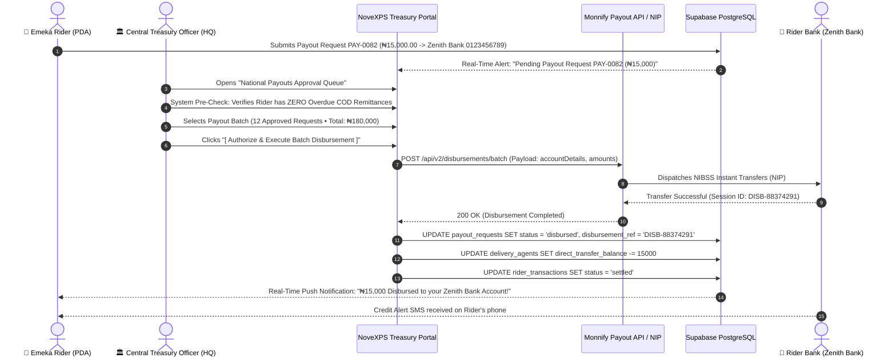

# 🏦 HQ Workflow 06: Central Treasury, Monnify Virtual Accounts & Batch Payout Disbursements

This document details Central Treasury operations, Monnify merchant settlement gateway management, national rider withdrawal payout request reviews, automated NIBSS/Monnify bank transfer disbursements, and audit trails.

---

## 🎯 Overview & Objectives

* **Primary Goal**: Manage corporate treasury liquidity, oversee digital direct-transfer collections (BR-021, BR-022), and execute automated or audited bulk rider withdrawal disbursements (BR-023, BR-024) to field agents' personal bank accounts.
* **Primary Actors**: Central Treasury Officer, Chief Financial Officer (CFO), Monnify Payout Gateway, Delivery Agents, Supabase Database.
* **Database Tables**: `payout_requests`, `rider_transactions`, `delivery_agents`, `monnify_transactions`.

---

## 📊 Detailed Workflow Diagram



---

## 📑 Step-by-Step Execution Sequence

### Step 1: Payout Queue Inspection & Automated Fraud Screening
1. The Central Treasury Officer opens the **Treasury Disbursements Dashboard**.
2. System displays all pending withdrawal requests (`payout_requests` where `status = 'pending'`).
3. Automated compliance screening checks:
   * **Rule 1 (COD Arrears Check)**: Rider’s `current_cod_balance` must not contain un-remitted physical cash older than 48 hours.
   * **Rule 2 (Name Matching Check)**: Registered bank account name must match `users.first_name` and `users.last_name`.
   * **Rule 3 (Balance Availability)**: Requested amount must be $\le$ `delivery_agents.direct_transfer_balance`.

### Step 2: Batch Selection & Executive Authorization
1. Treasury Officer selects validated requests (e.g. 12 rider payouts totaling `₦180,000.00`).
2. Requests above ₦100,000 require secondary approval by the Chief Financial Officer (Dual Authorization Principle).
3. Officer clicks **[ Authorize & Execute Batch Disbursement ]**.

### Step 3: API Electronic Funds Transfer (NIP / Monnify)
1. The portal sends signed batch payout instructions to Monnify Disburse API:
   ```json
   {
     "batchReference": "BATCH-NOV-2026-0819",
     "sourceAccountNumber": "7890001122",
     "transactions": [
       {
         "reference": "PAY-0082",
         "amount": 15000.00,
         "destinationBankCode": "057",
         "destinationAccountNumber": "0123456789",
         "narration": "NoveXPS Rider Earnings Payout — PAY-0082"
       }
     ]
   }
   ```
2. Funds are routed via NIBSS (Nigeria Inter-Bank Settlement System) directly into the rider's personal bank account.

### Step 4: Ledger Reconciliation & Database Updates
1. Portal receives success response (`status = 'SUCCESS'`, reference: `DISB-88374291`).
2. Database executes atomic settlement:
   ```sql
   UPDATE payout_requests
   SET status = 'disbursed',
       disbursement_ref = 'DISB-88374291',
       approved_by = auth.uid(),
       approved_at = NOW(),
       updated_at = NOW()
   WHERE payout_number = 'PAY-0082';

   UPDATE delivery_agents
   SET direct_transfer_balance = direct_transfer_balance - 15000.00,
       last_sync_at = NOW()
   WHERE id = 'agent-uuid-7000';

   UPDATE rider_transactions
   SET status = 'settled'
   WHERE reference = 'PAY-0082';
   ```

---

## 🛑 Treasury Security Controls

| Security Control | Implementation |
|---|---|
| **Dual Control Approval** | Any single payout request $> ₦100,000.00$ or batch $> ₦1,000,000.00$ requires approval from both Treasury Officer and CFO. |
| **Instant Freeze on Suspicious Activity** | If a rider's delivery failure rate exceeds 50% in a single day, automated payouts for that rider are temporarily frozen for manual audit. |
