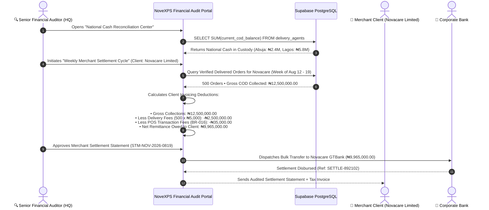

# 📊 HQ Workflow 07: National Financial Audit, POS Fee Reconciliation & Client Settlement

This document outlines enterprise financial auditing across all regional Distribution Centers, physical COD cash custody monitoring, POS fee tracking (BR-016), bank statement reconciliation, and merchant client remittance settlements.

---

## 🎯 Overview & Objectives

* **Primary Goal**: Ensure 100% financial auditing across all regional hubs, track physical cash in transit nationwide, reconcile POS transaction charges as separate financial line items (BR-016), and execute automated client COD proceeds settlements.
* **Primary Actors**: Senior Financial Auditor, Head of Internal Control, Merchant Finance Representative, Supabase Database.
* **Database Tables**: `cash_remittances`, `remittance_orders`, `orders`, `clients`, `companies`.

---

## 📊 Detailed Workflow Diagram

---

## 📑 Step-by-Step Execution Sequence

### Step 1: Real-Time Cash In Custody Auditing
1. Financial Auditor monitors the **National COD Heatmap** showing live physical cash balances across all field riders:
   * **Wuse DC**: 18 Riders holding `₦1,420,000.00`
   * **Ikeja Central DC**: 32 Riders holding `₦3,850,000.00`
2. Flags any individual rider holding $> ₦100,000.00$ physical cash or un-remitted funds $> 24$ hours for immediate supervisor contact.

### Step 2: POS Terminal Fee Accounting (BR-016)
1. In compliance with **BR-016**, POS payment processing charges are treated as separate financial transactions and never combined into delivery commission rates.
2. System logs exact POS charges:
   $$\text{Gross Collection} - \text{POS Processing Fee} = \text{Net Bank Inflow}$$
3. Audits monthly POS terminal invoices from merchant acquiring banks against logged transactions.

### Step 3: Merchant Client Settlement Statement Generation
1. At the end of every weekly billing cycle (Mondays at 00:00 UTC), the settlement engine aggregates all `delivered` & `verified` orders for each corporate client (*Novacare Limited*):
   * **Gross COD Collections**: `₦12,500,000.00` (500 delivered orders)
   * **Contractual Delivery Fees (BR-006)**: `500 × ₦5,000 = ₦2,500,000.00`
   * **POS Terminal Transaction Fees (BR-016)**: `₦35,000.00`
   * **Net Proceeds Payable to Merchant**: `₦9,965,000.00`

### Step 4: Electronic Disbursement & Audit Sign-Off
1. Senior Auditor verifies bank statement match and signs off.
2. Electronic wire transfer of `₦9,965,000.00` is executed from corporate treasury to Novacare’s designated bank account.
3. System issues an official PDF Settlement Report and Value-Added Tax (VAT) invoice to the client portal.

---

## 🛑 Financial Reconciliation Constraints

| Financial Rule | System Enforcement |
|---|---|
| **Zero Variance Settlement** | A client settlement statement cannot be finalized if any linked order has an un-reconciled remittance status (`status = 'pending'`). |
| **Separate POS Tracking (BR-016)** | POS fees are isolated in general ledger code `GL-5040 (Payment Gateway Charges)` for tax and operational accounting transparency. |
