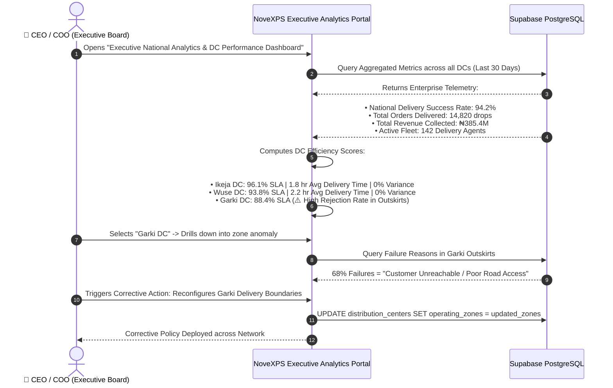

# 📈 HQ Workflow 08: Enterprise Analytics, Regional DC Auditing & Fleet Governance

This document details executive analytics, regional Distribution Center (DC) performance auditing, SLA compliance scoring, national fleet heatmaps, automated anomaly detection, and operational risk mitigation.

---

## 🎯 Overview & Objectives

* **Primary Goal**: Provide executive leadership and board members with comprehensive, real-time business intelligence across all operational hubs, benchmark DC efficiency, monitor rider fleet utilization, and detect operational anomalies early.
* **Primary Actors**: Chief Executive Officer (CEO), Chief Operating Officer (COO), National Operations Director, Supabase Database.
* **Database Tables**: `orders`, `distribution_centers`, `delivery_agents`, `inventory_audits`, `cash_remittances`.

---

## 📊 Detailed Workflow Diagram

---

## 📑 Step-by-Step Execution Sequence

### Step 1: Executive KPI Aggregation
1. The Executive Leadership Board accesses the **Enterprise Analytics Portal**.
2. System calculates key operational metrics in real-time:
   * **National Delivery Success Rate**:
     $$\text{Success Rate} = \frac{\text{Total Delivered Orders}}{\text{Total Assigned Orders}} \times 100 = 94.2\%$$
   * **First-Attempt Delivery Rate (FADR)**: `88.5%`
   * **Average Order Fulfillment Time**: `2.1 hours` (From DC dispatch to customer POD)
   * **Remittance Turnaround Speed**: `18.4 hours` (From cash collection to bank statement verification)
   * **National Inventory Accuracy**: `99.8%` (Physical audits vs database ledger)

### Step 2: Regional DC Benchmarking & Scorecards
1. Portal compares operational performance across all regional hubs:

| Distribution Center | Monthly Drops | Delivery SLA% | Remittance Cycle | Active Fleet | Audit Accuracy | Operational Rating |
|---|:---:|:---:|:---:|:---:|:---:|:---:|
| **Ikeja Central DC** | 7,450 | **96.1%** | 14.2 hrs | 65 Riders | 100% | 🟢 **Elite** |
| **Wuse DC (Abuja)** | 4,820 | **93.8%** | 16.5 hrs | 45 Riders | 100% | 🟢 **Optimal** |
| **Garki DC (Abuja)** | 1,850 | **88.4%** | 22.1 hrs | 20 Riders | 99.1% | 🟡 **Needs Review** |
| **Kubwa DC** | 700 | **91.2%** | 18.0 hrs | 12 Riders | 100% | 🟢 **Optimal** |

### Step 3: Anomaly Detection & Fleet Heatmap Monitoring
1. Automated AI monitoring continuously scans for operational risks:
   * **Risk Alert 1 (High Zone Rejection)**: Identifies specific neighborhood delivery addresses with $> 30\%$ failure rates.
   * **Risk Alert 2 (Unusual Stock Loss)**: Flags any DC or rider with $> 2$ consecutive inventory discrepancy audits.
   * **Risk Alert 3 (Excessive COD Retention)**: Automatically highlights riders holding physical cash $> ₦150,000.00$.

### Step 4: Executive Directive & Network Policy Optimization
1. Executives can implement system-wide optimizations directly from the dashboard:
   * Rebalancing fleet allocation (e.g. moving 5 riders from Wuse DC to high-demand Garki routes).
   * Adjusting delivery fee schedules or zone boundaries.
   * Generating board-level PDF operational and financial reports.

---

## 🛑 Governance & Regulatory Compliance

| Compliance Requirement | System Implementation |
|---|---|
| **Data Immutability (BR-020)** | All financial transactions, stock handovers, and delivery status changes maintain an append-only audit trail in PostgreSQL. |
| **Data Protection & Privacy** | Customer phone numbers and addresses are masked in historical reporting after 90 days of order completion for privacy compliance. |
