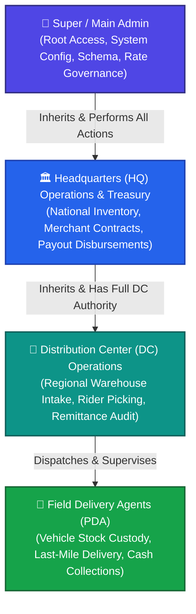

# 🏛️ NoveXPS Headquarters (HQ) & Super Admin Master Operational Workflow Guide

Welcome to the **NovaExpress Logistics Management System (NoveXPS) Headquarters (HQ) & Super Administration Operational Workflow Guide**. This master document details enterprise-level governance, merchant client management, national inventory distribution, compensation rate setting, central treasury disbursements, and multi-DC administrative supervisory operations.

---

## 👑 Administrative Authority & Cascading Hierarchy

The NoveXPS platform operates on a strict **Cascading Authority Model**:



> [!IMPORTANT]
> **Key Hierarchical Governance Rules**:
> 1. **Super / Main Admin**: Can execute any HQ function, any DC function, and any system configuration parameter.
> 2. **Headquarters (HQ) Staff**: Can execute any regional DC activity across all distribution centers (e.g., overriding stock approvals, directly intaking bulk inventory, verifying remittances, or reassigning fleet riders).
> 3. **Distribution Center (DC) Staff**: Scoped strictly to their assigned regional DC hub (*Wuse DC*, *Ikeja DC*).
> 4. **Delivery Agents (PDA)**: Scoped strictly to their vehicle custody and assigned order leads.

---

## 🗺️ Master HQ Workflow Architecture Overview

```mermaid
graph TD
    A[1. HQ Auth & Cascading Access Control] --> B[2. Merchant Client Onboarding & Billing]
    B --> C[3. Enterprise Product Catalog & SKU Setup]
    C --> D[4. National Inventory & Inter-DC Transfers]
    D --> E[5. Regional DC Operations (Wuse, Ikeja, Garki)]
    A --> F[6. Compensation Tiers & Rate Governance]
    E -->|Remittance Feeds & Payout Requests| G[7. Central Treasury & Payout Disbursements]
    G --> H[8. National Financial Audit & Reconciliation]
    subgraph Strategic Governance Layer
        I[9. Enterprise Analytics & DC Performance Auditing]
    end
    E -. Real-Time Telemetry .-> I
    G -. Cashflow Metrics .-> I
```

---

## 📑 Headquarters Workflow Guide Index

| # | Workflow Module | Description | Primary Actors | Documentation Link |
|:---:|---|---|---|---|
| **01** | **HQ Auth & Cascading Access Control** | Super Admin & HQ authentication, multi-DC hub switcher, supervisory override controls, and global dashboard hydration. | Super Admin, HQ Operations Director | [01_HQ_AUTH_AND_ADMIN_HIERARCHY_WORKFLOW.md](file:///c:/PROJECT/NoveXPS/DOCUMENTATION/HQ/WORKFLOW/01_HQ_AUTH_AND_ADMIN_HIERARCHY_WORKFLOW.md) |
| **02** | **Merchant Client Onboarding & Billing** | Onboarding corporate clients (*Novacare*, *PharmaPlus*), delivery fee SLAs, fulfillment type setup, and billing reconciliation. | HQ Account Manager, Client Representative | [02_CLIENT_ONBOARDING_CONTRACTS_AND_BILLING_WORKFLOW.md](file:///c:/PROJECT/NoveXPS/DOCUMENTATION/HQ/WORKFLOW/02_CLIENT_ONBOARDING_CONTRACTS_AND_BILLING_WORKFLOW.md) |
| **03** | **Enterprise Product Catalog & SKU Setup** | Master product registration (*Respira Tea*, *Grazer Tea*), pricing, reorder thresholds, and fulfillment rules. | Product Catalog Manager, Inventory Director | [03_ENTERPRISE_PRODUCT_CATALOG_AND_SKU_MANAGEMENT_WORKFLOW.md](file:///c:/PROJECT/NoveXPS/DOCUMENTATION/HQ/WORKFLOW/03_ENTERPRISE_PRODUCT_CATALOG_AND_SKU_MANAGEMENT_WORKFLOW.md) |
| **04** | **National Inventory & Inter-DC Transfers** | Inter-DC bulk freight manifests (e.g. *Ikeja Hub* to *Wuse DC*), in-transit freight seals, and national stock balancing. | National Logistics Director, Freight Drivers | [04_NATIONAL_INVENTORY_AND_INTER_DC_TRANSFERS_WORKFLOW.md](file:///c:/PROJECT/NoveXPS/DOCUMENTATION/HQ/WORKFLOW/04_NATIONAL_INVENTORY_AND_INTER_DC_TRANSFERS_WORKFLOW.md) |
| **05** | **Compensation Tiers & Rate Governance** | Configuration of commission tiers, transport allowances, salary models, historical rate locking (BR-010 to BR-015). | Super Admin, Head of Human Resources | [05_COMPENSATION_TIERS_AND_RATE_GOVERNANCE_WORKFLOW.md](file:///c:/PROJECT/NoveXPS/DOCUMENTATION/HQ/WORKFLOW/05_COMPENSATION_TIERS_AND_RATE_GOVERNANCE_WORKFLOW.md) |
| **06** | **Central Treasury & Payout Disbursements** | Monnify digital gateway configuration, reviewing batch withdrawal payouts (`PAY-XXXX`), and electronic bank disbursements. | Central Treasury Officer, Chief Financial Officer | [06_CENTRAL_TREASURY_AND_PAYOUT_DISBURSEMENTS_WORKFLOW.md](file:///c:/PROJECT/NoveXPS/DOCUMENTATION/HQ/WORKFLOW/06_CENTRAL_TREASURY_AND_PAYOUT_DISBURSEMENTS_WORKFLOW.md) |
| **07** | **National Financial Audit & Reconciliation** | Enterprise COD reconciliation across all DCs, POS fee adjustments (BR-016), bank statement feeds, and P&L auditing. | Senior Financial Auditor, Internal Control | [07_NATIONAL_REMITTANCE_AUDIT_AND_FINANCIAL_RECONCILIATION_WORKFLOW.md](file:///c:/PROJECT/NoveXPS/DOCUMENTATION/HQ/WORKFLOW/07_NATIONAL_REMITTANCE_AUDIT_AND_FINANCIAL_RECONCILIATION_WORKFLOW.md) |
| **08** | **Enterprise Analytics & DC Auditing** | Real-time DC performance metrics (Delivery SLA%, Remittance Turnaround, Inventory Shrinkage), fleet heatmaps, and audit logs. | Executive Leadership, Board of Directors | [08_ENTERPRISE_ANALYTICS_AND_DC_PERFORMANCE_AUDIT_WORKFLOW.md](file:///c:/PROJECT/NoveXPS/DOCUMENTATION/HQ/WORKFLOW/08_ENTERPRISE_ANALYTICS_AND_DC_PERFORMANCE_AUDIT_WORKFLOW.md) |
