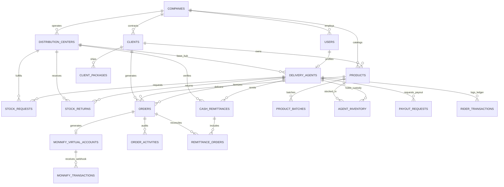
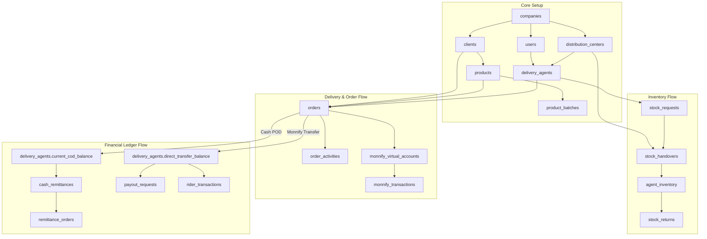

# NovaExpress PDA (Rider Application) — Database Schema & Entity Interdependence

## 1. Architectural Overview & Design Philosophy

The NovaExpress Logistics Management System (NoveXPS) PDA platform is engineered with a strict **Multi-Tenant, Ledger-Accurate, State-Driven Relational Schema** running on PostgreSQL and Supabase.

The schema balances three critical operational vectors:
1. **Physical Asset Tracking**: Real-time vehicle inventory custody, batch allocations, stock requests, physical handovers, and return logistics.
2. **Operational Delivery Execution**: Order state lifecycle, proof of delivery (POD), reschedule/callback management, geo-tagging, and customer interactions.
3. **Dual-Channel Financial Ledger**:
   - **Cash POD (To Remit)**: Physical cash collected from customers held in rider custody that must be remitted to the Distribution Center (DC).
   - **Direct Transfers (My Balance)**: Commissions and transport allowances automatically credited when customers pay via Monnify dynamic virtual accounts, withdrawable via DC Payout Requests.

---

## 2. Entity-Relationship (ER) Diagram

---

## 3. Entity Interdependence Graph

---

## 4. Comprehensive Relational Table Specifications

### 4.1. Core Identity & Infrastructure Tables

#### `companies`
Represents logistics tenant organizations.
| Column | Type | Constraints | Description |
|---|---|---|---|
| `id` | `UUID` | `PRIMARY KEY`, default `uuid_generate_v4()` | Unique Company ID |
| `name` | `VARCHAR(255)` | `NOT NULL` | Registered corporate name |
| `code` | `VARCHAR(50)` | `UNIQUE`, `NOT NULL` | Unique company reference code |
| `currency` | `VARCHAR(10)` | Default `'NGN'` | Operating fiat currency |
| `is_active` | `BOOLEAN` | Default `true` | System operational state |

#### `distribution_centers`
Warehousing facilities, distribution centers (DC), and regional logistics hubs.
| Column | Type | Constraints | Description |
|---|---|---|---|
| `id` | `UUID` | `PRIMARY KEY` | Distribution Center ID |
| `company_id` | `UUID` | `FK -> companies(id)` | Parent company |
| `name` | `VARCHAR(255)` | `NOT NULL` | Facility name (e.g. Wuse DC) |
| `code` | `VARCHAR(50)` | `UNIQUE`, `NOT NULL` | Unique facility code |
| `state` | `VARCHAR(100)` | `NOT NULL` | Operating state |
| `city` | `VARCHAR(100)` | `NOT NULL` | Operating city |
| `address` | `TEXT` | `NOT NULL` | Physical location |
| `is_hub` | `BOOLEAN` | Default `false` | Central sorting hub indicator |

#### `users`
Authentication identity and system access role table.
| Column | Type | Constraints | Description |
|---|---|---|---|
| `id` | `UUID` | `PRIMARY KEY` | Supabase Auth UUID |
| `company_id` | `UUID` | `FK -> companies(id)` | Assigned company |
| `email` | `VARCHAR(255)` | `UNIQUE`, `NOT NULL` | Login email address |
| `phone_number`| `VARCHAR(50)` | `UNIQUE` | User mobile contact |
| `first_name` | `VARCHAR(100)` | `NOT NULL` | First name |
| `last_name` | `VARCHAR(100)` | `NOT NULL` | Surname |
| `role` | `VARCHAR(50)` | `NOT NULL` | `'admin'`, `'dc_manager'`, `'delivery_agent'` |

#### `delivery_agents`
Operational delivery profile, vehicle data, and real-time ledger balances for riders.
| Column | Type | Constraints | Description |
|---|---|---|---|
| `id` | `UUID` | `PRIMARY KEY` | Unique Agent Profile ID |
| `user_id` | `UUID` | `FK -> users(id)` | Associated authentication user |
| `distribution_center_id` | `UUID` | `FK -> distribution_centers(id)` | Attached base DC |
| `agent_code` | `VARCHAR(50)` | `UNIQUE`, `NOT NULL` | Display badge (e.g. `PDA-7000`) |
| `vehicle_type` | `VARCHAR(50)` | Default `'motorcycle'` | Vehicle classification |
| `vehicle_plate_number` | `VARCHAR(50)` | Nullable | Vehicle registration plate |
| `current_status` | `VARCHAR(50)` | Default `'available'` | `'available'`, `'on_delivery'`, `'offline'` |
| `current_cod_balance` | `NUMERIC(14,2)`| Default `0.00` | Physical cash in custody (To Remit) |
| `direct_transfer_balance`| `NUMERIC(14,2)`| Default `0.00` | Unclaimed transfer commissions (My Balance) |
| `bank_name` | `VARCHAR(100)` | Nullable | Payout registered bank |
| `bank_account_number` | `VARCHAR(20)` | Nullable | 10-digit NUBAN account number |
| `bank_account_name` | `VARCHAR(255)` | Nullable | Registered account holder name |

---

### 4.2. Catalog & Inventory Custody Tables

#### `products`
Master catalog items available for distributed fulfillment or stock custody.
| Column | Type | Constraints | Description |
|---|---|---|---|
| `id` | `UUID` | `PRIMARY KEY` | Product unique ID |
| `company_id` | `UUID` | `FK -> companies(id)` | Company catalog |
| `client_id` | `UUID` | `FK -> clients(id)` | Merchant owner (e.g. Novacare) |
| `sku` | `VARCHAR(100)` | `UNIQUE`, `NOT NULL` | Stock Keeping Unit code |
| `name` | `VARCHAR(255)` | `NOT NULL` | Commercial product name |
| `category` | `VARCHAR(100)` | Nullable | Category classification |
| `base_price` | `NUMERIC(14,2)`| `NOT NULL` | Standard selling price |
| `reorder_level` | `INT` | Default `5` | Low stock notification threshold |

#### `agent_inventory`
Live stock balance currently loaded on the rider's vehicle.
| Column | Type | Constraints | Description |
|---|---|---|---|
| `id` | `UUID` | `PRIMARY KEY` | Inventory entry ID |
| `delivery_agent_id` | `UUID` | `FK -> delivery_agents(id)` | Rider holding physical custody |
| `product_id` | `UUID` | `FK -> products(id)` | Product SKU |
| `total_in_custody` | `INT` | `NOT NULL`, Default `0` | Physical quantity in vehicle box |
| `reserved_count` | `INT` | Default `0` | Quantity allocated to ongoing orders |
| `available_count` | `INT` | Default `0` | Free units available for dispatch/upsell |
| `delivered_count_today` | `INT` | Default `0` | Successfully handed over today |
| `returned_count` | `INT` | Default `0` | Returned items |
| `awaiting_return_count`| `INT` | Default `0` | Failed orders waiting DC return |

#### `stock_requests` & `stock_handovers`
Tracks warehouse restocking and two-party sign-off.
| Table | Key Columns | Purpose |
|---|---|---|
| `stock_requests` | `request_number`, `delivery_agent_id`, `status` | Restock intake request |
| `stock_request_items` | `stock_request_id`, `product_id`, `requested_qty`, `approved_qty` | Line item quantities |
| `stock_handovers` | `handover_code`, `agent_confirmed`, `supervisor_confirmed` | Dual physical verification |

---

### 4.3. Order & Delivery Lifecycle Tables

#### `orders`
Master order entity covering both distributed inventory and client package shipments.
| Column | Type | Constraints | Description |
|---|---|---|---|
| `id` | `UUID` | `PRIMARY KEY` | Unique Order UUID |
| `order_number` | `VARCHAR(100)` | `UNIQUE`, `NOT NULL` | Tracking reference (e.g. `TRK-8924`) |
| `delivery_agent_id` | `UUID` | `FK -> delivery_agents(id)` | Assigned dispatch rider |
| `customer_name` | `VARCHAR(255)` | `NOT NULL` | Recipient customer name |
| `customer_phone` | `VARCHAR(50)` | `NOT NULL` | Primary telephone number |
| `customer_alt_phone` | `VARCHAR(50)` | Nullable | Secondary phone number |
| `delivery_state` | `VARCHAR(100)` | `NOT NULL` | Destination state |
| `delivery_city` | `VARCHAR(100)` | `NOT NULL` | Destination neighborhood/city |
| `delivery_address` | `TEXT` | `NOT NULL` | Detailed physical street address |
| `product_id` | `UUID` | `FK -> products(id)` | Assigned product |
| `product_name` | `VARCHAR(255)` | Default `'Respira Detox Tea'` | Display product name |
| `quantity` | `INT` | Default `1` | Total quantity delivered |
| `paid_quantity` | `INT` | Default `1` | Paid items |
| `free_quantity` | `INT` | Default `0` | Complimentary promo units |
| `base_price` | `NUMERIC(14,2)`| `NOT NULL` | Unit base price |
| `upsell_amount` | `NUMERIC(14,2)`| Default `0.00` | Additional upsold value |
| `total_amount` | `NUMERIC(14,2)`| `NOT NULL` | Grand total payable |
| `payment_type` | `VARCHAR(50)` | `'pay_on_delivery'`, `'prepaid'` | Payment terms |
| `payment_status` | `VARCHAR(50)` | `'pending'`, `'collected'`, `'transferred'` | Payment state |
| `status` | `VARCHAR(50)` | `'in_transit'`, `'delivered'`, `'failed'`, `'call_back'` | Order state |
| `scheduled_callback_at`| `TIMESTAMPTZ` | Nullable | Customer rescheduled appointment |
| `reschedule_note` | `TEXT` | Nullable | Reason code for failure/callback |
| `proof_of_delivery_url`| `TEXT` | Nullable | POD signature / photo URL |

#### `monnify_virtual_accounts` & `monnify_transactions`
Dynamic virtual accounts generated per-order for real-time customer transfers.
| Table | Key Columns | Purpose |
|---|---|---|
| `monnify_virtual_accounts` | `order_id`, `account_reference`, `account_number`, `expected_amount`, `status` | Dedicated NUBAN account generated for order payment |
| `monnify_transactions` | `transaction_reference`, `amount_paid`, `payer_name`, `webhook_payload` | Verified webhook transaction logged from Monnify |

---

### 4.4. Financial Settlement & Remittance Tables

#### `cash_remittances`
Tracks rider physical cash handovers, bank deposits, and POS payments to the DC.
| Column | Type | Constraints | Description |
|---|---|---|---|
| `id` | `UUID` | `PRIMARY KEY` | Remittance ID |
| `delivery_agent_id` | `UUID` | `FK -> delivery_agents(id)` | Remitting rider |
| `reference_number` | `VARCHAR(100)` | `UNIQUE`, `NOT NULL` | Remittance code (e.g. `RMT-0005`) |
| `amount` | `NUMERIC(14,2)`| `NOT NULL` | Net remitted cash amount |
| `gross_collections` | `NUMERIC(14,2)`| Default `0.00` | Total order collections before deductions |
| `commission_deducted` | `NUMERIC(14,2)`| Default `0.00` | Rider commission offset |
| `transport_allowance_deducted`| `NUMERIC(14,2)`| Default `0.00` | Transport allowance offset |
| `payment_method` | `VARCHAR(50)` | `'bank_transfer'`, `'cash_to_dc'`, `'pos'` | Remittance channel |
| `status` | `VARCHAR(50)` | `'pending'`, `'submitted'`, `'approved'` | Reconciliation state |
| `verified_by_name` | `VARCHAR(255)` | Nullable | DC Finance supervisor name |
| `verified_at` | `TIMESTAMPTZ` | Nullable | Timestamp of verification |

#### `payout_requests` & `rider_transactions`
Direct transfer commission withdrawals and complete audit trail.
| Table | Key Columns | Purpose |
|---|---|---|
| `payout_requests` | `payout_number`, `amount`, `bank_name`, `account_number`, `status` | Rider withdrawal request from My Balance |
| `rider_transactions` | `transaction_code`, `category`, `amount`, `is_credit`, `reference`, `status` | Double-entry transaction history ledger |

---

## 5. Automated Database Triggers & Stored Procedures

### 5.1. Atomic Delivery Confirmation (`confirm_delivery_pod`)
- Transitions `orders.status` to `'delivered'`.
- Sets `orders.payment_status` to `'collected'`.
- If Cash POD: Increments `delivery_agents.current_cod_balance` atomically.
- If Monnify Direct Transfer: Increments `delivery_agents.direct_transfer_balance` with rider commission & transport allowance.
- Logs activity in `order_activities` and `rider_transactions`.

### 5.2. Atomic Delivery Failure / Reschedule (`log_delivery_failure`)
- Sets `orders.status` to `'call_back'` or `'cancelled'`.
- Updates `orders.scheduled_callback_at` and `orders.reschedule_note`.
- Increments `agent_inventory.awaiting_return_count`.
- Logs failure record in `order_activities`.
