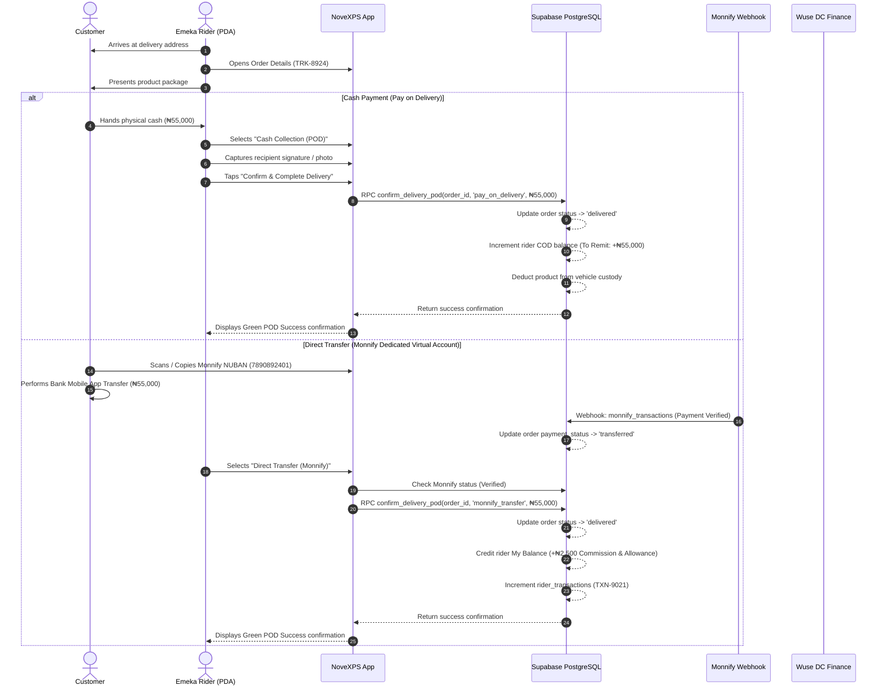
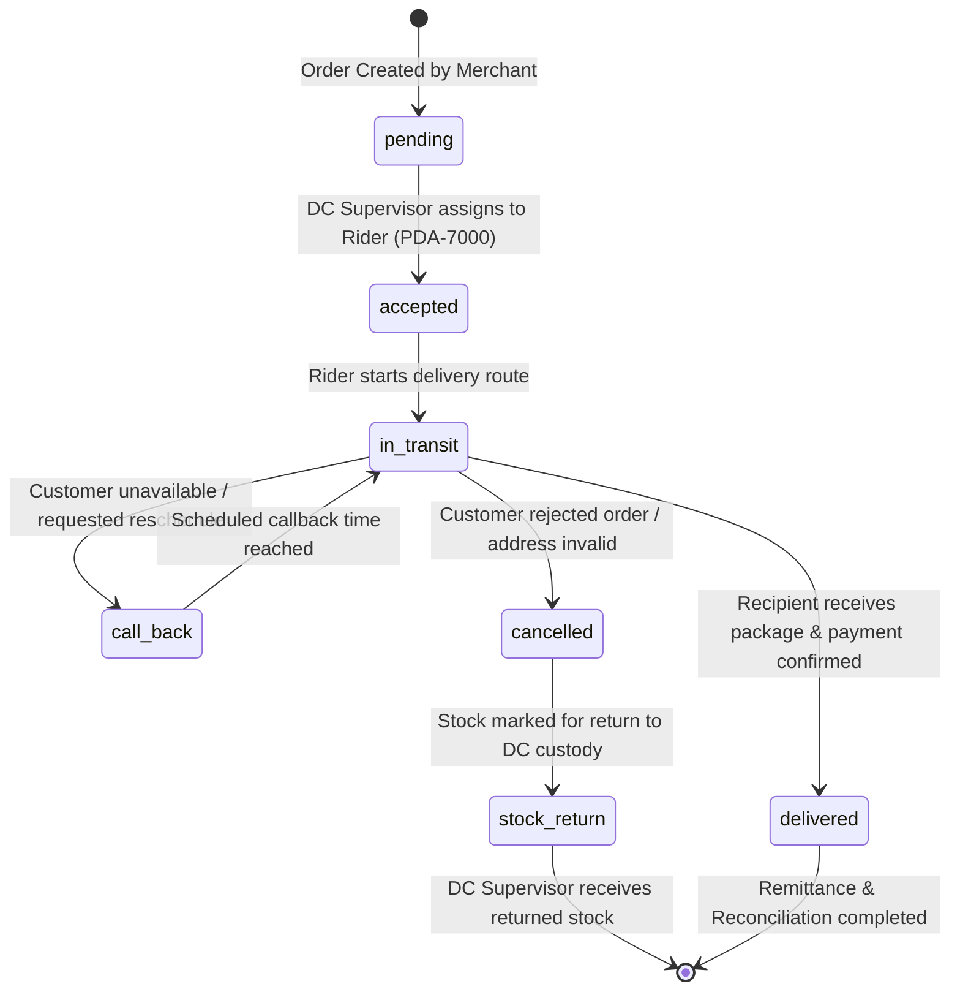
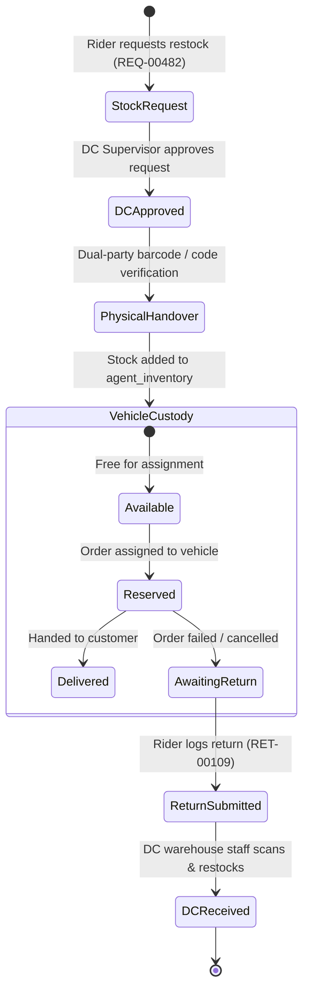
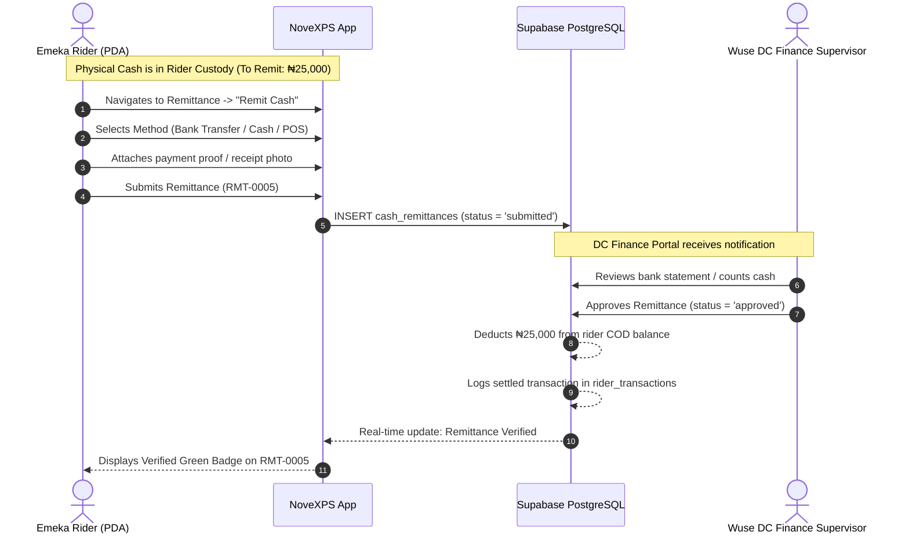
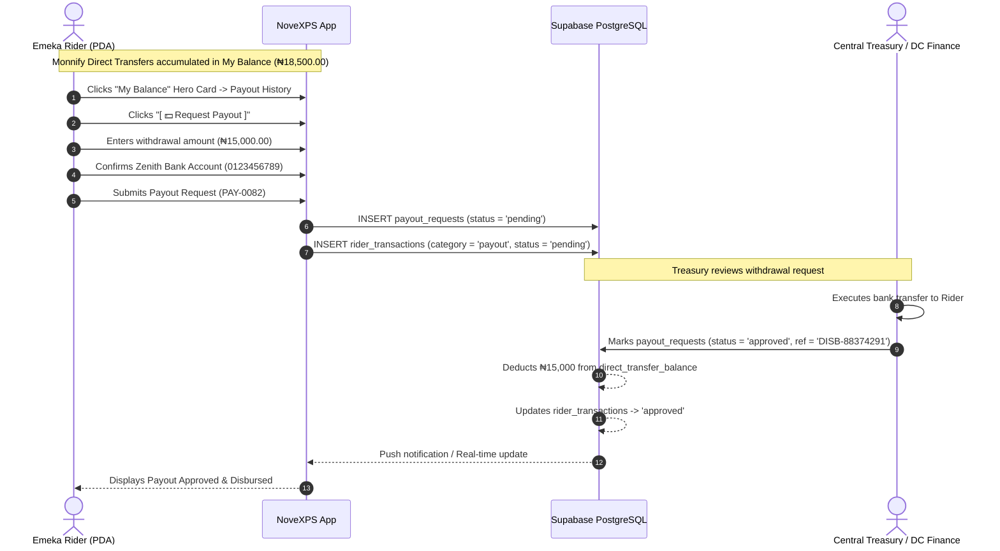

# NovaExpress PDA — System Workflows & State Machines

This document outlines the core business workflows, transaction state machines, and sequence diagrams governing the NovaExpress PDA ecosystem.

---

## 1. End-of-Delivery Payment & POD Workflow

---

## 2. Order Lifecycle State Machine

---

## 3. Stock Custody, Handover & Return Lifecycle

---

## 4. Financial Reconciliation & Remittance Workflow

---

## 5. Rider Earnings & My Balance Payout Workflow

