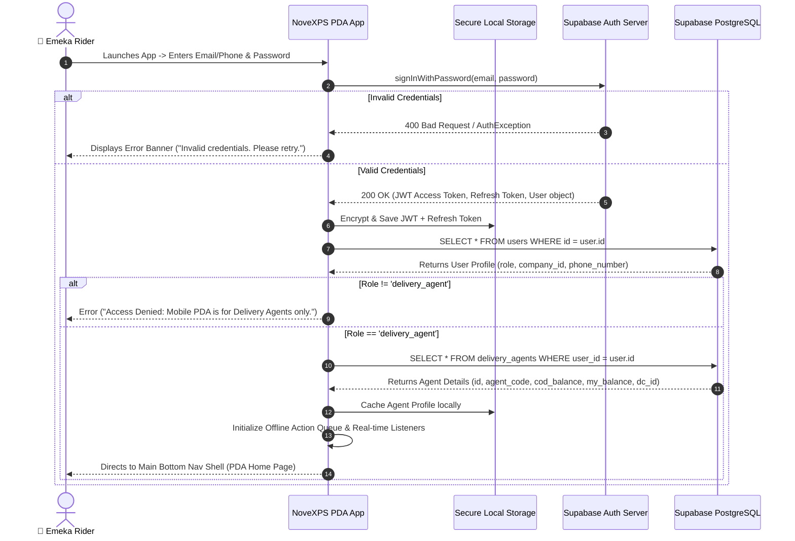

# 🔐 Workflow 01: Authentication, Session Management & Profile Hydration

This document outlines the step-by-step process for rider authentication, JWT token management, user role verification, profile hydration, real-time subscription setup, and offline cache initialization.

---

## 🎯 Overview & Objectives

* **Primary Goal**: Securely authenticate the Delivery Agent (Rider), hydrate their profile and linked DC agent metadata (`agent_code`, `operating_city`, balances), establish real-time subscriptions, and prepare offline local storage.
* **Primary Actors**: Delivery Agent (*Emeka Rider*), NoveXPS Flutter Mobile App, Supabase Auth Service, Supabase PostgreSQL Database.
* **Pre-requisites**: Active user account created in `users` table with `role = 'delivery_agent'` and a valid linked row in `delivery_agents`.

---

## 📊 Detailed Workflow Diagram



---

## 📑 Step-by-Step Execution Sequence

### Step 1: Credentials Entry & Form Validation
1. The Rider launches the NoveXPS PDA Mobile App.
2. If an unexpired session exists in `FlutterSecureStorage`, the app skips login and proceeds directly to **Step 5 (Profile Hydration)**.
3. If no session exists, the app displays the Login Screen requesting:
   * **Email / Phone**: e.g., `emeka.rider@novaexpress.ng`
   * **Password**: User secret credentials.
4. Client-side validation checks that fields are non-empty and formatted correctly.

### Step 2: Supabase Auth Verification
1. The app invokes `Supabase.instance.client.auth.signInWithPassword()`.
2. Supabase Auth validates credentials against encrypted `auth.users` passwords.
3. Upon success, Supabase issues:
   * `access_token` (JWT short-lived token containing `sub` user_id)
   * `refresh_token` (Long-lived refresh token)
   * `user.id` (UUID format)

### Step 3: Secure Local Storage Persistence
1. The app serializes the `Session` object into `FlutterSecureStorage` (using Android KeyStore / iOS Keychain).
2. The HTTP header default for all outgoing API and RPC requests is set to `Authorization: Bearer <access_token>`.

### Step 4: Role & Operational Profile Hydration
1. The app executes a PostgREST query:
   ```sql
   SELECT id, email, first_name, last_name, role, company_id 
   FROM users 
   WHERE id = auth.uid();
   ```
2. The app verifies that `role == 'delivery_agent'`. If an admin or client user attempts to log in, access is denied with a clear warning modal.
3. The app queries operational agent details:
   ```sql
   SELECT id, agent_code, distribution_center_id, current_cod_balance, direct_transfer_balance, current_status 
   FROM delivery_agents 
   WHERE user_id = auth.uid();
   ```

### Step 5: Real-time Channel Subscriptions & Offline Sync Setup
1. The app subscribes to PostgreSQL CDC (Change Data Capture) WebSocket channels:
   * `public:orders` (Filtered by `delivery_agent_id = eq.<agent_id>`)
   * `public:agent_inventory` (Filtered by `delivery_agent_id = eq.<agent_id>`)
   * `public:cash_remittances` (Filtered by `delivery_agent_id = eq.<agent_id>`)
2. Local SQLite/Hive database is initialized to store cached orders, active inventory counts, and pending offline transactions.

### Step 6: Navigation to Dashboard
The Rider is redirected to `MainBottomNavShell`, presenting:
* Active Delivery Cards (`In Transit`, `Accepted`)
* COD Balance Hero Card (`current_cod_balance`)
* My Balance / Earnings Hero Card (`direct_transfer_balance` / `my_balance`)
* Vehicle Inventory Widget (*Respira Tea*, *Grazer Tea*, etc.)

---

## 🛑 Edge Cases & Exception Handling

| Scenario / Risk | Cause | Handling / System Behavior |
|---|---|---|
| **No Network Connection at Login** | Device offline | If saved JWT token exists, log in using cached offline profile. Otherwise, display "Internet Connection Required for Initial Login". |
| **User Role Mismatch** | Non-rider account (e.g. Client / DC Manager) | Revoke token, clear storage, display modal: *"This application is restricted to NovaExpress Field Delivery Agents."* |
| **Token Expiry during Operation** | JWT token expired after 1 hour | Supabase SDK automatically uses `refresh_token` in background without disrupting rider workflow. |
| **Account Deactivated** | `users.is_active = false` | Server returns `403 Forbidden`. App logs user out immediately and displays *"Account Suspended. Contact HR/Operations."* |
