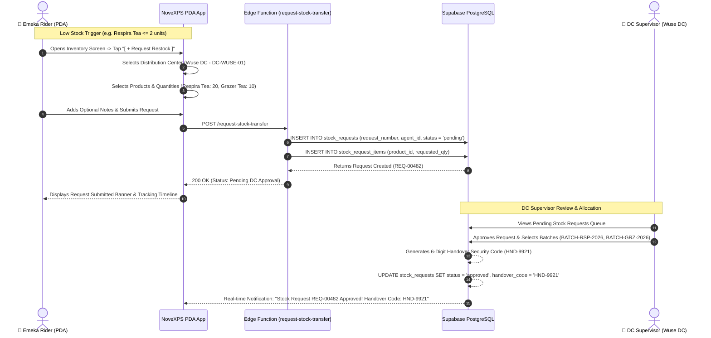

# 📦 Workflow 02: Stock Request & Inventory Replenishment

This document details the operational workflow for a field rider requesting additional inventory from a Distribution Center (DC), automated threshold alerts, DC supervisor approval, and handover code generation.

---

## 🎯 Overview & Objectives

* **Primary Goal**: Maintain optimal vehicle inventory for delivery operations by enabling riders to request restock from nearest DCs and allowing DC supervisors to review and approve allocations.
* **Primary Actors**: Delivery Agent (*Emeka Rider*), NoveXPS PDA App, DC Supervisor (*Adekunle Supervisor*), Supabase Edge Function (`request-stock-transfer`), PostgreSQL DB.
* **Database Tables Involved**: `stock_requests`, `stock_request_items`, `distribution_centers`, `products`, `product_batches`.

---

## 📊 Detailed Workflow Diagram



---

## 📑 Step-by-Step Execution Sequence

### Step 1: Low Stock Detection & Request Initiation
1. When a rider’s vehicle inventory for any product drops below `low_stock_threshold` (e.g. $\le 5$ units), the PDA displays a **Low Stock Warning Badge**.
2. The Rider navigates to **Stock / Inventory Page** $\rightarrow$ Taps **[ + Request Restock ]**.
3. The app fetches active nearby Distribution Centers (`distribution_centers` where `is_active = true`).

### Step 2: Product & Quantity Selection
1. Rider selects the target DC (e.g. *Wuse Distribution Center*).
2. Rider specifies items to restock:
   * **Product A**: *Respira Detox Tea* — Quantity: `20`
   * **Product B**: *Grazer Herbal Tea* — Quantity: `10`
3. Request Type selected: `restock` (Options: `restock`, `emergency`, `initial_intake`).
4. Optional notes added (e.g. *"High demand expected in Wuse 2 afternoon route"*).

### Step 3: Submission & Edge Function Validation
1. The app POSTs payload to Edge Function `request-stock-transfer`:
   ```json
   {
     "delivery_agent_id": "b1111111-1111-4111-8111-111111111111",
     "distribution_center_id": "22222222-2222-4222-8222-222222222222",
     "request_type": "restock",
     "items": [
       {"product_id": "d1111111-1111-4111-8111-111111111111", "requested_quantity": 20},
       {"product_id": "d2222222-2222-4222-8222-222222222222", "requested_quantity": 10}
     ]
   }
   ```
2. The Edge Function validates:
   * Rider active status in `delivery_agents`.
   * Target DC validity.
   * Product existence and non-zero positive quantities.
3. Inserts master record into `stock_requests` with generated code `REQ-XXXXX` and `status = 'pending'`.
4. Inserts detail lines into `stock_request_items`.

### Step 4: DC Supervisor Review & Handover Code Generation
1. The DC Supervisor logs into the NoveXPS Management Portal or DC Tablet.
2. Review pending requests under **Wuse Distribution Center Queue**.
3. Checks available physical stock in warehouse batch bins.
4. Taps **[ Approve & Allocate ]**:
   * Allocates approved quantities (`approved_quantity`).
   * Generates a unique 6-digit alphanumeric Handover Security Code (e.g. `HND-9921`).
   * Updates `stock_requests.status = 'approved'`.

### Step 5: Real-Time Notification & Route Planning
1. Supabase CDC pushes WebSocket event to Rider’s PDA.
2. Rider receives push banner: *"Stock Request REQ-00482 Approved! Proceed to Wuse DC for pickup. Code: HND-9921"*.
3. The request status updates in the PDA timeline from `Pending` to `Approved (Ready for Pickup)`.

---

## 🛑 Edge Cases & Error Handling

| Scenario | System Action & Mitigation |
|---|---|
| **DC Out of Stock** | DC Supervisor rejects or partially approves request. Status updated to `partially_approved` or `rejected` with explanation notes. |
| **Duplicate Pending Requests** | Edge Function prevents submitting a new restock request if an active `pending` request already exists for the same rider at the same DC. |
| **Emergency Restock during Route** | Rider marks request type as `emergency`. DC Portal highlights row with high priority red tag for immediate picking. |
