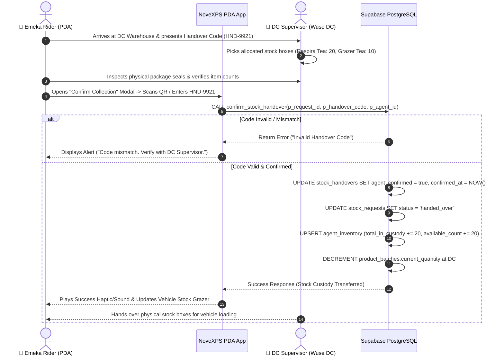

# 🤝 Workflow 03: Confirming Stock Collection & Physical Handover

This document details the step-by-step physical handover verification process between the Distribution Center (DC) Supervisor and the Delivery Agent, including Security PIN / QR Code verification, batch custody transfer, and atomic inventory updates.

---

## 🎯 Overview & Objectives

* **Primary Goal**: Ensure zero inventory leakage by verifying physical stock transfer at DC through dual-confirmation (Rider Security PIN / QR Code & DC Supervisor confirmation), transferring custody atomically into the rider's vehicle inventory.
* **Primary Actors**: Delivery Agent (*Emeka Rider*), DC Supervisor (*Adekunle Supervisor*), NoveXPS PDA App, Supabase Database (`agent_inventory`, `stock_handovers`, `product_batches`).

---

## 📊 Detailed Workflow Diagram



---

## 📑 Step-by-Step Execution Sequence

### Step 1: Arrival & Physical Counting at DC
1. The Rider arrives at the designated Distribution Center (e.g. *Wuse Distribution Center*).
2. Rider opens the **Stock Pickup Notification** in the PDA displaying approved request `REQ-00482` and Security Code `HND-9921`.
3. The DC Supervisor retrieves the pre-picked package items:
   * **Box 1**: 20 units of *Respira Detox Tea* (Batch `BATCH-RSP-2026`).
   * **Box 2**: 10 units of *Grazer Herbal Tea* (Batch `BATCH-GRZ-2026`).
4. Both parties perform a physical count and verify package seals.

### Step 2: Verification Input on Mobile PDA
1. Rider taps **[ Confirm Collection ]** on the PDA screen.
2. The PDA presents two verification methods:
   * **Option A**: Scan QR Code displayed on DC Supervisor’s terminal screen.
   * **Option B**: Enter 6-digit Handover Security Code `HND-9921`.
3. Rider submits the code.

### Step 3: Atomic Backend Execution (`confirm_stock_handover`)
1. The app invokes the atomic stored procedure:
   ```sql
   SELECT confirm_stock_handover(
       p_request_id := 'req-uuid-00482',
       p_handover_code := 'HND-9921',
       p_agent_id := 'agent-uuid-7000'
   );
   ```
2. The database executes in a single transaction block:
   * Validates `stock_requests.status == 'approved'`.
   * Verifies `handover_code == 'HND-9921'`.
   * Marks `stock_handovers`: `agent_confirmed = true`, `supervisor_confirmed = true`, `confirmed_at = NOW()`.
   * Updates `stock_requests.status = 'handed_over'`.
   * Updates `agent_inventory`:
     ```sql
     INSERT INTO agent_inventory (delivery_agent_id, product_id, batch_id, total_in_custody, available_count)
     VALUES ('agent-uuid', 'product-uuid', 'batch-uuid', 20, 20)
     ON CONFLICT (delivery_agent_id, product_id) DO UPDATE
     SET total_in_custody = agent_inventory.total_in_custody + EXCLUDED.total_in_custody,
         available_count = agent_inventory.available_count + EXCLUDED.available_count;
     ```
   * Deducts quantity from DC warehouse batch `product_batches.current_quantity`.

### Step 4: UI Hydration & Stock Grazer Update
1. The PDA screen updates with a green success checkmark animation.
2. The vehicle inventory widget on the **PDA Home Page** immediately increments:
   * *Respira Detox Tea*: 20 in custody (20 Available)
   * *Grazer Herbal Tea*: 10 in custody (10 Available)
3. Rider loads the boxes into their motorcycle/van cargo box and proceeds to delivery routes.

---

## 🛑 Edge Cases & Discrepancy Resolution

| Discrepancy / Issue | Handling Procedure |
|---|---|
| **Damaged / Expired Bins at Handover** | DC Supervisor updates `approved_quantity` on DC portal before handover confirmation. Inventory update adjusts to physical count actually accepted by rider. |
| **Network Outage at Warehouse** | Offline verification code is saved locally in SQLite action queue and synchronized automatically upon reconnecting to network. |
| **Incorrect Batch Handed Over** | Handover transaction logs exact `batch_id` to maintain lot traceability in case of manufacturer product recalls. |
