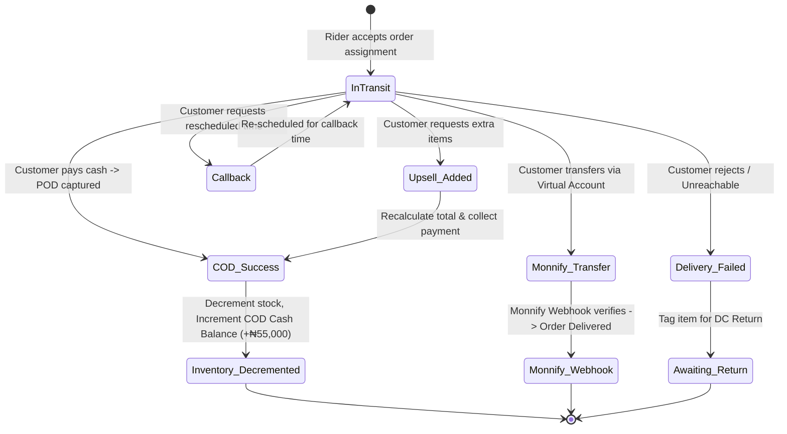
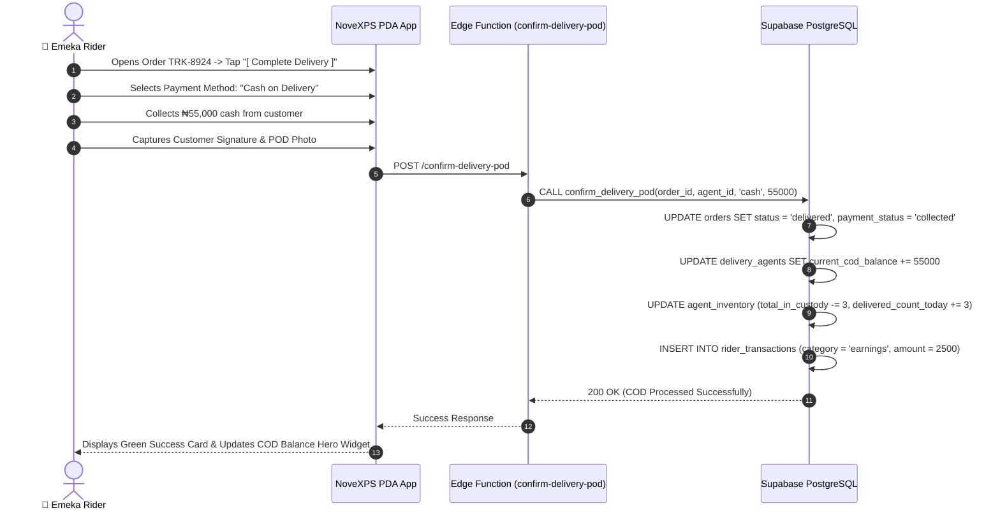
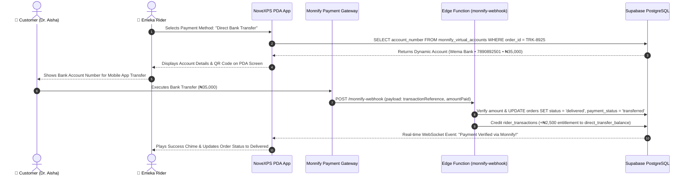
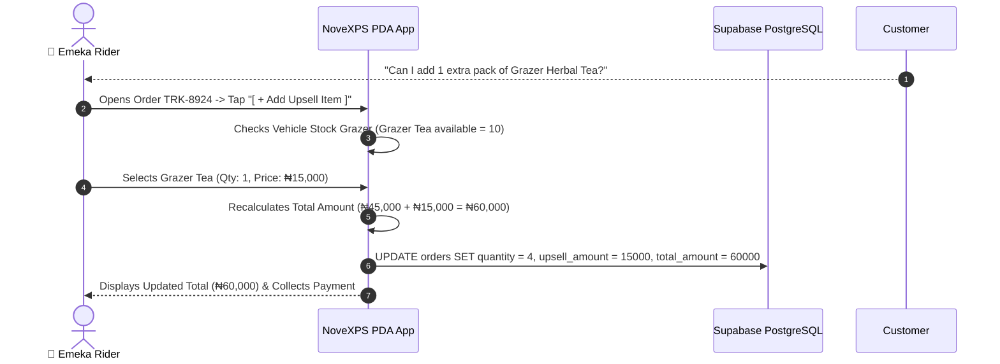
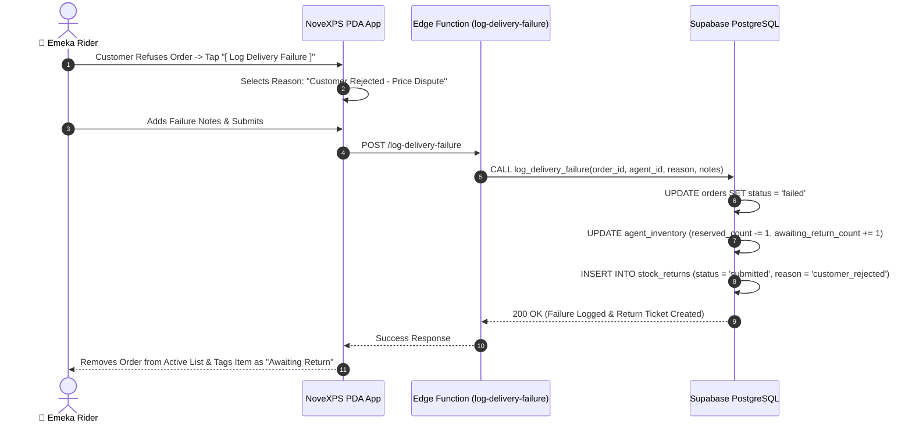
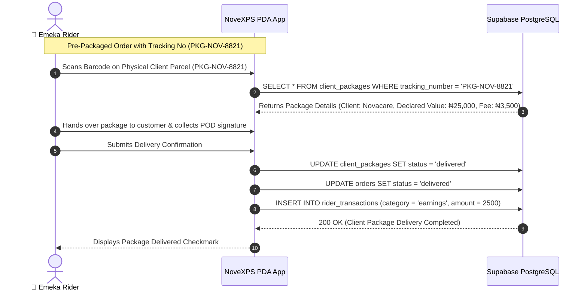

# 🚚 Workflow 04: Delivery Execution, Payment Scenarios & Edge Cases

This document provides a comprehensive step-by-step operational guide for field delivery execution, covering Cash on Delivery (COD), Monnify Direct Bank Transfers, Upsells, Rescheduling/Callbacks, and Delivery Failures.

---

## 🎯 Overview & Objectives

* **Primary Goal**: Guide delivery agents through end-to-end customer order fulfillment, instant payment collection, proof-of-delivery (POD) capture, upsell handling, and failed delivery classification.
* **Primary Actors**: Delivery Agent (*Emeka Rider*), Customer (*Chief Aliyu Mohammed*), NoveXPS PDA App, Edge Functions (`confirm-delivery-pod`, `monnify-webhook`, `log-delivery-failure`), Supabase DB.

---

## 📊 Master Delivery Lifecycle Diagram

---

## 📑 Detailed Delivery Sub-Workflows

### Case 4.1: Cash on Delivery (COD) Successful Delivery

#### Step-by-Step Execution:
1. Rider arrives at customer address (e.g. *Plot 402 Aminu Kano Crescent, Wuse 2, Abuja*).
2. Rider opens active order card `TRK-8924` (Customer: *Chief Aliyu Mohammed*, Item: *Respira Detox Tea*, Quantity: `3`, Total Amount: `₦55,000.00`).
3. Customer inspects package and hands over physical cash (`₦55,000.00`).
4. Rider taps **[ Complete Delivery ]** on PDA screen.
5. Selects **Payment Method: Cash on Delivery**.
6. Takes a photo of signed delivery receipt or package handover (uploaded to Supabase Storage `pod-proofs` bucket).
7. PDA calls Edge Function `confirm-delivery-pod`.
8. Edge Function atomically updates database:
   * `orders.status` set to `'delivered'`.
   * `orders.payment_status` set to `'collected'`.
   * `delivery_agents.current_cod_balance` incremented by `+₦55,000.00`.
   * `agent_inventory.total_in_custody` decremented by `3` units.
   * `agent_inventory.delivered_count_today` incremented by `3` units.
   * Rider entitlement created in `rider_transactions`: `+₦2,500.00` (₦1,000 commission + ₦1,500 transport allowance).

---

### Case 4.2: Monnify Direct Bank Transfer / Virtual Account Payment

#### Step-by-Step Execution:
1. Customer requests to pay via Instant Bank Transfer.
2. Rider selects **Payment Method: Direct Transfer**.
3. PDA displays dynamic virtual account generated specifically for order `TRK-8925`:
   * **Bank Name**: Wema Bank / Monnify
   * **Account Number**: `7890892501`
   * **Account Name**: `NovaExpress / Novacare`
   * **Amount Expected**: `₦35,000.00`
4. Customer transfers `₦35,000.00` using their bank app.
5. Monnify sends real-time webhook notification to `monnify-webhook` Edge Function.
6. Edge Function validates payment match and updates order `payment_status = 'transferred'` and `status = 'delivered'`.
7. Rider does **NOT** collect physical cash; instead, rider entitlement (`₦2,500.00`) is credited directly to rider’s **My Balance** (`direct_transfer_balance`).

---

### Case 4.3: On-Site Upsell / Additional Product Purchase

#### Step-by-Step Execution:
1. During delivery, customer expresses interest in purchasing an additional product item.
2. Rider taps **[ + Add Upsell Item ]** on the order screen.
3. App queries local stock grazer to verify available item in rider vehicle custody (`agent_inventory.available_count >= requested_qty`).
4. Rider adds item (e.g. +1 *Grazer Herbal Tea* @ `₦15,000.00`).
5. Order total is updated dynamically from `₦45,000.00` to `₦60,000.00`.
6. Additional rider upsell commission is logged.

---

### Case 4.4: Reschedule / Customer Requested Callback

1. If customer is in a meeting or unavailable, rider taps **[ Reschedule / Call Back ]**.
2. Selects scheduled callback date and time (e.g. *Today @ 4:30 PM*).
3. Adds reschedule note (e.g. *"Customer requested callback at 4:30 PM after office meeting"*).
4. App updates order status to `call_back`.
5. Order moves to **Scheduled Callbacks** tab; item remains in vehicle custody.

---

### Case 4.5: Delivery Failure & Customer Rejection

#### Step-by-Step Execution:
1. Customer refuses delivery or address is invalid after multiple calls.
2. Rider taps **[ Log Delivery Failure ]**.
3. Selects Failure Reason:
   * `customer_rejected` (Price dispute / Changed mind)
   * `unreachable` (Phone switched off after 3 attempts)
   * `wrong_address` (Address non-existent)
   * `damaged_on_arrival`
4. Adds detailed notes and submits.
5. Edge Function `log-delivery-failure` updates order status to `failed`.
6. Item custody is moved in `agent_inventory`:
   * `reserved_count` decremented by `1`.
   * `awaiting_return_count` incremented by `1`.
7. Auto-generates a pending return record in `stock_returns` (`RET-XXXXX`) for handover back to DC.

### Case 4.6: Client Pre-Packaged Delivery Fulfillment (`client_package`)

#### Step-by-Step Execution:
1. For merchant-specific pre-packaged parcels (`fulfillment_type = 'client_package'`), items are not deducted from vehicle bulk product stock.
2. Rider scans or inputs the unique package tracking number `PKG-NOV-8821`.
3. Collects customer signature / proof of delivery photo.
4. Database updates `client_packages.status = 'delivered'` and logs rider entitlement.

---

## 🛑 Summary Matrix of Delivery Scenarios

| Scenario | Fulfillment Type | Payment Collected | Order Status | COD Balance | Rider My Balance | Inventory / Package Action |
|---|:---:|:---:|:---:|:---:|:---:|---|
| **COD Delivery** | `distributed_inventory` | ₦55,000 Cash | `delivered` | **+₦55,000** | +₦2,500 | `agent_inventory.total_in_custody` decremented |
| **Monnify Transfer** | `distributed_inventory` | ₦35,000 Bank | `delivered` | ₦0 | **+₦35,000** | `agent_inventory.total_in_custody` decremented |
| **Client Pre-Package** | `client_package` | ₦0 (Prepaid) / Cash | `delivered` | +Cash (if COD) | +₦2,500 | `client_packages.status = 'delivered'` |
| **Upsell Delivery** | `distributed_inventory` | ₦60,000 Cash | `delivered` | **+₦60,000** | +₦3,000 | Total items decremented |
| **Call Back / Reschedule** | Either | ₦0 | `call_back` | ₦0 | ₦0 | Retained in custody |
| **Delivery Failure** | `distributed_inventory` | ₦0 | `failed` | ₦0 | ₦0 | Tagged `awaiting_return_count` |

