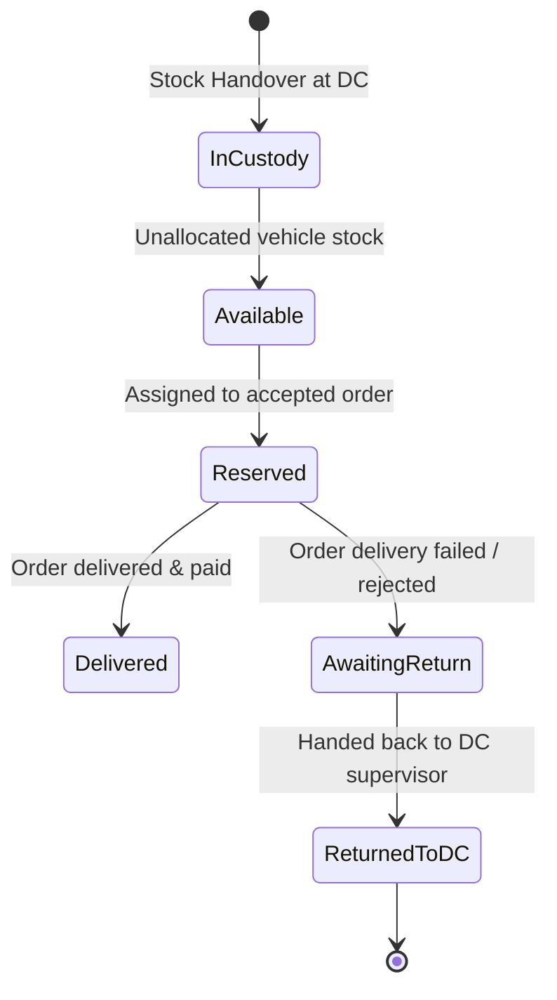
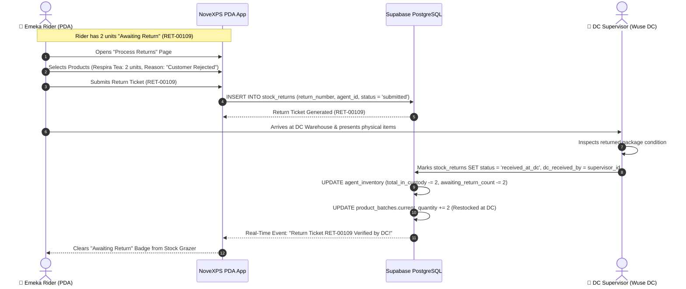
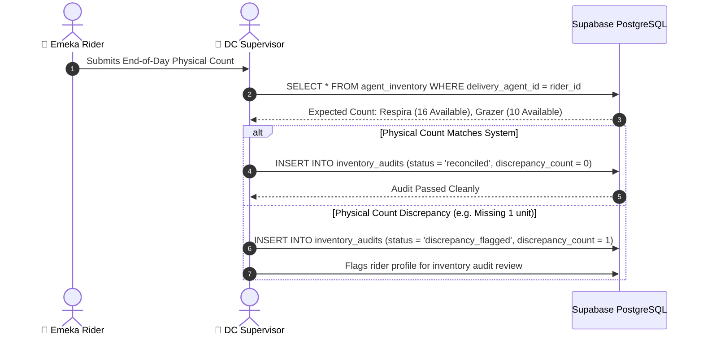

# 📊 Workflow 05: Vehicle Inventory Custody & Stock Return Workflows

This document outlines vehicle inventory tracking via the Stock Grazer widget, inventory state transitions (Total, Available, Reserved, Delivered, Returned, Awaiting Return), stock returns to Distribution Centers, and daily inventory audits.

---

## 🎯 Overview & Objectives

* **Primary Goal**: Provide 100% real-time visibility into physical stock held in rider vehicle custody, maintain strict auditability across product batches, and streamline stock return procedures to DCs.
* **Primary Actors**: Delivery Agent (*Emeka Rider*), DC Stock Keeper (*Adekunle Supervisor*), NoveXPS PDA App, Supabase PostgreSQL Database.
* **Database Tables**: `agent_inventory`, `stock_returns`, `inventory_audits`, `product_batches`.

---

## 📊 Inventory State Transition Diagram



---

## 📑 Step-by-Step Execution Sequence

### Step 1: Vehicle Stock Grazer Inspection
1. The Rider opens the **Inventory / Stock Page** on the PDA.
2. The Stock Grazer displays a live summary card for each assigned product:

```
┌─────────────────────────────────────────────────────────┐
│ 🍃 Respira Detox Tea (SKU-RSP01)                        │
│ Batch: BATCH-RSP-2026  | Exp: 2028-06-30                    │
├─────────────────────────────────────────────────────────┤
│ 📦 Total In Custody : 20 units                          │
│ 🟢 Available        : 16 units                          │
│ 🟡 Reserved         :  3 units (TRK-8924, TRK-8925)    │
│ 🔵 Delivered Today  :  1 unit                           │
│ 🔴 Awaiting Return  :  0 units                          │
└─────────────────────────────────────────────────────────┘
```

3. Inventory counters automatically adjust in real-time as orders transition through states.

---

### Step 2: Stock Returns Process (Failed Orders / Damaged Items)



#### Step-by-Step Execution:
1. When an order fails or is cancelled, items are tagged as `awaiting_return` in `agent_inventory`.
2. At the end of the shift or route, rider navigates to **Process Returns Page**.
3. Selects items to return to DC:
   * **Product**: *Respira Detox Tea* — Quantity: `2`
   * **Reason**: `customer_rejected` (Options: `customer_rejected`, `defective`, `order_cancelled`, `overstock`).
4. Submits return ticket `RET-00109`.
5. At the DC, the DC Supervisor inspects physical package seals and verifies returned quantities.
6. DC Supervisor taps **[ Confirm Return Receipt ]** on DC Portal.
7. Backend updates:
   * `stock_returns.status` set to `'received_at_dc'`.
   * `agent_inventory.total_in_custody` decremented by `2`.
   * `agent_inventory.awaiting_return_count` decremented by `2`.
   * DC warehouse stock batch `product_batches.current_quantity` incremented by `2` (restocked).

---

### Step 3: End-of-Day Inventory Audit & Reconciliation



---

## 🛑 Inventory Reconciliation Rules

| Metric | Calculation Formula | Audit Condition |
|---|---|---|
| **Total In Custody** | $\text{Available} + \text{Reserved} + \text{Awaiting Return}$ | Must equal physical count inside motorcycle cargo box. |
| **Available Count** | $\text{Total In Custody} - \text{Reserved} - \text{Awaiting Return}$ | Available for new order assignments or upsells. |
| **Reserved Count** | $\sum \text{Product Quantities in Active } (\text{accepted}, \text{in\_transit}) \text{ Orders}$ | Blocked from new allocations. |
