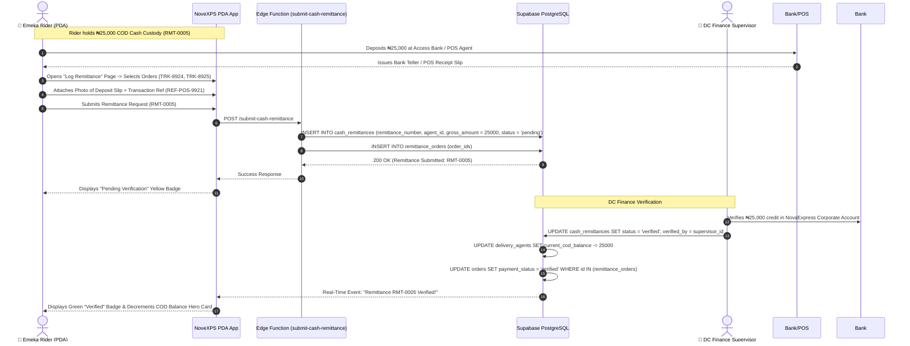

# 💵 Workflow 06: Physical Cash Custody & Remittance Workflow

This document details the operational workflow for physical Cash on Delivery (COD) custody management, bank deposit teller/POS slip attachment, DC finance verification, and COD balance clearance.

---

## 🎯 Overview & Objectives

* **Primary Goal**: Ensure prompt and auditable reconciliation of physical cash collected from COD deliveries, preventing cash holdover risk and clearing rider custody balances.
* **Primary Actors**: Delivery Agent (*Emeka Rider*), DC Finance Supervisor, Edge Function (`submit-cash-remittance`), Supabase PostgreSQL Database.
* **Database Tables**: `cash_remittances`, `remittance_orders`, `delivery_agents`, `orders`.

---

## 📊 Detailed Workflow Diagram



---

## 📑 Step-by-Step Execution Sequence

### Step 1: Cash Collection & Deposit
1. As the Rider completes COD deliveries, physical cash accumulates in `delivery_agents.current_cod_balance` (e.g. `₦25,000.00`).
2. When COD balance reaches the daily threshold or shift end, rider proceeds to:
   * **Option A**: Bank Branch / CDM (Cash Deposit Machine)
   * **Option B**: POS Agent Terminal
   * **Option C**: Direct Physical Cash Handover to DC Finance Cashier.
3. Rider deposits `₦25,000.00` into NovaExpress Corporate Bank Account.
4. Collects printed receipt/teller slip.

### Step 2: Remittance Logging on Mobile PDA
1. Rider opens **Log Remittance Page** on PDA.
2. Selects payment channel: `bank_transfer` (Options: `bank_transfer`, `pos_deposit`, `cash_to_dc`).
3. Selects delivered COD orders to include in this batch:
   * `TRK-8924` (₦15,000)
   * `TRK-8925` (₦10,000)
   * **Total Gross Collections**: `₦25,000.00`
4. Takes a clear camera photo of the deposit slip/teller (uploaded to Supabase Storage `remittance-proofs` bucket).
5. Enters Reference Number (e.g. `REF-POS-9921`).
6. Submits remittance request.

### Step 3: Edge Function Execution (`submit-cash-remittance`)
1. Payload sent to `submit-cash-remittance` Edge Function:
   ```json
   {
     "delivery_agent_id": "b1111111-1111-4111-8111-111111111111",
     "payment_channel": "bank_transfer",
     "gross_amount": 25000.00,
     "proof_url": "https://supabase.co/storage/v1/object/public/remittance-proofs/rmt-0005.jpg",
     "transaction_reference": "REF-POS-9921",
     "order_ids": ["20202020-2020-4020-8020-202020202020", "20202020-2020-4020-8020-303030303030"]
   }
   ```
2. Edge Function validates sum of selected orders against `gross_amount`.
3. Inserts row into `cash_remittances` with `status = 'pending'`.
4. Links orders in `remittance_orders`.

### Step 4: DC Finance Verification & Balance Clearance
1. DC Finance Supervisor views **Pending Remittances Queue** on Management Portal.
2. Cross-checks corporate bank statement/alert against uploaded receipt `REF-POS-9921`.
3. Taps **[ Verify & Approve ]**.
4. Database updates:
   * `cash_remittances.status` updated to `'verified'`.
   * `delivery_agents.current_cod_balance` decremented by `₦25,000.00`.
   * Linked orders `payment_status` updated to `'verified'`.

---

## 🛑 Edge Cases & Discrepancy Protocol

| Discrepancy | System & Operational Resolution |
|---|---|
| **Shortage / Under-Remittance** | If rider deposits ₦24,000 instead of ₦25,000, finance supervisor approves partial remittance. Remaining ₦1,000 remains in rider `current_cod_balance`. |
| **Fake Receipt / Uncredited Transfer** | Supervisor flags status as `rejected`. Notification sent to rider PDA. COD balance remains uncleared until valid proof is supplied. |
