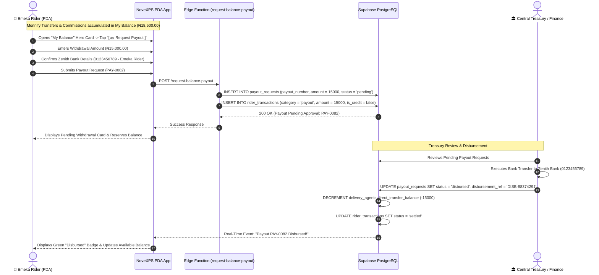

# 💰 Workflow 07: Rider Earnings, Commissions & Withdrawal Payouts

This document details rider commission calculations, Monnify direct transfer credits, My Balance ledger tracking, withdrawal payout requests, and Treasury disbursement procedures.

---

## 🎯 Overview & Objectives

* **Primary Goal**: Provide full financial transparency to field delivery agents by tracking earnings, commissions, and allowances in real-time, and enabling automated/treasury withdrawal payouts into rider bank accounts.
* **Primary Actors**: Delivery Agent (*Emeka Rider*), Central Treasury / DC Finance Officer, Edge Function (`request-balance-payout`), Supabase PostgreSQL Database.
* **Database Tables**: `payout_requests`, `rider_transactions`, `delivery_agents`, `orders`.

---

## 📊 Detailed Workflow Diagram



---

## 📑 Step-by-Step Execution Sequence

### Step 1: Rider Entitlement & Balance Accumulation
1. For every successfully delivered order, the system calculates rider entitlement:
   * **Base Commission**: `₦1,000.00`
   * **Transport Allowance**: `₦1,500.00`
   * **Total Entitlement Per Order**: `₦2,500.00`
2. For **Monnify Direct Transfers**, customer payments credit the rider's `direct_transfer_balance` / `my_balance` directly.
3. Live balance is displayed on the **My Balance Hero Card**:
   ```
   ┌────────────────────────────────────────────────────────┐
   │ 💳 My Balance (Available Earnings)                     │
   │ ₦18,500.00                                             │
   │ Direct Transfers: ₦15,000 | Entitlements: ₦3,500        │
   │ [ 💵 Request Payout ]                                  │
   └────────────────────────────────────────────────────────┘
   ```

### Step 2: Withdrawal Request Initiation
1. Rider taps **[ 💵 Request Payout ]** on the PDA screen.
2. App validates available balance (`available_balance >= minimum_payout_threshold` e.g. `₦1,000.00`).
3. Rider enters desired payout amount (e.g. `₦15,000.00`).
4. Confirms linked bank account:
   * **Bank**: Zenith Bank Plc
   * **Account Number**: `0123456789`
   * **Account Name**: `EMEKA RIDER`
5. Submits request.

### Step 3: Edge Function Validation (`request-balance-payout`)
1. Payload sent to `request-balance-payout` Edge Function:
   ```json
   {
     "delivery_agent_id": "b1111111-1111-4111-8111-111111111111",
     "amount": 15000.00,
     "bank_name": "Zenith Bank",
     "account_number": "0123456789",
     "account_name": "EMEKA RIDER"
   }
   ```
2. Validation checks:
   * Rider `direct_transfer_balance >= 15000.00`.
   * Bank details non-empty.
3. Database updates:
   * Inserts row into `payout_requests` with `payout_number = 'PAY-0082'` and `status = 'pending'`.
   * Logs transaction entry in `rider_transactions` with `is_credit = false` and `status = 'pending'`.

### Step 4: Treasury Review & Disbursement
1. Treasury Officer accesses **Payout Approvals Queue** on Corporate Treasury Portal.
2. Verifies rider identity and bank account name match.
3. Initiates electronic bank transfer via Monnify Payout API or NIBSS Instant Payment (NIP).
4. Upon successful bank disbursement response, Treasury marks status as `disbursed` with reference `DISB-88374291`.
5. Database updates:
   * `delivery_agents.direct_transfer_balance` decremented by `₦15,000.00`.
   * `payout_requests.status` updated to `'disbursed'`.
   * `rider_transactions.status` updated to `'settled'`.
6. Push notification sent to Rider PDA: *"₦15,000.00 successfully transferred to your Zenith Bank Account!"*.

---

## 🛑 Financial Control & Audit Rules

| Rule | Enforcement Mechanism |
|---|---|
| **Negative Balance Lock** | Rider cannot request payout if their `current_cod_balance` is overdue for remittance beyond 48 hours. |
| **Account Name Verification** | Bank account name must match `users.first_name` and `users.last_name` to prevent unauthorized diversion of funds. |
| **Max Single Withdrawal Limit** | Single withdrawal limit capped at ₦100,000; larger amounts require secondary approval by Operations Director. |
