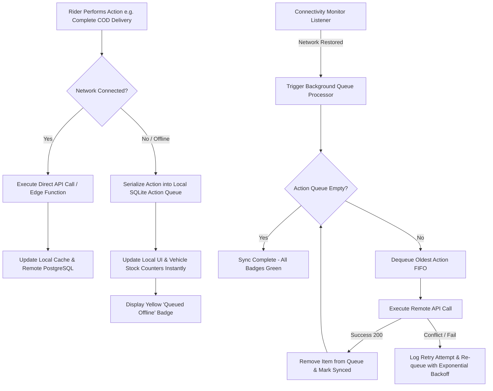

# 📡 Workflow 08: Offline Resiliency, Action Queueing & Auto-Sync Engine

This document details the architectural and operational design of the PDA offline persistence layer, offline transaction queueing, connectivity detection, and background synchronization engine.

---

## 🎯 Overview & Objectives

* **Primary Goal**: Ensure zero operational disruption for field riders delivering in low-network or dead-zone environments by enabling 100% offline order execution, local action queueing, and reliable background synchronization upon reconnecting.
* **Primary Actors**: NoveXPS Flutter PDA Engine, Local Hive / SQLite Storage, Background Sync Service, Supabase Database.

---

## 📊 Offline Queue & Sync Engine Diagram



---

## 📑 Step-by-Step Execution Sequence

### Step 1: Local Cache Initialization
1. Upon logging in, the PDA caches all active assignments and stock records into local Hive/SQLite storage:
   * Active Orders (`orders` where `delivery_agent_id = agent_id`)
   * Vehicle Stock Custody (`agent_inventory`)
   * Customer Addresses & Contact Info
2. All UI screens query local storage first (**Single Source of Truth pattern**) ensuring instantaneous UI response times (<50ms).

### Step 2: Offline Action Interception & Local Execution
1. When rider completes a delivery in an offline zone (e.g. *Basement Delivery at Maitama*):
   * Rider collects cash and captures signature/POD photo.
   * Taps **[ Complete Delivery ]**.
2. Connectivity monitor detects `ConnectivityResult.none`.
3. App serializes the transaction into `offline_action_queue`:
   ```json
   {
     "queue_id": "q-99120",
     "action_type": "CONFIRM_POD",
     "timestamp": "2026-08-19T18:45:00Z",
     "payload": {
       "order_id": "20202020-2020-4020-8020-202020202020",
       "payment_type": "cash",
       "amount": 55000.00,
       "pod_local_path": "/storage/emulated/0/novexps/pod_trk8924.jpg"
     }
   }
   ```
4. Local DB immediately updates order status to `delivered` locally and increments local COD balance.
5. Order card displays a yellow **"Saved Offline (Pending Sync)"** status badge.

### Step 3: Background Connectivity Monitor & Auto-Sync Execution
1. As rider leaves dead zone, Connectivity Monitor detects `ConnectivityResult.mobile` / `wifi`.
2. Triggers `SyncEngine.processQueue()`.
3. Processes queued items in strict **First-In, First-Out (FIFO)** order:
   * **Step A**: Upload local POD photo file to Supabase Storage.
   * **Step B**: Invoke Edge Function `confirm-delivery-pod` with uploaded image URL.
   * **Step C**: Server confirms atomic execution (`200 OK`).
   * **Step D**: Queue processor deletes item `q-99120` from SQLite action queue.
4. Yellow badge changes to green **"Synced Live"** checkmark.

---

## 🛑 Conflict Resolution Strategies

| Conflict Scenario | Resolution Strategy |
|---|---|
| **Order Cancelled by Dispatch while Rider was Offline** | Server returns `409 Conflict`. Sync engine flags order for manual DC supervisor review, retains physical item in rider custody, and alerts rider with a modal. |
| **Duplicate Delivery Submission** | Idempotency keys (`order_id + action_type`) prevent duplicate database executions if network drops during HTTP response. |
| **Intermittent Reconnections** | Queue processor uses exponential backoff (Retry at 2s, 4s, 8s, 16s) to avoid battery and bandwidth drain. |
