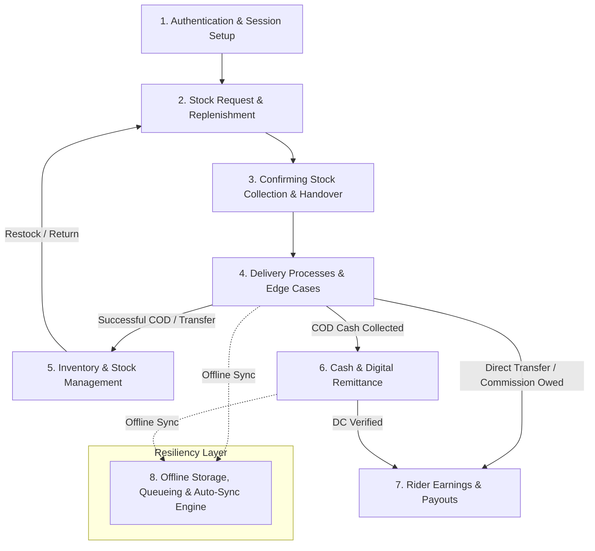
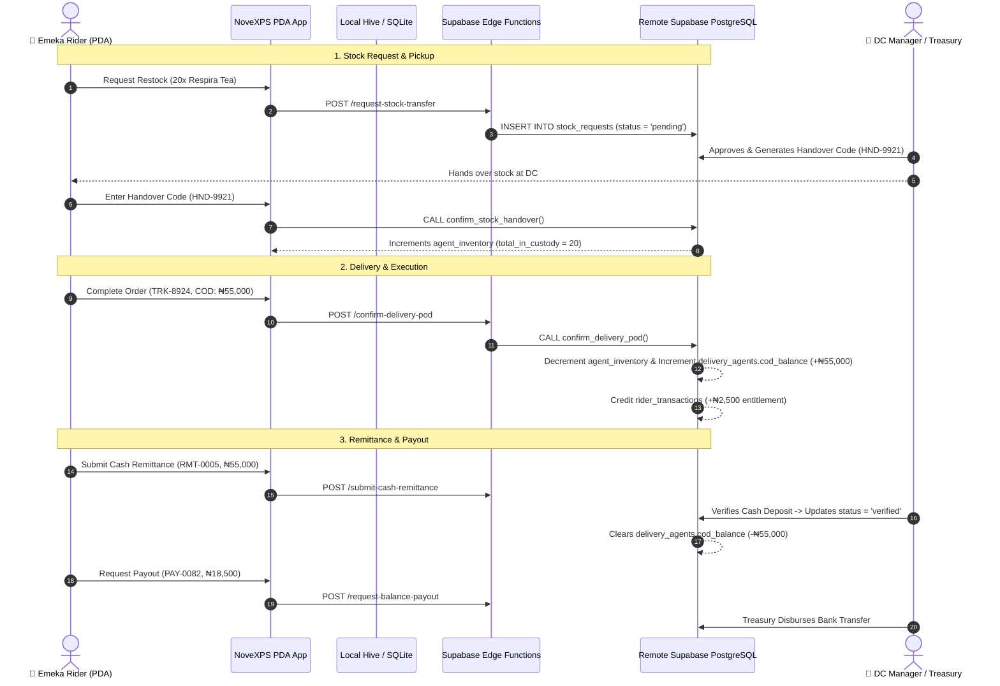

# 📘 NoveXPS PDA Complete Operational Workflow Guide & Sitemap

Welcome to the **NovaExpress Logistics Management System (NoveXPS) Personal Digital Assistant (PDA) Operational Workflow Guide**. This master index organizes end-to-end operational workflows for delivery riders, distribution center supervisors, treasury personnel, and backend Edge Functions.

---

## 🗺️ Master Workflow Architecture Overview

---

## 📑 Workflow Guide Index

| # | Workflow Module | Description | Primary Actors | Documentation Link |
|:---:|---|---|---|---|
| **01** | **Authentication & Session Setup** | Login, JWT authentication, role detection, profile hydration, and offline sync initialization. | Emeka Rider (PDA Agent), Supabase Auth | [01_AUTHENTICATION_AND_SESSION_WORKFLOW.md](file:///c:/PROJECT/NoveXPS/DOCUMENTATION/PDA/WORKFLOW/01_AUTHENTICATION_AND_SESSION_WORKFLOW.md) |
| **02** | **Stock Request & Replenishment** | Requesting inventory from Distribution Center (DC), restock threshold triggers, and approval queues. | Rider, DC Supervisor, Edge Function (`request-stock-transfer`) | [02_STOCK_REQUEST_AND_REPLENISHMENT_WORKFLOW.md](file:///c:/PROJECT/NoveXPS/DOCUMENTATION/PDA/WORKFLOW/02_STOCK_REQUEST_AND_REPLENISHMENT_WORKFLOW.md) |
| **03** | **Confirming Stock Collection & Handover** | Security PIN / QR physical handover verification, batch allocation, and vehicle inventory intake. | Rider, DC Manager, PostgreSQL Triggers | [03_STOCK_COLLECTION_AND_HANDOVER_WORKFLOW.md](file:///c:/PROJECT/NoveXPS/DOCUMENTATION/PDA/WORKFLOW/03_STOCK_COLLECTION_AND_HANDOVER_WORKFLOW.md) |
| **04** | **Delivery Processes & Edge Cases** | End-to-end order execution: COD, Monnify Transfer, Upsell, Callback/Reschedule, Delivery Failure, POD attachment. | Rider, Customer, Edge Functions (`confirm-delivery-pod`, `monnify-webhook`, `log-delivery-failure`) | [04_DELIVERY_PROCESSES_AND_EDGE_CASES_WORKFLOW.md](file:///c:/PROJECT/NoveXPS/DOCUMENTATION/PDA/WORKFLOW/04_DELIVERY_PROCESSES_AND_EDGE_CASES_WORKFLOW.md) |
| **05** | **Inventory & Stock Management** | Stock Grazer custody view, real-time inventory counts (Reserved, Delivered, Returned, Awaiting Return), and DC returns. | Rider, DC Stock Keeper | [05_INVENTORY_AND_STOCK_MANAGEMENT_WORKFLOW.md](file:///c:/PROJECT/NoveXPS/DOCUMENTATION/PDA/WORKFLOW/05_INVENTORY_AND_STOCK_MANAGEMENT_WORKFLOW.md) |
| **06** | **Cash & Digital Remittance** | Physical COD cash custody accumulation, POS/Bank slip uploads, DC supervisor verification, and COD balance clearance. | Rider, DC Finance Supervisor, Edge Function (`submit-cash-remittance`) | [06_CASH_AND_DIGITAL_REMITTANCE_WORKFLOW.md](file:///c:/PROJECT/NoveXPS/DOCUMENTATION/PDA/WORKFLOW/06_CASH_AND_DIGITAL_REMITTANCE_WORKFLOW.md) |
| **07** | **Rider Earnings & Payouts** | Ledger tracking (₦1000 commission + ₦1500 allowance), Monnify direct transfer credits, My Balance withdrawal requests. | Rider, Treasury Officer, Edge Function (`request-balance-payout`) | [07_RIDER_EARNINGS_AND_PAYOUT_WORKFLOW.md](file:///c:/PROJECT/NoveXPS/DOCUMENTATION/PDA/WORKFLOW/07_RIDER_EARNINGS_AND_PAYOUT_WORKFLOW.md) |
| **08** | **Offline Resiliency & Sync Engine** | Offline sqlite persistence, action queueing, connectivity detection, and background sync conflict resolution. | PDA App Engine, Hive/SQLite | [08_OFFLINE_RESILIENCY_AND_SYNC_WORKFLOW.md](file:///c:/PROJECT/NoveXPS/DOCUMENTATION/PDA/WORKFLOW/08_OFFLINE_RESILIENCY_AND_SYNC_WORKFLOW.md) |

---

## 🛠️ Key System Components & Data Flow Mapping

