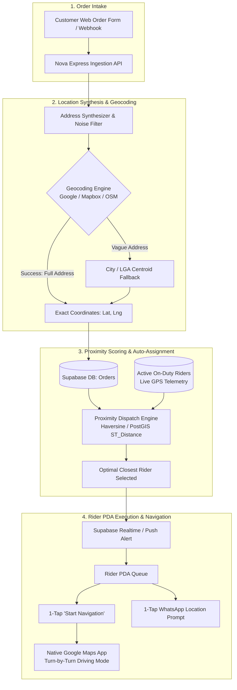

# 🛰️ Automated Geocoding, Proximity Dispatch & Rider Navigation

## 1. Overview & Problem Statement

In Nigerian e-commerce and last-mile delivery operations, customers rarely provide GPS coordinates during checkout. Instead, intake channels (landing pages, social commerce ads, WooCommerce/Shopify stores) capture unstructured, free-form text:
- *"Behind Total filling station, near modern market, Wuse 2, Abuja"*
- *"No 14 off Hospital Road, Ring Road, Benin City, Edo State"*
- *"Beside First Bank, Ikeja Along, Lagos"*

### Operational Goals
1. **Automated Location Resolution**: Automatically convert raw, messy address text into high-precision geographical coordinates $(\text{latitude}, \text{longitude})$ immediately upon order ingestion.
2. **Proximity-Based Auto-Dispatch**: Automatically calculate distance to all active on-duty delivery agents (riders) and assign the order to the closest optimal rider.
3. **Turn-by-Turn Rider Navigation**: Enable 1-tap, zero-cost Google Maps voice navigation on the rider's PDA terminal without expensive in-app SDK fees.
4. **Resilient Fallback Loops**: Support graceful degradation (City Centroid fallback, WhatsApp location pin drop, and DC supervisor reassignment).

---

## 2. End-to-End System Architecture



---

## 3. Database Schema & Data Models

### 3.1 `orders` Table Extensions

| Column Name | Data Type | Default | Description |
|---|---|---|---|
| `latitude` | `DOUBLE PRECISION` | `NULL` | Geocoded destination latitude. |
| `longitude` | `DOUBLE PRECISION` | `NULL` | Geocoded destination longitude. |
| `geocoding_status` | `VARCHAR(32)` | `'pending'` | Enum: `'pending'`, `'exact_match'`, `'landmark_match'`, `'centroid_fallback'`, `'failed'`. |
| `geocoded_address` | `TEXT` | `NULL` | Canonical formatted address returned by the geocoding provider. |
| `location_confidence` | `REAL` | `0.0` | Confidence score between `0.0` and `1.0`. |
| `is_location_verified`| `BOOLEAN` | `FALSE` | Set to `TRUE` once verified by rider or customer WhatsApp pin. |

### 3.2 `delivery_agents` / `users` Table Extensions

| Column Name | Data Type | Default | Description |
|---|---|---|---|
| `current_latitude` | `DOUBLE PRECISION` | `NULL` | Live GPS latitude from rider PDA. |
| `current_longitude`| `DOUBLE PRECISION` | `NULL` | Live GPS longitude from rider PDA. |
| `last_location_update` | `TIMESTAMPTZ` | `NULL` | Timestamp of last heartbeat/GPS ping. |
| `is_on_duty` | `BOOLEAN` | `TRUE` | Whether the rider is currently active for dispatch. |
| `max_active_orders`| `INTEGER` | `15` | Maximum concurrent active deliveries. |
| `assigned_zones` | `TEXT[]` | `ARRAY[]::TEXT[]` | Array of sub-zones / LGAs covered (e.g. `['Ikeja', 'Maryland']`). |

---

## 4. Automated Geocoding & Address Synthesis Engine

### 4.1 Address Cleaning & Query Synthesis
Raw customer addresses often contain noise words (*"opposite"*, *"behind"*, *"call me when you reach"*). The query synthesizer formats clean query strings before dispatching to the geocoder.

```dart
class AddressSynthesizer {
  static String synthesizeQuery({
    required String address,
    String? city,
    required String state,
    String country = 'Nigeria',
  }) {
    // Remove phone numbers and delivery instructions
    String cleaned = address
        .replaceAll(RegExp(r'\b(0[789][01]\d{8}|\+?234\d{10})\b'), '')
        .replaceAll(RegExp(r'(?i)\b(call|contact|deliver|reach|urgent|please)\b.*'), '')
        .trim();

    final parts = <String>[cleaned];
    if (city != null && city.trim().isNotEmpty && !cleaned.toLowerCase().contains(city.toLowerCase())) {
      parts.add(city.trim());
    }
    parts.add(state.trim());
    parts.add(country);

    return parts.where((p) => p.isNotEmpty).join(', ');
  }
}
```

### 4.2 Multi-Tier Resolution Strategy
1. **Tier 1: Full Synthesized Address Geocode**:
   - Query: `"Opposite Zenith Bank, Admiralty Way, Lekki, Lagos, Nigeria"`
   - If confidence $\ge 0.70$, store coordinates with `geocoding_status = 'exact_match'`.
2. **Tier 2: Landmark & Neighborhood Sub-Zone Geocode**:
   - If Tier 1 fails or returns confidence $< 0.40$, extract known landmarks from [`NigeriaLocations`](file:///c:/PROJECT/NoveXPS/lib/core/constants/nigeria_locations.dart) and geocode: `"Admiralty Way, Lekki, Lagos, Nigeria"`.
   - Store coordinates with `geocoding_status = 'landmark_match'`.
3. **Tier 3: City / LGA Centroid Fallback**:
   - If Tier 2 fails, query `"Lekki, Lagos, Nigeria"`.
   - Store coordinates with `geocoding_status = 'centroid_fallback'` (enables initial DC hub assignment and regional rider selection).

### 4.3 Provider Economics & Free Quotas
- **Google Cloud Geocoding API**: **$200 monthly free credit** (~**40,000 free geocodes/month**).
- **Mapbox Geocoding**: **100,000 free requests/month**.
- **OpenStreetMap / Nominatim**: **100% Free / Open Source**.

---

## 5. Proximity Dispatch & Distance Calculation Engine

### 5.1 Spatial Distance Formula (Haversine)
To calculate straight-line geographical distance $d$ (in kilometers) between order $(\phi_1, \lambda_1)$ and rider $(\phi_2, \lambda_2)$:

$$d = 2R \arcsin\left(\sqrt{\sin^2\left(\frac{\Delta \phi}{2}\right) + \cos(\phi_1)\cos(\phi_2)\sin^2\left(\frac{\Delta \lambda}{2}\right)}\right)$$

Where $R = 6371\text{ km}$ (Earth radius).

#### Dart Implementation:
```dart
import 'dart:math' as math;

class GeoProximityCalculator {
  static const double earthRadiusKm = 6371.0;

  static double calculateDistanceKm({
    required double lat1,
    required double lon1,
    required double lat2,
    required double lon2,
  }) {
    final dLat = _degToRad(lat2 - lat1);
    final dLon = _degToRad(lon2 - lon1);

    final a = math.sin(dLat / 2) * math.sin(dLat / 2) +
        math.cos(_degToRad(lat1)) *
            math.cos(_degToRad(lat2)) *
            math.sin(dLon / 2) *
            math.sin(dLon / 2);

    final c = 2 * math.atan2(math.sqrt(a), math.sqrt(1 - a));
    return earthRadiusKm * c;
  }

  static double _degToRad(double deg) => deg * (math.pi / 180.0);
}
```

### 5.2 PostgreSQL / PostGIS Nearest-Rider Function (Supabase)
For server-side execution:

```sql
CREATE OR REPLACE FUNCTION find_closest_available_rider(
  p_order_lat DOUBLE PRECISION,
  p_order_lng DOUBLE PRECISION,
  p_distribution_center_id UUID,
  p_max_distance_km DOUBLE PRECISION DEFAULT 25.0
)
RETURNS TABLE (
  delivery_agent_id UUID,
  full_name TEXT,
  phone TEXT,
  distance_km DOUBLE PRECISION,
  active_orders_count INT
)
LANGUAGE sql
STABLE
AS $$
  SELECT 
    u.id AS delivery_agent_id,
    u.full_name,
    u.phone,
    (6371 * acos(
      cos(radians(p_order_lat)) * cos(radians(u.current_latitude)) *
      cos(radians(u.current_longitude) - radians(p_order_lng)) +
      sin(radians(p_order_lat)) * sin(radians(u.current_latitude))
    )) AS distance_km,
    (SELECT COUNT(*) FROM orders o WHERE o.delivery_agent_id = u.id AND o.status IN ('assigned', 'in_transit'))::INT AS active_orders_count
  FROM users u
  WHERE u.role = 'delivery_agent'
    AND u.distribution_center_id = p_distribution_center_id
    AND u.is_on_duty = TRUE
    AND u.current_latitude IS NOT NULL
    AND u.current_longitude IS NOT NULL
    AND (
      SELECT COUNT(*) FROM orders o 
      WHERE o.delivery_agent_id = u.id AND o.status IN ('assigned', 'in_transit')
    ) < u.max_active_orders
    AND (6371 * acos(
      cos(radians(p_order_lat)) * cos(radians(u.current_latitude)) *
      cos(radians(u.current_longitude) - radians(p_order_lng)) +
      sin(radians(p_order_lat)) * sin(radians(u.current_latitude))
    )) <= p_max_distance_km
  ORDER BY distance_km ASC, active_orders_count ASC
  LIMIT 1;
$$;
```

---

## 6. Rider PDA Turn-by-Turn Navigation & Verification

### 6.1 Zero-Cost Native Google Maps Intent Launch
Rather than embedding heavy mapping SDKs inside Flutter, the PDA deep-links into the native Google Maps navigation application on Android / iOS.

```dart
import 'package:url_launcher/url_launcher.dart';

class NavigationHelper {
  /// Launches turn-by-turn driving navigation in Google Maps
  static Future<bool> launchTurnByTurnNavigation({
    required double latitude,
    required double longitude,
    String? destinationLabel,
  }) async {
    // 1. Try native Google Maps driving mode intent (Android)
    final nativeUri = Uri.parse('google.navigation:q=$latitude,$longitude&mode=d');
    if (await canLaunchUrl(nativeUri)) {
      return await launchUrl(nativeUri);
    }

    // 2. Fallback to universal Google Maps web/app direction URL (iOS / Web)
    final universalUri = Uri.parse(
      'https://www.google.com/maps/dir/?api=1&destination=$latitude,$longitude&travelmode=driving',
    );
    return await launchUrl(universalUri, mode: LaunchMode.externalApplication);
  }
}
```

### 6.2 The WhatsApp 1-Tap Customer Location Prompt
For orders with vague addresses or centroid fallbacks, riders can trigger a 1-tap WhatsApp prompt:

```dart
class WhatsAppLocationPromptHelper {
  static Future<void> promptCustomerForLocationPin({
    required String customerPhone,
    required String customerName,
    required String orderRef,
    required String packageName,
  }) async {
    final cleanPhone = customerPhone.replaceAll(RegExp(r'[^0-9]'), '');
    final internationalPhone = cleanPhone.startsWith('0')
        ? '234${cleanPhone.substring(1)}'
        : cleanPhone;

    final message = '''
Hello $customerName! 🚚
This is your Nova Express delivery rider for your package ($packageName - Ref: #$orderRef).

To help me drive directly to your gate without delays:
1️⃣ Tap the attachment (📎 or +) icon below
2️⃣ Select "Location"
3️⃣ Tap "Send your current location"

Thank you!
''';

    final uri = Uri.parse(
      'https://wa.me/$internationalPhone?text=${Uri.encodeComponent(message)}',
    );
    await launchUrl(uri, mode: LaunchMode.externalApplication);
  }
}
```

### 6.3 Gate Pin Refinement & Order Location Locking
When a rider delivers to a customer or receives their location pin, tapping **"Lock Customer Gate Location"** on the PDA updates the order record and links the coordinates to the customer's phone profile in Supabase. Subsequent orders for this customer are automatically 100% pinpoint accurate.

---

## 7. Distribution Center (DC) Console Supervisor Controls

In the **DC Console $\rightarrow$ Dispatch Tab**:
1. **Live Geocoding Confidence Badges**:
   - 🟢 `Exact Match` (High precision address)
   - 🟡 `Landmark Match` (Resolved via landmark heuristics)
   - 🟠 `City Centroid` (Requires rider confirmation / WhatsApp pin)
2. **Interactive Rider Proximity List**:
   - Shows top 3 closest riders with live distances (e.g. *Emeka Rider - 0.8 km*, *Tunde - 4.2 km*).
3. **1-Click Manual Override / Reassignment**:
   - Supervisors can override automated assignments or batch route clusters to a specific rider with a single click.

---

## 8. Summary Comparison of Location & Routing Strategies

| Feature | Proposed Nova Express Pipeline | Standard In-App Map SDK |
|---|---|---|
| **Mapping Cost** | **$0 / Free** (Leverages native OS maps & free tier) | High recurring API costs ($$$) |
| **Voice Navigation** | Full native voice guidance & live traffic alerts | Requires custom engine |
| **Nigerian Address Accuracy** | 3-Tier fallback (Address $\rightarrow$ Landmark $\rightarrow$ Centroid $\rightarrow$ WhatsApp Pin) | Frequent geocoder failures on raw text |
| **Battery & Data Impact** | Minimal (OS-level optimization) | Heavy in-app rendering drain |
| **Repeat Customer Memory** | Saved verified gate coordinates | Re-geocoded every order |
