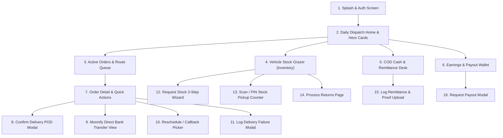

# 📱 Product Requirement Document (PRD): Field Delivery Agent Mobile PDA App

* **Target Persona**: Field Delivery Agent / Motorcycle & Van Rider (`role = 'delivery_agent'`).
* **Platform & Form Factor**: Native Flutter Mobile App (Android, iOS, Rugged PDA Terminals).
* **Primary Environmental Context**: Outdoor field operations, high glare/sunlight, one-handed mobile use, motorcycle riding, varying cellular connectivity.

---

## 🎯 Persona Goals & Core UX Requirements

1. **High Sunlight Contrast & Glove-Friendly Touch Targets**: Minimum 48px interactive touch targets, bold typography, and distinct color-coded status badges.
2. **Frictionless Delivery Execution**: One-tap phone calling to customer, one-tap navigation to Google Maps, and fast Proof-of-Delivery (POD) capture.
3. **Instant Financial Clarity**: Clear separation between **Physical COD Cash in Custody** (liability to be remitted) and **"My Balance"** (rider's earned personal money).
4. **Offline Resiliency Indicator**: Ambient persistent banner showing offline queue status when connection is interrupted.

---

## 📱 Detailed Screen Inventory & Information Architecture

---

## 🖼️ Screen-by-Screen UI/UX Specifications

### Screen 1: Home Dashboard & Vehicle Shift Overview
* **Header**: Rider Profile Avatar, Name (`Emeka Rider`), Agent Code (`PDA-7000`), Online/Break toggle switch.
* **Top Hero Cards (Carousel / Grid)**:
  * **Card A — COD Cash Custody**: Bold red/slate card displaying `₦55,000.00` ("Cash in Custody") + Quick-tap `[ Remit Cash ]` button.
  * **Card B — My Balance Wallet**: Emerald green card displaying `₦24,500.00` ("Available Earnings") + Quick-tap `[ Withdraw ]` button.
* **Vehicle Stock Summary Widget**: Quick-glance pill counters (*Respira: 18*, *Grazer: 10*). Tapping opens Vehicle Stock Grazer.
* **Active Route Queue**: Bottom sheet / list showing today's assigned deliveries sorted by proximity.

### Screen 2: Order Detail & Action Hub
* **Customer Card**: Name (`Chief Aliyu Mohammed`), primary phone with **Green Call Button**, alternative phone, full delivery address with **Blue Maps Navigation Button**.
* **Order Itemization Table**: Product SKU, Quantity (3x), Base Price (₦45,000), Upsell Amount (₦10,000), **Total Due: ₦55,000.00**.
* **Payment Method Selector**: Pill buttons: `[ 💵 Cash on Delivery ]`, `[ 📲 Direct Bank Transfer (Monnify) ]`, `[ 💳 POS Terminal ]`.
* **Action Footer (Sticky Bottom)**:
  * **Primary (Green)**: `[ Complete Delivery / POD ]` (Spans 65% width).
  * **Secondary (Amber)**: `[ Reschedule / Call Back ]` (Spans 17.5% width).
  * **Destructive (Red)**: `[ Report Failed ]` (Spans 17.5% width).

### Screen 3: Proof of Delivery (POD) Modal
* **Payment Verification**: Confirmation of cash amount collected (`₦55,000.00`).
* **Digital Signature Canvas**: Smooth touch drawing canvas with "Clear" and "Accept" buttons.
* **POD Photo Upload**: Camera viewfinder thumbnail showing photo of customer holding package or building gate.
* **Submit Button**: High-visibility green slider or button: `[ 🚀 Submit POD & Complete Delivery ]`.

### Screen 4: Monnify Direct Bank Transfer View
* **Dynamic Account Display**: Large readable card showing **Monnify Virtual Account Number (`7890892401`)**, Bank Name (`Wema Bank / NovaExpress`), and Exact Amount (`₦35,000.00`).
* **Copy Account Number Button**: One-tap clipboard copy.
* **Real-time Payment Listener Animation**: Pulsing circular loader: *"Listening for customer transfer..."*. Transitions to full-screen green confetti animation when webhook succeeds.

### Screen 5: Request Stock Wizard (3 Steps)
* **Step 1 (Select DC Hub)**: Radio card list of nearby DCs (*Wuse DC — 1.2km*, *Garki DC — 4.5km*).
* **Step 2 (Select Products & Stepper Quantities)**: Card list of master products with clean `[ - ] [ Count ] [ + ]` stepper controls.
* **Step 3 (Review & Submit)**: Summary breakdown of requested quantities with `[ Submit Request ]` button.

### Screen 6: Log Remittance & Teller Slip Upload
* **Gross Cash Collected Counter**: Shows total un-remitted cash (`₦25,000.00`).
* **Multi-Select Delivered Order Checklist**: Checkboxes for `TRK-8924` (₦15,000) and `TRK-8925` (₦10,000).
* **Payment Channel Tabs**: `[ Bank Deposit / CDM ]`, `[ POS Agent ]`, `[ DC Cash Counter ]`.
* **Camera Capture Container**: Large dashed box for photographing the physical bank deposit teller / POS slip.
* **Transaction Reference Input**: Textfield for entering `REF-POS-9921`.

---

## 🎨 Component Styling & Interaction States for Designer

| Element | Default State | Active / Pressed | Disabled / Offline |
|---|---|---|---|
| **Primary CTA Button** | Solid `#2563EB`, 48px height, 16px text | `#1D4ED8` + 0.98 scale transform | `#94A3B8` background |
| **Order Status Badge** | Tinted pill with matching colored dot | N/A | Gray background |
| **Signature Canvas** | Slate-50 surface with dashed border | White surface with active dark stroke | Non-interactive |
| **Offline Sync Banner** | Amber `#F59E0B` bar pinned below header | Shows spinning sync icon when reconnecting | Disappears on live sync |
