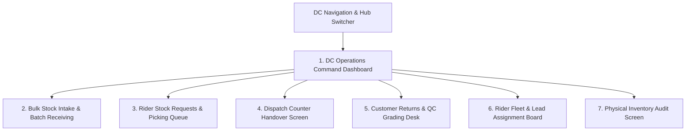

# 🏢 Product Requirement Document (PRD): Distribution Center (DC) Operations & Warehouse Portal

* **Target Persona**: DC Operations Manager (`dc_manager`) & DC Warehouse Floor Supervisor (`dc_supervisor`).
* **Platform & Form Factor**: Responsive Web Portal (Desktop 1920x1080 / Laptop 1440x900) + Rugged Warehouse Tablet (10-inch Touchscreen).
* **Primary Environmental Context**: Warehouse floor, dispatch counters, receiving loading docks, DC office desks.

---

## 🎯 Persona Goals & Core UX Requirements

1. **High-Velocity Queue Processing**: Process incoming rider stock requests and dispatch handovers in under 30 seconds per rider.
2. **Batch & Expiry Traceability**: Clear visual distinction between product batches, shelf bins, and expiration countdowns.
3. **Dual Counter Handover Validation**: Fast camera scanning of rider QR codes or numeric PIN keypad for rapid counter checkouts.
4. **Live Fleet & Lead Balancing**: Real-time map board showing rider availability and unassigned delivery leads for instant zone dispatch.

---

## 🖥️ Screen Inventory & Architecture

---

## 🖼️ Screen-by-Screen UI/UX Specifications

### Screen 1: DC Operations Command Dashboard
* **Top Hub Header**: DC Name (`Wuse Distribution Center - DC-WUSE-01`), Hub Status Badge (🟢 Active Hub), Shift Supervisor Name (`Adekunle Supervisor`).
* **KPI Metrics Strip**:
  * **Pending Stock Requests**: Counter (e.g. `5 Requests`) with high-contrast amber indicator.
  * **Warehouse Stock Volume**: Total units (`12,450 Units`) across all active batches.
  * **Returns Awaiting QC**: Counter (e.g. `8 Items`) with purple indicator.
  * **Active Field Fleet**: `18 Available / 24 On Delivery / 3 Offline`.
* **Urgent Action Feeds**: Split view showing incoming stock requests on the left and unverified return tickets on the right.

### Screen 2: Bulk Stock Intake & Batch Receiving
* **Waybill & Client Selector**: Dropdown to select Client (*Novacare Limited*, *PharmaPlus*), Textfield for Waybill Number (`WAY-2026-0819`).
* **Product Batch Creator**:
  * Product SKU Selector (Searchable dropdown with thumbnail images).
  * Batch Lot Number Input (`BATCH-RSP-2026`).
  * Date Pickers: Manufacture Date and Expiry Date (`2028-06-30`).
  * Quantity Input with quick buttons (`+100`, `+500`, `+1,000`).
  * Warehouse Storage Bin Tagging: Textfield / Dropdown (`BIN-A1-04`).
* **Action Footer**: `[ Save & Print Warehouse Bin Barcode Label ]`.

### Screen 3: Rider Stock Request Review & Picking Queue
* **Split Queue View**: Left panel lists pending rider requests (`REQ-00482` — Emeka Rider); right panel shows request detail.
* **Requested Item Itemization Table**:
  * Product Name & SKU (*Respira Detox Tea*).
  * Available Warehouse Stock Indicator (🟢 420 Units in `BATCH-RSP-2026`).
  * Requested Quantity (20) vs Approved Quantity editable field (default: 20).
  * Bin Location Helper: Displays `BIN A1-04` to assist warehouse pickers.
* **Action Buttons**:
  * Primary Green: `[ Approve & Generate Handover PIN (HND-XXXX) ]`.
  * Secondary Blue: `[ Print Picking Ticket ]`.
  * Destructive Red: `[ Reject Request with Reason ]`.

### Screen 4: Dispatch Counter Handover Screen (Tablet Optimized)
* **High-Speed Input Modes**:
  * **Mode A (Camera QR Scanner)**: Viewfinder scanning the rider’s mobile PDA screen.
  * **Mode B (Large Numeric Keypad)**: 6-Digit PIN input box for entering `HND-9921`.
* **Verification Confirmation Modal**:
  * Displays Rider Name, Photo, and Box Breakdown (*20x Respira Tea, 10x Grazer Tea*).
  * Action: Large 64px button: `[ ✅ Confirm Physical Handover & Transfer Custody ]`.
  * Instantly triggers green success banner and audio beep.

### Screen 5: Customer Returns & QC Grading Desk
* **Return Ticket Search**: Search box for `RET-00109` or scan return item barcode.
* **Grading Selector Cards**:
  * **Card A — Grade A (Restockable)**: Outer box intact, seal unbroken $\rightarrow$ Prompt to select target bin for restocking.
  * **Card B — Grade B (Damaged / Written-Off)**: Broken seal, torn packaging $\rightarrow$ Logs write-off to scrap ledger.
* **Action Button**: `[ Complete QC & Clear Rider Custody ]`.

### Screen 6: Rider Fleet & Lead Assignment Board
* **Interactive City Map**: GPS pins of active riders color-coded by status (🟢 Available, 🟡 In Delivery).
* **Unassigned Leads Pool**: Draggable order cards (`TRK-8924`, `TRK-8925`) that can be drag-and-dropped directly onto rider profile cards to assign routes.

---

## 🎨 Component Styling for DC Portals

| Component | Visual Specification | Behavior |
|---|---|---|
| **Data Tables** | Clean Slate-50 alternating rows, 14px text | Sortable headers, sticky table header, pagination |
| **PIN Input Field** | 6 individual 56px square boxes with focus jump | Auto-advances to next digit; auto-submits on 6th digit |
| **Bin Location Tag** | Slate-800 dark badge with white monospace text (`BIN-A1-04`) | High visibility from 2 meters away on warehouse tablet |
