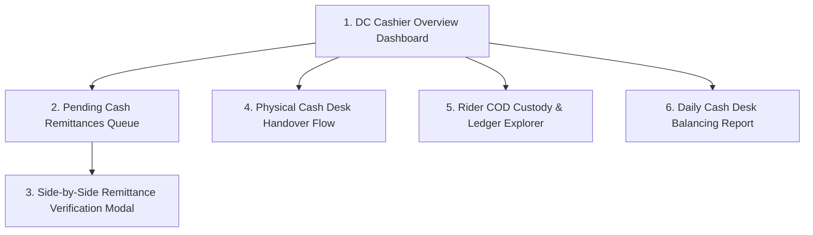

# 💵 Product Requirement Document (PRD): DC Finance & Cash Remittance Desk

* **Target Persona**: DC Cashier & Finance Desk Supervisor (`role = 'dc_finance'`).
* **Platform & Form Factor**: Desktop Web Application (1920x1080 / 1440x900).
* **Primary Environmental Context**: Distribution Center finance cage, cashier counter, accounting workstations.

---

## 🎯 Persona Goals & Core UX Requirements

1. **Zero Financial Leakage**: Instant verification of physical cash handovers and electronic bank deposits against corporate bank statements.
2. **Side-by-Side Image Forensics**: Side-by-side modal displaying high-res zoomable deposit slips alongside rider order collection breakdowns.
3. **Shortage & Discrepancy Adjustments**: Streamlined workflows for approving partial deposits while retaining remaining balances in rider custody.
4. **Rider Cash Custody Monitoring**: Real-time alerts for riders holding high physical cash balances.

---

## 🖥️ Screen Inventory & Architecture

---

## 🖼️ Screen-by-Screen UI/UX Specifications

### Screen 1: DC Cashier Overview Dashboard
* **Top Metric Ribbon**:
  * **Unverified Remittances**: Badge Counter (e.g. `6 Pending`) + Gross Value (`₦145,000.00`).
  * **Cash Collected at Counter Today**: Bold Emerald figure (`₦380,000.00`).
  * **Total Un-remitted Fleet Cash in Transit**: High-visibility card (`₦1,240,000.00`).
  * **Riders Over Risk Threshold**: Red warning pill (e.g. `2 Riders > ₦150k`).
* **Live Remittance Stream Table**: Real-time updating table showing submitted remittance tickets with rider name, payment channel, amount, and quick-action `[ Review ]` button.

### Screen 2: Side-by-Side Remittance Verification Modal (Core Screen)
* **Left Panel (Image Forensics Viewer - 50% width)**:
  * High-resolution image canvas showing uploaded bank teller / POS receipt slip.
  * Controls: Zoom In (`+`), Zoom Out (`-`), Rotate (`90°`), Fullscreen.
  * Extracted Reference Display: `REF-POS-9921`.
* **Right Panel (Audit Breakdown - 50% width)**:
  * **Rider Information**: Emeka Rider (`PDA-7000`), Assigned DC (`Wuse DC`).
  * **Claimed Deposit Channel**: `bank_transfer` (GTBank Corporate Account).
  * **Financial Breakdown**:
    * Gross Collections Claimed: `₦25,000.00`
    * Less Commission Deducted (if self-remittance): `₦0.00`
    * Less Transport Allowance Deducted: `₦0.00`
    * **Net Amount Deposited**: `₦25,000.00`
  * **Linked Orders Table**: Accordion list showing `TRK-8924` (₦15,000) and `TRK-8925` (₦10,000).
* **Action Footer**:
  * **Primary (Green)**: `[ ✅ Approve & Clear COD Balance ]`.
  * **Secondary (Amber)**: `[ ⚠️ Approve Partial Deposit with Shortage ]`.
  * **Destructive (Red)**: `[ ❌ Reject Remittance with Reason ]`.

### Screen 3: Physical Cash Counter Handover Flow
* **Fast Cash Denomination Calculator**:
  * Currency denomination counter:
    - ₦1,000 notes $\times$ count = Subtotal
    - ₦500 notes $\times$ count = Subtotal
    - ₦200 notes $\times$ count = Subtotal
  * Auto-calculates total cash received.
* **Instant Cash Receipt Generation**: Generates and prints official thermal counter deposit receipt (`REM-CASH-XXXX`) for the rider.

### Screen 4: Rider COD Custody & Ledger Explorer
* **Search & Filter Bar**: Search by Rider Name, Agent Code (`PDA-7000`), or Phone Number.
* **Rider Profile Summary Card**: Shows Current COD Balance, Last Remittance Date, Total Historical Collections.
* **Audit History Tab**: Tabulated history of all completed deliveries and verified remittances with downloadable CSV statements.

---

## 🎨 Component Styling for Finance Portals

| Component | Visual Specification | Behavior |
|---|---|---|
| **High-Res Image Viewer** | Slate-900 dark backdrop with pan-and-zoom canvas | Supports mousewheel zoom and drag-to-pan |
| **Denomination Counter** | Clean tabular grid with auto-focusing numeric steppers | Recalculates grand total on every keystroke |
| **Risk Warning Banner** | Red `#EF4444` border card with pulsing alert icon | Highlights riders exceeding the 48-hour holdover limit |
