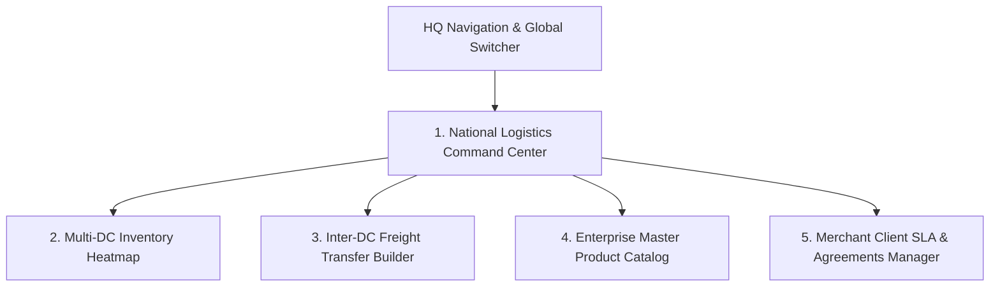

# 🌐 Product Requirement Document (PRD): HQ National Operations & Master Catalog Portal

* **Target Persona**: National Logistics Director & Enterprise Product Catalog Manager (`role = 'hq_manager'`).
* **Platform & Form Factor**: Desktop Web Application (1920x1080 / 1440x900).
* **Primary Environmental Context**: Headquarters operations control room, executive workstations.

---

## 🎯 Persona Goals & Core UX Requirements

1. **National Stock Balancing & Visibility**: Real-time visibility into inventory across all regional distribution centers, identifying regional deficits early.
2. **Seamless Inter-DC Freight Transfers**: Multi-step transfer manifest builder tracking freight drivers, truck license plates, and security seals.
3. **Master Catalog & SKU Governance**: Centralized product SKU management, pricing, reorder levels, and client ownership rules (BR-001).
4. **Corporate Client Contracts & SLAs**: Defining delivery fees, failed delivery policies (BR-006, BR-007), and billing agreements.

---

## 🖥️ Screen Inventory & Architecture

---

## 🖼️ Screen-by-Screen UI/UX Specifications

### Screen 1: National Logistics Command Center
* **National Telemetry Strip**:
  * **Total Network Deliveries Today**: Live counter (`1,840 Drops`) with daily SLA progress ring (94.2%).
  * **National Stock in Warehouses**: Total active units (`68,450 Units`).
  * **In-Transit Inter-DC Freight**: Active shipments counter (e.g. `3 Bulk Trucks En Route`).
  * **Active Regional Hubs**: Status badge list (`4 Hubs Operational`).
* **Interactive Nigeria Hub Map**: High-contrast interactive map pinning Lagos, Abuja, Kano, and Port Harcourt with live status tooltips.

### Screen 2: Inter-DC Freight Transfer Manifest Builder
* **Step 1 — Route Selection**:
  * Origin DC Dropdown (e.g. `Ikeja Central Hub - Lagos`).
  * Destination DC Dropdown (e.g. `Wuse Distribution Center - Abuja`).
* **Step 2 — Stock Itemization**:
  * Product SKU Selector (*Respira Detox Tea*).
  * Batch Lot Selector (`BATCH-RSP-2026`).
  * Transfer Quantity Input (`5,000 units`).
* **Step 3 — Carrier & Security Seal Metadata**:
  * Haulage Contractor Name & Driver Phone Number.
  * Truck Vehicle License Plate (`ABC-992-XY`).
  * **Tamper-Evident Security Seal Number**: Textfield with barcode preview (`SEAL-9021-NOV`).
* **Action Footer**: `[ 🚀 Dispatch Freight & Generate Official Manifest ]`.

### Screen 3: Enterprise Master Product Catalog & SKU Manager
* **SKU Master Grid / Table**:
  * Product Thumbnail, Name (*Respira Detox Tea*), SKU Code (`SKU-RSP01`), Category (`Herbal Detox`).
  * Client Owner Badge (*Novacare Limited*).
  * Base Selling Price (`₦26,000.00`) & Base Delivery Fee (`₦5,000.00`).
  * Low Stock Alert Threshold (`5 units`) & National Total Stock (`18,420 units`).
  * Actions: `[ Edit SKU ]`, `[ View Batches ]`, `[ Manage Dimensions ]`.
* **Add / Edit Master SKU Slide-Over Drawer**:
  * Form inputs for SKU code, client, category, pricing, reorder levels, and high-res image upload.

### Screen 4: Merchant Client SLA & Contracts Manager
* **Corporate Clients Table**:
  * Client Name & Code (*Novacare Limited - NOVACARE*), Key Contact Person.
  * Successful Delivery Fee (BR-006): `₦5,000.00`.
  * Failed Attempt Charge Policy (BR-007): `₦2,500.00 (50%)`.
  * Billing Settlement Cycle: `Weekly (Mondays)`.
  * Active Orders & Distributed Stock Counts.
* **Actions**: `[ Edit SLA Terms ]`, `[ View Invoices ]`, `[ Manage Client API Keys ]`.

---

## 🎨 Component Styling for HQ Portals

| Component | Visual Specification | Behavior |
|---|---|---|
| **National Map View** | Vector map of Nigeria with pulsing SVG hub pins | Hover shows popover summary; click drills down into hub view |
| **Slide-Over Drawers** | 600px right drawer with smooth slide animation | Backdrop blur with escape key dismissal |
| **Security Seal Tag** | Monospace dark blue badge with padlock icon (`🔒 SEAL-9021-NOV`) | Highlights in red if unverified at destination |
