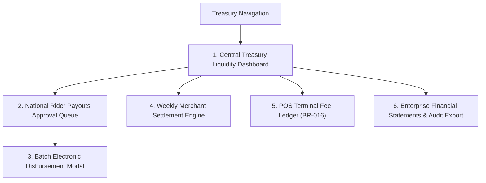

# 🏦 Product Requirement Document (PRD): HQ Central Treasury & Settlement Portal

* **Target Persona**: Central Treasury Officer & Chief Financial Officer (`role = 'hq_finance'`).
* **Platform & Form Factor**: Desktop Web Application (1920x1080 / 1440x900).
* **Primary Environmental Context**: Corporate finance desk, treasury workstations, executive boardrooms.

---

## 🎯 Persona Goals & Core UX Requirements

1. **Liquidity & Digital Cashflow Oversight**: Real-time monitoring of corporate bank accounts, Monnify digital collection pools, and national physical cash in transit.
2. **Automated Batch Payout Authorizations**: Streamlined batch selection of rider withdrawal requests with automated fraud and COD arrears pre-screening.
3. **Automated Merchant Settlement Engine**: Generating weekly audited settlement statements for corporate clients (Gross Collections $-$ Delivery Fees $-$ POS Fees = Net Proceeds).
4. **Separate POS Fee Ledger Accounting (BR-016)**: Clear accounting isolation for POS terminal processing charges.

---

## 🖥️ Screen Inventory & Architecture

---

## 🖼️ Screen-by-Screen UI/UX Specifications

### Screen 1: Central Treasury Liquidity Dashboard
* **Primary Cashflow Hero Cards**:
  * **Monnify Digital Collection Pool**: Real-time API balance (`₦14,850,200.00`) with instant settlement trigger.
  * **National Cash in Rider Transit**: Total un-remitted physical cash (`₦5,280,000.00`) across all regional DCs.
  * **Pending Rider Withdrawal Demands**: Total queued payouts (`₦480,000.00` across 32 riders).
  * **Corporate GTBank Main Account**: Available operating funds (`₦42,500,000.00`).
* **Live Inflow Stream Chart**: Area chart showing real-time Monnify webhook digital payments vs cash remittances over the last 24 hours.

### Screen 2: National Rider Payouts Approval Queue
* **Batch Action Toolbar**:
  * `[ Select All Eligible ]` checkbox (Auto-selects requests passing all automated pre-checks).
  * Batch Summary Pill: `32 Requests Selected • Total: ₦480,000.00`.
  * Primary Button: `[ 🚀 Authorize & Disburse Selected Batch ]`.
* **Rider Payout Demands Table**:
  * Checkbox, Rider Name (`Emeka Rider`), Agent Code (`PDA-7000`), Assigned Hub (`Wuse DC`).
  * Withdrawal Requested Amount (`₦15,000.00`), Available Balance (`₦24,500.00`).
  * Destination Bank & Account Number (`Zenith Bank • 0123456789`).
  * **Compliance Shield Badges**:
    * 🟢 *No COD Arrears* (Rider holds zero overdue cash).
    * 🟢 *Account Name Match* (Bank account name matches registered profile).
    * 🟢 *Balance Verified* (Sufficient funds in `direct_transfer_balance`).

### Screen 3: Batch Electronic Disbursement Modal (Dual Control)
* **Summary Itemization**: Total payout count, total Naira amount, Monnify Disburse API fee breakdown.
* **Secondary Dual Authorization Step (For Batches $> ₦1,000,000$)**:
  * Prompts for CFO Approval Signature and TOTP MFA Token.
* **Execution Progress Bar**: Real-time progress bar displaying live API transfer status:
  * *"Disbursing 32 / 32 transfers via NIBSS NIP..."*
  * Final Screen: Confetti animation with batch transaction reference (`BATCH-NOV-2026-0819`).

### Screen 4: Weekly Merchant Settlement Engine
* **Client Selector**: Dropdown to select client (*Novacare Limited*), Settlement Date Range Picker (e.g. *Aug 12 - Aug 19*).
* **Automated Statement Computation Card**:
  * **Gross COD Collections**: `₦12,500,000.00` (500 delivered orders).
  * **Less Contractual Delivery Fees (BR-006)**: `-₦2,500,000.00` (500 drops $\times$ ₦5,000).
  * **Less POS Payment Gateway Fees (BR-016)**: `-₦35,000.00`.
  * **Net Payable to Merchant**: `₦9,965,000.00`.
* **Action Footer**:
  * Primary Blue: `[ 🏦 Execute Direct Wire Transfer (₦9,965,000.00) ]`.
  * Secondary: `[ 📄 Export Certified PDF Statement & Tax Invoice ]`.

---

## 🎨 Component Styling for Treasury Portals

| Component | Visual Specification | Behavior |
|---|---|---|
| **Compliance Shield** | Circular green/red shield icon with tooltip | Hovering displays specific verification rules passed/failed |
| **Large Currency Figure** | Bold 28px/36px text with Naira currency symbol (`₦`) | Formatted with standard comma thousand separators |
| **Progress Execution Ring** | Circular SVG loader transitioning from blue to green | Animates as API webhooks acknowledge bank payouts |
