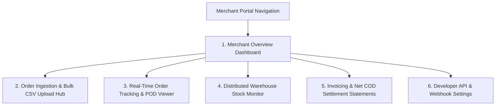

# 🏢 Product Requirement Document (PRD): Corporate Merchant Client Portal

* **Target Persona**: Corporate Merchant Client Logistics & Finance Manager (`role = 'client_admin'` e.g. *Novacare Limited*, *PharmaPlus*).
* **Platform & Form Factor**: Responsive Web Portal (Desktop 1920x1080 / Laptop 1440x900 / Tablet).
* **Primary Environmental Context**: Corporate merchant offices, e-commerce fulfillment desks.

---

## 🎯 Persona Goals & Core UX Requirements

1. **Instant Order Ingestion**: Seamless bulk order ingestion via drag-and-drop Excel/CSV uploads or direct REST API webhook integration.
2. **End-to-End Live Tracking**: Real-time package tracking with instant proof-of-delivery (POD) photo and signature access.
3. **Multi-DC Stock Visibility**: Live inventory counts of merchant products stored across all NovaExpress Distribution Centers.
4. **Transparent Financial Settlements**: Real-time visibility into COD collections, delivery fee deductions, and weekly wire transfer settlement statements.

---

## 🖥️ Screen Inventory & Architecture

---

## 🖼️ Screen-by-Screen UI/UX Specifications

### Screen 1: Merchant Overview Dashboard
* **Merchant Profile Header**: Client Logo, Name (*Novacare Limited*), Account Tier (*Enterprise SLA*).
* **Key Performance Metric Cards**:
  * **Total Orders This Month**: Counter (`1,420 Drops`) with 96.2% fulfillment rate ring.
  * **Gross COD Cash Collected**: Total value (`₦35,500,000.00`) safely held by NovaExpress.
  * **Net Settlement Balance Pending**: Owed to client (`₦28,400,000.00`).
  * **Live Active In-Transit Deliveries**: Pulse counter (`42 Deliveries Active`).
* **Recent Deliveries Feed**: Interactive table showing recent status transitions with clickable tracking links.

### Screen 2: Order Ingestion & Bulk CSV Upload Hub
* **Bulk Upload Dropzone**:
  * Large dashed container with drag-and-drop support for `.csv`, `.xlsx` order files.
  * Downloadable template button: `[ 📥 Download Sample Excel Template ]`.
  * Real-time Validation Table: Parses uploaded file, highlights invalid phone numbers or missing addresses in red before final confirmation.
* **Single Order Manual Entry**: Clean modal for dispatching individual emergency orders.
* **Action Button**: `[ 🚀 Upload & Dispatch 150 Orders to NovaExpress ]`.

### Screen 3: Real-Time Order Tracking & POD Viewer
* **Search & Filter Bar**: Search by Tracking Number (`TRK-8924`), Customer Phone, or Recipient Name.
* **Tracking Timeline Drawer / Card**:
  * Step 1: 🟢 *Order Placed & Ingested* (Aug 19, 09:00 AM)
  * Step 2: 🟢 *Intake at Wuse DC & Allocated to Rider Emeka* (Aug 19, 10:30 AM)
  * Step 3: 🟢 *In Transit* (Aug 19, 11:15 AM)
  * Step 4: 🟢 *Delivered & POD Captured* (Aug 19, 12:45 PM)
* **Proof of Delivery (POD) Embedded Viewer**:
  * Digital Customer Signature preview.
  * High-resolution delivery photo preview.
  * Payment details: `Cash on Delivery — ₦55,000.00 Paid`.

### Screen 4: Distributed Warehouse Stock Monitor
* **Product Inventory Table**:
  * Product Thumbnail & Name (*Respira Detox Tea*), Master SKU (`SKU-RSP01`).
  * **Stock Distribution Breakdown Across Regional DCs**:
    * *Wuse DC (Abuja)*: 420 Units Available (🟢 Healthy)
    * *Ikeja Central DC (Lagos)*: 15,000 Units Available (🟢 Healthy)
    * *Kano Central DC*: 50 Units Available (🟡 Low Stock Alert)
  * Total National Stock: `15,470 Units`.
* **Action**: `[ Request Bulk Stock Intake / Delivery to DC ]`.

### Screen 5: Invoicing & Net COD Settlement Statements
* **Settlement Statements Table**:
  * Statement ID (`STM-NOV-2026-0819`), Date Range (*Aug 12 - Aug 19*), Delivered Orders Count (500).
  * Gross COD Collected (`₦12,500,000.00`), Delivery Fees (`₦2,500,000.00`), POS Fees (`₦35,000.00`).
  * Net Settlement Amount (`₦9,965,000.00`), Payment Status (🟢 Disbursed to GTBank Account).
  * Actions: `[ 📥 Download PDF Statement ]`, `[ 📥 Download Tax Invoice ]`.

---

## 🎨 Component Styling for Merchant Portals

| Component | Visual Specification | Behavior |
|---|---|---|
| **Bulk Upload Dropzone** | Slate-50 background with dashed Blue-400 border | Highlights green when valid `.csv` file is dragged over |
| **Tracking Timeline** | Vertical step line with solid green circles for completed steps | Smooth micro-animations on step completion |
| **POD Photo Lightbox** | Centered modal with high-res image and zoom controls | Click backdrop or escape key to close |
