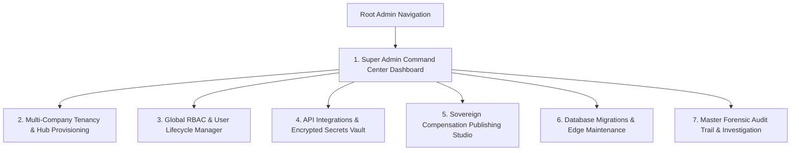

# 👑 Product Requirement Document (PRD): Super Admin Command Center Portal

* **Target Persona**: Overall Sovereign Platform Owner & Chief Administrator (`role = 'super_admin'`).
* **Platform & Form Factor**: High-Density Desktop Web Application (1920x1080 / 2560x1440).
* **Primary Environmental Context**: Executive command room, DevOps workstation, platform operations desk.

---

## 🎯 Persona Goals & Core UX Requirements

1. **Sovereign Platform Governance**: Sovereign control over system infrastructure, database migrations, multi-company tenancy, and payment gateways.
2. **Sovereign Compensation Rate Publishing**: Exclusive authority to configure and publish delivery compensation models with immutable historical rate locking (BR-010 to BR-015).
3. **Emergency Circuit-Breakers & Security Lockdown**: High-visibility kill-switches for instant account freezing, payment channel pausing, and API session termination.
4. **Forensic Audit Deep-Dives**: Omnipresent search across all append-only audit trails, GPS breadcrumbs, and financial ledgers (BR-020).

---

## 🖥️ Screen Inventory & Architecture

---

## 🖼️ Screen-by-Screen UI/UX Specifications

### Screen 1: Super Admin Command Center Dashboard
* **Top System Health Bar**:
  * **PostgreSQL Engine**: 🟢 99.99% Uptime | Active Pool Connections: `42 / 100`.
  * **Edge Function Runtime**: 🟢 6 Microservices Live | Avg Latency: `84ms`.
  * **Monnify Webhook Engine**: 🟢 Connected | 0 Errors in 24 hrs.
  * **SMS & Maps Gateways**: 🟢 Termii & Google Maps Active.
* **Master Financial Summary Ribbon**:
  * **Total Network GMV Today**: `₦48,250,000.00`.
  * **National Cash In Transit**: `₦5,280,000.00` (142 Riders).
  * **Total Monnify Inflows**: `₦14,850,200.00`.
* **Emergency Action Trigger**: Crimson Red Button in top right header: `[ 🚨 System Emergency Lockdown ]`.

### Screen 2: Multi-Company Tenancy & Hub Provisioning Manager
* **Tenant Companies Grid**: Cards for corporate entities (`NovaExpress Logistics Limited`, `Novacare Logistics Subsidiary`).
* **Regional Distribution Centers Table**:
  * Hub Name (*Wuse DC*, *Ikeja DC*, *Kano Central DC*), Code (`DC-KANO-01`), State, City.
  * Facility Address, Appointed DC Manager, Active Warehouse Stock Count.
  * Action: `[ + Provision New Distribution Center ]`.

### Screen 3: Global RBAC & User Lifecycle Manager
* **Unified User Directory**: Searchable across all 8 roles (`super_admin`, `hq_manager`, `hq_finance`, `dc_manager`, `dc_supervisor`, `dc_finance`, `delivery_agent`, `client_admin`).
* **Action Drawer**:
  * Edit Role & Permissions.
  * `[ 🔑 Send One-Click Password Reset ]`.
  * `[ 🚫 Emergency Suspend & Revoke Active Sessions ]`.

### Screen 4: API Integrations & Encrypted Secrets Vault
* **Gateway Cards (Monnify, Termii, Google Maps, Firebase)**:
  * Masked API Key display (`MK_PROD_••••••••••••8921`) with `[ Show / Copy ]` eye icon.
  * Webhook Signing Secret input.
  * Test Connection Ping Button with live response time indicator (`52ms`).
  * `[ 🔄 Rotate Secret Key Without Downtime ]` button.

### Screen 5: Sovereign Compensation Publishing Studio (BR-010 to BR-015)
* **Tier Configuration Matrix**:
  * **Tier 1 (Standard Commission Rider)**:
    - Base Delivery Commission Input: `₦1,000.00`
    - Transport Allowance Input: `₦1,500.00`
    - Upsell Commission Rate: `10%`
  * **Tier 2 (Salaried Staff Rider - BR-012)**:
    - Base Delivery Commission: `₦0.00`
    - Monthly Base Salary: `₦85,000.00`
* **Effective Date Time Picker**: Sets exact moment when new rates activate.
* **Publishing Seal Button**: `[ 🔏 Sign & Publish Immutable Rate Policy ]` (Requires Hardware MFA Confirmation).

### Screen 6: Database Migrations & Edge Maintenance
* **Applied Migrations List**: Chronological timeline of applied SQL scripts with verification checksums.
* **Action Toolbar**:
  * `[ 🔄 Reload PostgREST Schema Cache (pg_notify) ]`.
  * `[ ⚡ Verify Edge Function Endpoints ]`.
  * `[ 🧹 Run VACUUM ANALYZE on Core Tables ]`.

### Screen 7: Master Forensic Audit Trail & Timeline
* **Omnipresent Search**: Filter by User ID, Order Number (`TRK-8924`), Transaction Ref (`REF-POS-9921`), or IP Address.
* **Chronological Event Stream**: Shows every database insertion, state change, photo upload, and financial transfer with exact millisecond timestamps and actor identities.

---

## 🎨 Component Styling for Super Admin Command Center

| Component | Visual Specification | Behavior |
|---|---|---|
| **Health Telemetry Pill** | Emerald / Crimson glowing dot with text label | Pulses every 5 seconds on live heartbeat |
| **Emergency Lockdown Modal** | Fullscreen Crimson modal requiring typing "CONFIRM LOCKDOWN" | Instantly terminates active client sessions |
| **Masked Secret Input** | Slate-900 monospace input with password dots and reveal toggle | Auto-masks after 10 seconds of visibility |
