# 🎨 NoveXPS Master UI/UX Product Requirement Documents (PRD) Suite

Welcome to the **NovaExpress Logistics Management System (NoveXPS) Master UI/UX Design Specification & PRD Suite**. This documentation provides complete, screen-by-screen product requirement documents tailored specifically for UI/UX product designers, Figma creators, and frontend engineering teams.

---

## 🗺️ Role-to-Platform Form Factor & PRD Sitemap

```mermaid
graph TD
    DesignSystem["🎨 Master Design Tokens & Style Guide<br>(00_MASTER_DESIGN_SYSTEM_AND_TOKENS.md)"]
    
    subgraph Mobile Form Factor
        PDA["📱 Field Delivery Agent PDA App<br>(01_DELIVERY_AGENT_PDA_UI_UX_PRD.md)"]
    end
    
    subgraph Tablet & Floor Terminals
        DCOps["🏢 DC Operations & Warehouse Portal<br>(02_DC_OPERATIONS_AND_WAREHOUSE_UI_UX_PRD.md)"]
    end
    
    subgraph Desktop Workstations & Portals
        DCFinance["💵 DC Finance & Cash Desk<br>(03_DC_FINANCE_DESK_UI_UX_PRD.md)"]
        HQOps["🌐 HQ National Logistics & Catalog<br>(04_HQ_OPERATIONS_AND_CATALOG_UI_UX_PRD.md)"]
        HQTreasury["🏦 HQ Central Treasury & Settlements<br>(05_HQ_CENTRAL_TREASURY_UI_UX_PRD.md)"]
        Merchant["🏢 Corporate Merchant Client Portal<br>(06_MERCHANT_CLIENT_PORTAL_UI_UX_PRD.md)"]
        SuperAdmin["👑 Super Admin Command Center<br>(07_SUPER_ADMIN_COMMAND_CENTER_UI_UX_PRD.md)"]
    end

    DesignSystem --> PDA
    DesignSystem --> DCOps
    DesignSystem --> DCFinance
    DesignSystem --> HQOps
    DesignSystem --> HQTreasury
    DesignSystem --> Merchant
    DesignSystem --> SuperAdmin

    style DesignSystem fill:#312E81,stroke:#1E1B4B,stroke-width:2px,color:#fff
    style PDA fill:#16A34A,stroke:#166534,stroke-width:2px,color:#fff
    style DCOps fill:#0D9488,stroke:#115E59,stroke-width:2px,color:#fff
    style DCFinance fill:#059669,stroke:#047857,stroke-width:2px,color:#fff
    style HQOps fill:#2563EB,stroke:#1D4ED8,stroke-width:2px,color:#fff
    style HQTreasury fill:#4F46E5,stroke:#3730A3,stroke-width:2px,color:#fff
    style Merchant fill:#D97706,stroke:#B45309,stroke-width:2px,color:#fff
    style SuperAdmin fill:#7C3AED,stroke:#5B21B6,stroke-width:2px,color:#fff
```

---

## 📑 Complete PRD Document Index for Designers

| Document | Target Persona & Role | Target Devices | Key Highlighted Screens | Document Link |
|---|---|---|---|---|
| **00. Master Design Tokens** | All Designers & Developers | All Form Factors | Color palette, typography scale, spacing grid, button/badge styles. | [00_MASTER_DESIGN_SYSTEM_AND_TOKENS.md](file:///c:/PROJECT/NoveXPS/DOCUMENTATION/UI_UX_DESIGN_PRD/00_MASTER_DESIGN_SYSTEM_AND_TOKENS.md) |
| **01. Field PDA App** | Field Delivery Rider (`delivery_agent`) | Android, iOS, Rugged PDA | Vehicle Stock Grazer, Route Queue, POD signature/photo, Monnify Transfer, Stock Request Wizard. | [01_DELIVERY_AGENT_PDA_UI_UX_PRD.md](file:///c:/PROJECT/NoveXPS/DOCUMENTATION/UI_UX_DESIGN_PRD/01_DELIVERY_AGENT_PDA_UI_UX_PRD.md) |
| **02. DC Operations & Warehouse** | DC Manager & Supervisor (`dc_manager`, `dc_supervisor`) | 10-inch Floor Tablet, Desktop | Bulk Intake, Picking Queue, Dispatch Counter PIN Keypad, Returns QC Grading, Fleet Live Map. | [02_DC_OPERATIONS_AND_WAREHOUSE_UI_UX_PRD.md](file:///c:/PROJECT/NoveXPS/DOCUMENTATION/UI_UX_DESIGN_PRD/02_DC_OPERATIONS_AND_WAREHOUSE_UI_UX_PRD.md) |
| **03. DC Finance & Cash Desk** | DC Cashier / Accountant (`dc_finance`) | Desktop Web | Pending Remittances, Side-by-side Teller Photo Forensics, Cash Denomination Calculator. | [03_DC_FINANCE_DESK_UI_UX_PRD.md](file:///c:/PROJECT/NoveXPS/DOCUMENTATION/UI_UX_DESIGN_PRD/03_DC_FINANCE_DESK_UI_UX_PRD.md) |
| **04. HQ Logistics & Catalog** | National Logistics & SKU Manager (`hq_manager`) | Desktop Web | National Multi-DC Stock Heatmap, Inter-DC Freight Manifest Builder, Master SKU Manager. | [04_HQ_OPERATIONS_AND_CATALOG_UI_UX_PRD.md](file:///c:/PROJECT/NoveXPS/DOCUMENTATION/UI_UX_DESIGN_PRD/04_HQ_OPERATIONS_AND_CATALOG_UI_UX_PRD.md) |
| **05. HQ Central Treasury** | Central Treasury Officer (`hq_finance`) | Desktop Web | Monnify Collection Stream, Batch Rider Payout Disbursals, Client Weekly Settlement Engine. | [05_HQ_CENTRAL_TREASURY_UI_UX_PRD.md](file:///c:/PROJECT/NoveXPS/DOCUMENTATION/UI_UX_DESIGN_PRD/05_HQ_CENTRAL_TREASURY_UI_UX_PRD.md) |
| **06. Merchant Client Portal** | Merchant Logistics Officer (`client_admin` - *Novacare*) | Desktop & Tablet Web | Bulk CSV Order Ingestion, Live Package Tracking & POD Lightbox, Distributed DC Stock Counts. | [06_MERCHANT_CLIENT_PORTAL_UI_UX_PRD.md](file:///c:/PROJECT/NoveXPS/DOCUMENTATION/UI_UX_DESIGN_PRD/06_MERCHANT_CLIENT_PORTAL_UI_UX_PRD.md) |
| **07. Super Admin Command Center** | Sovereign Platform Administrator (`super_admin`) | High-Density Desktop Web | Platform Telemetry & Kill-Switch, Tenancy & Hub Provisioning, Compensation Rate Studio. | [07_SUPER_ADMIN_COMMAND_CENTER_UI_UX_PRD.md](file:///c:/PROJECT/NoveXPS/DOCUMENTATION/UI_UX_DESIGN_PRD/07_SUPER_ADMIN_COMMAND_CENTER_UI_UX_PRD.md) |
