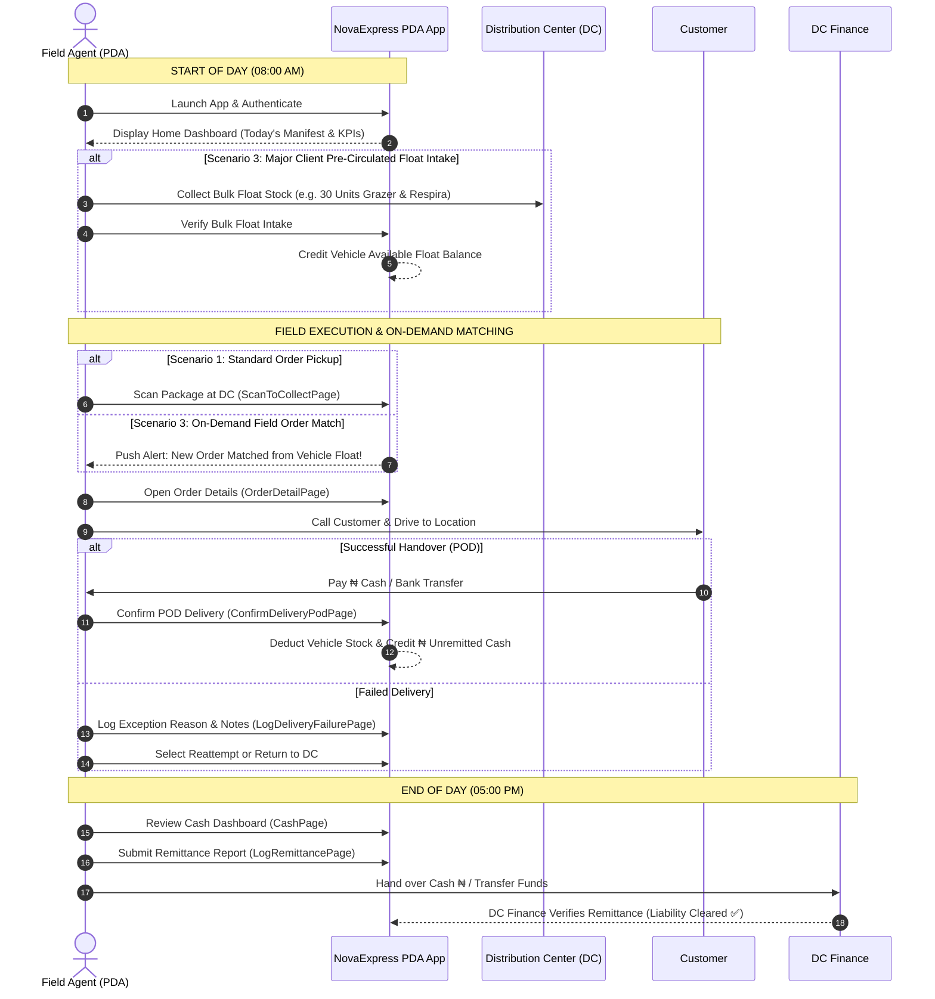

# Module 1: Daily Operational Journey & Fulfillment Models 🌅🚀

## 1. Overview & Operational Fulfillment Models
The Personal Distribution Agent (PDA) is the primary field logistics operational agent for NovaExpress in Nigeria. The PDA operates under three main fulfillment scenarios:

1. **Scenario 1: Standard Order-First Fulfillment**: Orders assigned at DC ➔ Picked up at DC ➔ Delivered to customer.
2. **Scenario 2: Failed Delivery & Reattempt/Return**: Failed delivery attempt ➔ Reattempt scheduled or physical package returned to DC.
3. **Scenario 3: Major Client Pre-Circulated Float Model**: Bulk product stock loaded into PDA vehicles **BEFORE** orders arrive ➔ Standing buffer ➔ On-demand field order matching & instant delivery!

---

## 2. Master Daily Operational Journey Diagram

---

## 3. Step-by-Step Daily Workflow Instructions

### Phase A: Morning Check-in & Bulk Float Loading
1. **Login**: Enter assigned Phone Number / Agent ID and password.
2. **Review Home Dashboard**: Inspect Today's Manifest (Assigned, In Transit, Delivered, Failed) and current **Vehicle Stock Card**.
3. **Load Bulk Float Stock (Scenario 3)**:
   - Collect bulk pre-circulated stock for Major Clients (*Grazer Herbal Tea, Respira, Alpha Man*) from DC warehouse staff.
   - Verify available floating stock count on the **Stock** tab.

---

### Phase B: On-Demand Field Delivery & Intake
1. **On-Demand Order Matching (Scenario 3)**:
   - As new customer orders arrive in your zone, the central system matches the orders to your vehicle floating stock.
   - Proceed directly to the customer address without returning to the DC.
2. **Order Pickup (Scenario 1)**:
   - For custom packages, scan package QR code at DC via **Collect Order** screen.

---

### Phase C: Field Delivery & POD Payment
1. **Contact Customer**: Tap green **Call Customer** button on `OrderDetailPage`.
2. **Handover & Collect Payment**:
   - For Pay-on-Delivery (POD), enter amount collected (`₦`) and payment mode (Cash / Bank Transfer).
   - Check **Customer Confirmed Receipt** and tap **Confirm & Complete**.
   - **System Effect**: Physical stock is deducted from vehicle float, and collected POD cash updates your **Unremitted Cash Balance (₦)**.

---

### Phase D: End-of-Day Remittance & Reconcile
1. **Inspect Cash Position**: Navigate to **Cash** tab.
2. **Submit Remittance**: Tap **LOG REMITTANCE**, enter amount (`₦`) and bank reference number, and submit to DC Finance for verification.
