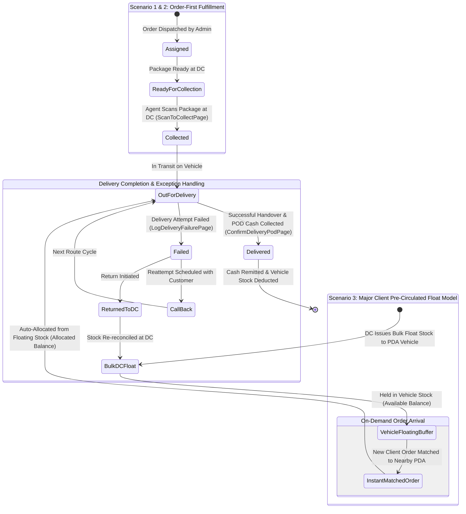
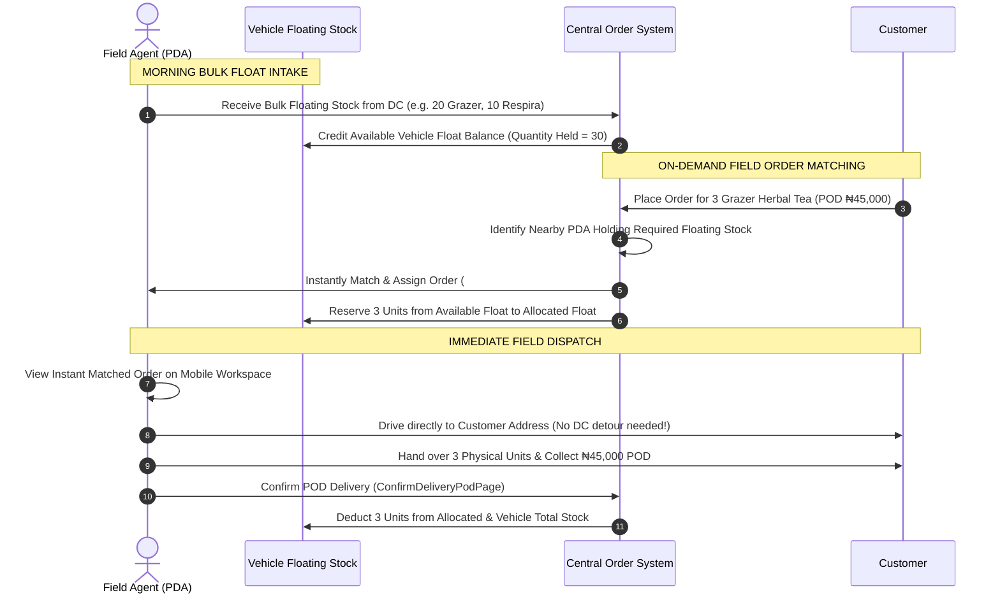

# Module 2: End-to-End Orders Lifecycle & Delivery Workflows 📦📍

## 1. Overview & Fulfillment Scenarios
The **Orders Module** is the core operational workspace for NovaExpress field agents across Nigeria. NovaExpress operates under **three distinct fulfillment scenarios** depending on client requirements and operational speed:

---

### 🏬 Fulfillment Scenario Matrix

| Scenario Type | Operational Flow | Inventory Allocation Model | Primary Use Case |
| :--- | :--- | :--- | :--- |
| **Scenario 1: Standard Order-First Pickup** | Order Placed ➔ Assigned to PDA ➔ Pickup Package at DC ➔ Deliver to Customer | Package specific to order picked up at DC after order creation. | Standard customer orders, customized packages & non-bulk client goods. |
| **Scenario 2: Failed Delivery & Exception Return** | Out for Delivery ➔ Delivery Attempt Fails ➔ Log Reason ➔ Reattempt / DC Return | Package retained in vehicle for retry or physically returned to DC. | Unreachable customers, wrong address, payment refused, or customer reschedule. |
| **Scenario 3: Major Client Pre-Circulated Float** *(Core High-Volume Model)* | Bulk Float Stock Issued to Vehicles ➔ Standing Buffer ➔ On-Demand Instant Order Matching ➔ Immediate Field Delivery | Bulk physical stock loaded into PDA vehicles **BEFORE** orders arrive. Orders matched on the fly. | **Major Client Products** (*Grazer Herbal Tea, Respira, Alpha Man*). Enables instant same-hour delivery without returning to DC! |

---

## 2. Master Order & Float Stock State Machine Diagram

---

## 3. Detailed Workflows by Scenario

### Scenario 1: Standard Order-First Fulfillment Workflow
1. **Order Dispatched**: Central admin/DC assigns an order (`assigned`) to the PDA.
2. **DC Pickup (`ScanToCollectPage`)**:
   - Agent arrives at DC, scans package QR code or enters tracking number (e.g. `#TRK-8924`).
   - Taps **CONFIRM INTAKE & RECEIVE STOCK**.
   - Order status moves to `in_transit`. Physical stock transfers from DC Warehouse to Agent Vehicle.
3. **Delivery & Handover (`ConfirmDeliveryPodPage`)**:
   - Agent delivers package to customer, collects POD cash (₦), and checks **Customer Confirmed Receipt**.
   - Order status moves to `delivered`. Physical stock is deducted.

---

### Scenario 2: Failed Delivery & Reattempt / Return Workflow
1. **Initiate Exception (`LogDeliveryFailurePage`)**:
   - Agent taps **LOG FAILURE / EXCEPTION** on `OrderDetailPage`.
2. **Select Reason & Enter Notes**:
   - Select reason card (*Customer Unavailable*, *Address Incorrect*, *Payment Refused*, *Package Damaged*).
   - Enter detailed notes or quick chip tags (*Gate locked*, *Security denied entry*).
3. **Select Resolution Path**:
   - **Reattempt Later**: Order status becomes `call_back`. Package stays in vehicle float for next run.
   - **Return to DC**: Order status becomes `failed` / `failed_return`. Physical package returned to DC cashier/warehouse for stock credit.

---

### Scenario 3: Major Client Pre-Circulated Floating Stock Fulfillment Workflow *(Major Client Model)*

#### Step-by-Step Scenario 3 Operational Instructions:
1. **Morning Bulk Float Intake**:
   - Field agents load bulk quantities of major client SKUs (*Grazer Herbal Tea, Respira, Alpha Man*) into their delivery vehicles at start-of-day.
   - **App Display (`StockPage`)**:
     - `TOTAL HELD`: Total physical units loaded in vehicle (e.g. `30 Units`).
     - `AVAILABLE`: Unallocated floating buffer ready for new on-demand orders (e.g. `18 Units`).
     - `ALLOCATED`: Reserved for orders currently dispatched (e.g. `12 Units`).
2. **On-Demand Field Order Matching**:
   - When a major client customer places an order while the PDA is in the field, the central system matches the order directly to the nearby PDA carrying the required floating stock.
   - The PDA receives a push alert: **New Matched Order #NEX-9902 Assigned from Vehicle Float**.
3. **Immediate Field Fulfillment**:
   - The PDA opens `OrderDetailPage` and proceeds directly to customer delivery without returning to the DC.
   - Upon completing delivery (`ConfirmDeliveryPodPage`), the 3 physical units automatically deduct from `ALLOCATED` and `TOTAL HELD` stock, while POD cash collected updates the **Unremitted Cash Balance (₦)**.
