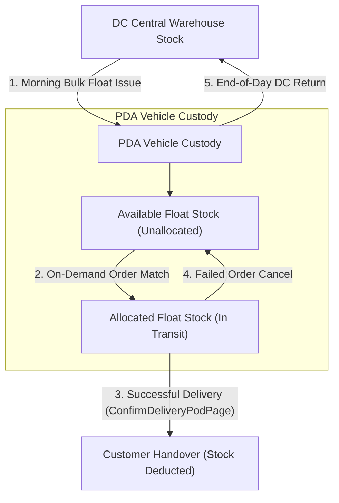

# Module 3: Inventory & Vehicle Stock Custody Workflow 📦📊

## 1. Overview & Business Principles
Every Personal Distribution Agent (PDA) maintains an individual physical inventory balance representing all products currently held in their delivery vehicle. 

NovaExpress supports two physical stock distribution patterns:
1. **Order-First Intake (Scenario 1)**: Packages picked up at DC after customer order placement.
2. **Major Client Pre-Circulated Float Model (Scenario 3)**: Bulk stock loaded into vehicle float buffers **BEFORE** orders arrive, allowing instant on-demand order matching and delivery in the field!

---

## 2. Vehicle Inventory Accounting Equation

$$\text{Quantity Held (Total Vehicle Stock)} = \text{Available Floating Stock} + \text{Allocated Order Stock}$$

| Stock Field | Definition | Operational Impact |
| :--- | :--- | :--- |
| **Quantity Held (`quantityHeld`)** | Total physical product units inside the agent's delivery vehicle. | Absolute physical inventory liability assigned to agent custody. |
| **Available Stock (`availableCount`)** | Floating buffer stock not yet matched to specific customer orders. | Ready for instant on-demand order matching for Major Clients. |
| **Allocated Stock (`allocatedCount`)** | Units matched and reserved for active orders out for delivery. | Deducted from vehicle stock upon successful customer delivery handover. |

---

## 3. Physical Stock & Pre-Circulated Float Diagram

---

## 4. Stock Screen Layout & Controls (`StockPage` & `StockDetailsGrazerPage`)

Navigating to **Tab 2 (STOCK)** on the bottom navigation bar presents the **My Stock** dashboard:

### A. Total Inventory Hero Card
- **TOTAL INVENTORY**: Displays total physical float units held in vehicle (e.g. `24 UNITS HELD`).
- **Vehicle Stock Balance**: Total physical custody count.

### B. Action Controls
- **Stock History**: Opens [`StockHistoryPage`](file:///c:/PROJECT/NoveXPS/lib/features/stock/presentation/pages/stock_history_page.dart) showing complete audit movement log (Received +, Delivered -, Returned -).
- **Scan Return**: Opens package intake scanner for DC returns.

### C. Product Stock Cards & Floating Stock Details
Selecting a product card (e.g. *Grazer Herbal Tea*) opens **`StockDetailsGrazerPage`**:
- **TOTAL HELD**: Total physical units in vehicle (`quantityHeld`).
- **AVAILABLE**: Unallocated float buffer ready for instant on-demand orders (`availableCount`).
- **ALLOCATED TO ORDERS**: Units reserved for active customer deliveries (`allocatedCount`).
- **Today's Movement Reconciliation Card**:
  - Opening Balance
  - Received from DC (+) [Bulk Float + Specific Intake]
  - Delivered to Customers (-) [Paid + Free Promotional Units]
  - Returned to DC (-)
  - Current Vehicle Stock

---

## 5. Paid vs Free Product Rule (Rule 5 & Rule 55)

If a Major Client order specifies:
- **5 Grazer Herbal Tea (Paid)**
- **1 Grazer Herbal Tea (Free Promotional)**

The system automatically reserves and deducts **6 physical units** from `Allocated Float` and `Total Held` stock upon delivery confirmation, ensuring 100% physical unit accountability!
